# pr-agent Fork for jclee941 | jclee941용 pr-agent 포크

> 개인 homelab CLIProxyAPI 백엔드를 사용하는 AI 기반 PR 리뷰어 및 자동화 봇
> AI-powered PR reviewer and automation bot backed by a homelab CLIProxyAPI

[](https://github.com/qodo-ai/pr-agent)
[](https://www.python.org/)
[](LICENSE)
[](https://github.com/qodo-ai/pr-agent)


[](#github-workflows-56-total--github-워크플로우-56개)
[](#go-automation-tools-8-total--go-자동화-도구-8개)

---

## Table of Contents | 목차

- [Overview | 개요](#overview--개요)
- [Features | 기능](#features--기능)
- [Architecture | 아키텍처](#architecture--아키텍처)
- [Automation Inventory | 자동화 인벤토리](#automation-inventory--자동화-인벤토리)
  - [GitHub Workflows (56 total) | GitHub 워크플로우 (56개)](#github-workflows-56-total--github-워크플로우-56개)
  - [Go Automation Tools (8 total) | Go 자동화 도구 (8개)](#go-automation-tools-8-total--go-자동화-도구-8개)
- [Quick Start | 빠른 시작](#quick-start--빠른-시작)
- [Local Development | 로컬 개발](#local-development--로컬-개발)
- [Commands Reference | 명령어 참조](#commands-reference--명령어-참조)
- [Contribution | 기여](#contribution--기여)

---

## Overview | 개요

This repository is a hard fork of [qodo-ai/pr-agent](https://github.com/qodo-ai/pr-agent), customized for `jclee941/*` repositories. It uses a homelab-hosted CLIProxyAPI (`<homelab-host>:8317`) as the primary LLM backend, accessible externally via `https://cliproxy.jclee.me/v1`.

이 저장소는 `jclee941/*` 저장소를 위해 커스터마이징된 [qodo-ai/pr-agent](https://github.com/qodo-ai/pr-agent)의 하드 포크입니다. 개인 homelab에 호스팅된 CLIProxyAPI (`<homelab-host>:8317`)를 주요 LLM 백엔드로 사용하며, 외부에서는 `https://cliproxy.jclee.me/v1`를 통해 접근합니다.

### Key Models | 주요 모델

| Model | Role | Endpoint |
|-------|------|----------|
| `kimi-k2.6` | Primary | CLIProxyAPI |
| `minimax-m2.7` | Fallback #1 | CLIProxyAPI |
| `gpt-5.5` | Fallback #2 | CLIProxyAPI |

### Upstream Attribution | 업스트림 귀속

This fork is based on [qodo-ai/pr-agent](https://github.com/qodo-ai/pr-agent) @ `d82f7d3e`. All upstream features are preserved including `/review`, `/improve`, `/describe`, `/ask`, `/update_changelog`, PR compression, dynamic context, multi-model fallback, and slash commands.

---

## Features | 기능

### Core Features | 핵심 기능

- **AI-Powered PR Review**: Automated code review using LLM with context awareness
- **Multi-Model Fallback**: Automatic failover through `kimi-k2.6` → `minimax-m2.7` → `gpt-5.5`
- **Bilingual Support**: Full Korean and English support for PR descriptions, reviews, and documentation
- **Security Scanning**: Integrated secret detection, CodeQL analysis, and hardcode pattern scanning
- **Automated Merge Operations**: Auto-merge, auto-fix, and stale PR cleanup
- **Issue Management**: Automated issue creation, labeling, and lifecycle management
- **Release Automation**: Release drafter, changelog generation, and publication workflows
- **Health Monitoring**: ELK-based health checks and runtime monitoring

### Fork-Specific Features | 포크별 기능

- **Homelab Backend**: CLIProxyAPI integration with external access via `https://cliproxy.jclee.me/v1`
- **Custom PR Review**: Dedicated `10_pr-review.yml` and `security/11_pr-review.yml` workflows
- **Repository Health**: Automated health reports, drift detection, and downstream checking
- **Go Automation Suite**: 8 standalone Go tools for repository management

---

## Architecture | 아키텍처

```mermaid
flowchart TB
    subgraph GitHub["GitHub Platform"]
        subgraph Runners["GitHub Hosted Runners (ubuntu-latest)"]
            WF01[01_branch-to-pr.yml]
            WF02[02_issue-to-branch.yml]
            WF03[03_pr-checks.yml]
            WF04[04_actionlint.yml]
            WF05[05_gitleaks.yml]
            WF06[06_codeql.yml]
            WF07[07_dependency-review.yml]
            WF08[08_scorecard.yml]
            WF09[09_semantic-pr.yml]
            WF10[10_pr-review.yml]
            WF12[12_dependabot-auto-merge.yml]
            WF13[13_pr-auto-merge.yml]
            WF14[14_bot-auto-fix.yml]
            WF15[15_merged-pr-cleanup.yml]
            WF16[16_stale-repo-identifier.yml]
            WF17[17_pr-stale-bot.yml]
            WF18[18_issue-management.yml]
            WF19[19_issue-backfill.yml]
            WF20[20_readme-gen.yml]
            WF21[21_docs-sync.yml]
            WF22[22_template-sync.yml]
            WF23[23_release-drafter.yml]
            WF24[24_release-notes.yml]
            WF25[25_release-publish.yml]
            WF26[26_elk-health-check.yml]
            WF27[27_elk-setup.yml]
            WF28[28_bot-health-monitor.yml]
            WF29[29_downstream-health-check.yml]
            WF30[30_runtime-health-check.yml]
            WF31[31_repo-health.yml]
            WF32[32_org-health-report.yml]
            WF33[33_drift-detector.yml]
            WF34[34_auto-deploy.yml]
            WF35[35_auto-hardcode-scan.yml]
            WF36[36_build-and-push-app.yml]
            WF37[37_ci-failure-issues.yml]
            WF38[38_e2e.yml]
            WF39[39_e2e-live.yml]
            WF40[40_repo-review-batch.yml]
            WF41[41_reusable-ci.yml]
            WF42[42_reusable-docs-sync.yml]
            WF43[43_reusable-issue-management.yml]
            WF44[44_reusable-pr-checks.yml]
            WF45[45_reusable-gitleaks.yml]
            WF60[60_ci-auto-heal.yml]
            WF81[81_auto-merge.yml]
            WF82[82_issue-label.yml]
            WF83[83_issue-lifecycle.yml]
            WF84[84_labeler.yml]
            WF85[85_pr-normalize.yml]
            WF86[86_pr-review-security.yml]
            WF87[87_pr-size.yml]
            WF88[88_stale.yml]
            WF89[89_welcome.yml]
            WF90[90_sanity.yml]
            WF11S[security/11_pr-review.yml]
        end

        subgraph GoTools["Go Automation Tools"]
            GT01[branch-protection]
            GT02[deploy-to-repos]
            GT03[drift-detector]
            GT04[repo-metadata]
            GT05[repo-review]
            GT06[rulesets-manager]
            GT07[sync-secrets]
            GT08[validate-naming]
        end

        PR[Pull Requests] --> WF10
        PR --> WF11S
        Issues --> WF18
        Push --> WF05
        Schedule --> WF26
        Schedule --> WF35
    end

    subgraph External["External Services"]
        CLIProxy[<homelab-host>:8317<br/>CLIProxyAPI<br/><https://cliproxy.jclee.me/v1>]
        ELK[<homelab-elk><br/>ELK Stack]
    end

    subgraph Models["LLM Models"]
        M1[kimi-k2.6<br/>Primary]
        M2[minimax-m2.7<br/>Fallback #1]
        M3[gpt-5.5<br/>Fallback #2]
    end

    WF10 --> |"PR Review"| CLIProxy
    WF11S --> |"Security Review"| CLIProxy
    WF20 --> |"README Gen"| CLIProxy
    WF40 --> |"Repo Review"| CLIProxy

    CLIProxy --> M1
    CLIProxy --> M2
    CLIProxy --> M3

    WF26 --> ELK
    WF27 --> ELK
    WF28 --> ELK

    GoTools --> |"API Calls"| GitHub
    GoTools --> |"Deploy Workflows"| WF34
```



---

## Automation Inventory | 자동화 인벤토리

### GitHub Workflows (56 total) | GitHub 워크플로우 (56개)

#### PR Lifecycle | PR 라이프사이클

| File | Description |
|------|-------------|
| `01_branch-to-pr.yml` | Create PR from branch |
| `02_issue-to-branch.yml` | Create branch from issue |
| `03_pr-checks.yml` | Run PR validation checks |
| `09_semantic-pr.yml` | Enforce semantic PR titles |
| `10_pr-review.yml` | AI-powered PR review (primary) |
| `security/11_pr-review.yml` | Deep security review (Korean, label-triggered) |
| `12_dependabot-auto-merge.yml` | Auto-merge Dependabot PRs |
| `13_pr-auto-merge.yml` | Auto-merge qualified PRs |
| `14_bot-auto-fix.yml` | Auto-fix bot suggestions |
| `15_merged-pr-cleanup.yml` | Cleanup after PR merge |
| `81_auto-merge.yml` | Additional auto-merge logic |
| `85_pr-normalize.yml` | Normalize PR metadata |
| `86_pr-review-security.yml` | Security-focused PR review |
| `87_pr-size.yml` | PR size labeling |

#### Issue Management | 이슈 관리

| File | Description |
|------|-------------|
| `16_stale-repo-identifier.yml` | Identify stale repositories |
| `17_pr-stale-bot.yml` | Mark stale PRs |
| `18_issue-management.yml` | Automated issue management |
| `19_issue-backfill.yml` | Backfill issue data |
| `82_issue-label.yml` | Label issues automatically |
| `83_issue-lifecycle.yml` | Manage issue lifecycle |
| `84_labeler.yml` | Labeler configuration |
| `88_stale.yml` | Stale issue management |
| `89_welcome.yml` | Welcome new contributors |

#### Documentation | 문서화

| File | Description |
|------|-------------|
| `20_readme-gen.yml` | Generate README documentation |
| `21_docs-sync.yml` | Sync documentation across repos |
| `22_template-sync.yml` | Sync issue/PR templates |
| `41_reusable-ci.yml` | Reusable CI workflow |
| `42_reusable-docs-sync.yml` | Reusable docs sync workflow |
| `43_reusable-issue-management.yml` | Reusable issue management workflow |
| `44_reusable-pr-checks.yml` | Reusable PR checks workflow |
| `45_reusable-gitleaks.yml` | Reusable gitleaks workflow |

#### Security & Compliance | 보안 및 준수

| File | Description |
|------|-------------|
| `04_actionlint.yml` | Lint GitHub Actions YAML |
| `05_gitleaks.yml` | Scan for secrets |
| `06_codeql.yml` | CodeQL static analysis |
| `07_dependency-review.yml` | Dependency vulnerability review |
| `08_scorecard.yml` | OpenSSF Scorecard assessment |

#### Release Automation | 릴리스 자동화

| File | Description |
|------|-------------|
| `23_release-drafter.yml` | Draft releases automatically |
| `24_release-notes.yml` | Generate release notes |
| `25_release-publish.yml` | Publish releases |

#### Health & Monitoring | 상태 및 모니터링

| File | Description |
|------|-------------|
| `26_elk-health-check.yml` | ELK stack health check |
| `27_elk-setup.yml` | Setup ELK integration |
| `28_bot-health-monitor.yml` | Monitor bot health |
| `29_downstream-health-check.yml` | Check downstream repos |
| `30_runtime-health-check.yml` | Runtime health verification |
| `31_repo-health.yml` | Repository health report |
| `32_org-health-report.yml` | Organization health report |

#### Maintenance | 유지보수

| File | Description |
|------|-------------|
| `33_drift-detector.yml` | Detect configuration drift |
| `34_auto-deploy.yml` | Auto-deploy to repositories |
| `35_auto-hardcode-scan.yml` | Scan for hardcoded patterns |
| `36_build-and-push-app.yml` | Build and push Docker images |
| `37_ci-failure-issues.yml` | Create issues for CI failures |
| `38_e2e.yml` | End-to-end tests |
| `39_e2e-live.yml` | Live end-to-end tests |
| `40_repo-review-batch.yml` | Batch repository review |
| `60_ci-auto-heal.yml` | Auto-heal CI failures |
| `90_sanity.yml` | Sanity checks gate |

---

### Go Automation Tools (8 total) | Go 자동화 도구 (8개)

Located in `scripts/cmd/`. Invoke via `(cd scripts && go run ./cmd/<name>)`.

| Tool | Description |
|------|-------------|
| `branch-protection` | Manage branch protection rules |
| `deploy-to-repos` | Deploy `10_pr-review.yml` to `jclee941/*` repos |
| `drift-detector` | Detect configuration drift across repositories |
| `repo-metadata` | Collect and manage repository metadata |
| `repo-review` | Batch repository review automation |
| `rulesets-manager` | Manage GitHub Rulesets (list/apply/delete) |
| `sync-secrets` | Synchronize secrets across repositories |
| `validate-naming` | Validate repository and branch naming conventions |

---

## Quick Start | 빠른 시작

### Prerequisites | 사전 요구사항

- Python 3.12+
- Go 1.21+ (for Go automation tools)
- Docker (for containerized deployment)
- GitHub App or PAT for repository access

### Installation | 설치

```bash
# Clone the repository
git clone https://github.com/jclee941/.github
cd github-bot

# Create virtual environment
python3.12 -m venv .venv
source .venv/bin/activate

# Install dependencies
pip install --upgrade pip
pip install -e .
```

### Configuration | 설정

```bash
# Copy environment template
cp .env.example .env

# Edit .env with your configuration
# Set CLIProxyAPI endpoint: https://cliproxy.jclee.me/v1
# Configure model preferences
```

### Running Locally | 로컬 실행

```bash
# Run PR agent CLI
pr-agent --help

# Run a specific command
pr-agent review --pr_url https://github.com/owner/repo/pull/123
```

---

## Local Development | 로컬 개발

### Development Environment | 개발 환경

```bash
# Install development dependencies
pip install -r requirements-dev.txt

# Run linter
make lint

# Run unit tests
make test-unit

# Run e2e tests
make test-e2e

# Run live tests
make test-live

# Run all tests
make test
```

### Go Tools Development | Go 도구 개발

```bash
# Navigate to scripts directory
cd scripts

# Run a specific tool
go run ./cmd/branch-protection

# Run tests for Go tools
go test ./...

# Build all tools
go build ./cmd/...
```

### Docker Development | Docker 개발

```bash
# Build GitHub Action image
docker build -f Dockerfile.github_action -t pr-agent:action .

# Build GitHub App image
docker build -f Dockerfile.github_app -t pr-agent:app .

# Run with docker-compose
docker-compose -f docker-compose.github_app.yml up
```

### Project Structure | 프로젝트 구조

```
.
├── .github/
│   └── workflows/          # 56 GitHub Actions workflows
│       └── security/       # Security-specific workflows
├── scripts/
│   ├── cmd/                # Go automation tools (8 tools)
│   │   ├── branch-protection/
│   │   ├── deploy-to-repos/
│   │   ├── drift-detector/
│   │   ├── repo-metadata/
│   │   ├── repo-review/
│   │   ├── rulesets-manager/
│   │   ├── sync-secrets/
│   │   └── validate-naming/
│   └── *.py                # Python automation scripts
├── pr_agent/               # Main Python package
├── tests/
│   ├── unittest/          # Unit tests
│   ├── e2e/               # End-to-end tests
│   └── e2e_live/          # Live e2e tests
├── config/
│   └── repos.yaml         # Repository configuration
├── docs/                   # Documentation
│   ├── architecture.md
│   ├── automation-enhancement-brainstorm.md
│   ├── git-workflow-gap-analysis.md
│   └── review-templates/  # Review templates
├── Dockerfile.github_action
├── Dockerfile.github_app
├── docker-compose.github_app.yml
├── pyproject.toml
├── requirements.txt
└── requirements-dev.txt
```

---

## Commands Reference | 명령어 참조

### Make Commands | Make 명령어

| Command | Description |
|---------|-------------|
| `make install` | Install package in development mode |
| `make test` | Run all tests (unit + e2e + live) |
| `make test-unit` | Run unit tests only |
| `make test-e2e` | Run end-to-end tests |
| `make test-live` | Run live end-to-end tests |
| `make lint` | Run ruff linter |
| `make clean` | Clean up cache files |

### PR Agent Commands | PR Agent 명령어

```bash
# Review a PR
pr-agent review --pr_url https://github.com/owner/repo/pull/123

# Describe a PR
pr-agent describe --pr_url https://github.com/owner/repo/pull/123

# Improve code suggestions
pr-agent improve --pr_url https://github.com/owner/repo/pull/123

# Ask a question
pr-agent ask --pr_url https://github.com/owner/repo/pull/123 "What does this function do?"

# Update changelog
pr-agent update_changelog --pr_url https://github.com/owner/repo/pull/123
```

### Go Tools Commands | Go 도구 명령어

```bash
# branch-protection
cd scripts && go run ./cmd/branch-protection --repo owner/repo --protection enabled

# deploy-to-repos
cd scripts && go run ./cmd/deploy-to-repos --org jclee941 --workflow 10_pr-review.yml

# drift-detector
cd scripts && go run ./cmd/drift-detector --org jclee941

# repo-metadata
cd scripts && go run ./cmd/repo-metadata --repo owner/repo

# repo-review
cd scripts && go run ./cmd/repo-review --org jclee941 --batch-size 10

# rulesets-manager
cd scripts && go run ./cmd/rulesets-manager --repo owner/repo --action list

# sync-secrets
cd scripts && go run ./cmd/sync-secrets --org jclee941 --secret-name DEPLOY_KEY

# validate-naming
cd scripts && go run ./cmd/validate-naming --repo owner/repo
```

---

## Contribution | 기여

### Contributing Guidelines | 기여 가이드라인

Please read [CONTRIBUTING.md](CONTRIBUTING.md) for details on our development workflow and coding standards.

자세한 개발 워크플로우와 코딩 표준은 [CONTRIBUTING.md](CONTRIBUTING.md)를 참고하세요.

### Code of Conduct | 행동 강령

This project adheres to the [CODE_OF_CONDUCT.md](CODE_OF_CONDUCT.md). By participating, you agree to uphold its terms.

이 프로젝트는 [CODE_OF_CONDUCT.md](CODE_OF_CONDUCT.md)를 따릅니다. 참여함으로써 해당 약관을 준수하는 것에 동의합니다.

### Security | 보안

For security vulnerabilities, please refer to [SECURITY.md](SECURITY.md).

보안 취약점에 대해서는 [SECURITY.md](SECURITY.md)를 참고하세요.

### Reporting Issues | 이슈 보고

1. Check existing issues before creating new ones
2. Use appropriate issue templates (Bug/Feature/Security)
3. Provide reproduction steps and environment details
4. For security issues, follow the process in SECURITY.md

### Submitting Changes | 변경 사항 제출

1. Fork the repository
2. Create a feature branch (`git checkout -b feature/amazing-feature`)
3. Commit your changes with semantic commit messages
4. Run tests and linting (`make test`, `make lint`)
5. Push to your fork and create a Pull Request
6. Wait for review and address feedback

### License | 라이선스

This project is licensed under the AGPL-3.0 License. See [LICENSE](LICENSE) and [NOTICE](NOTICE) for details.

이 프로젝트는 AGPL-3.0 라이선스 하에 제공됩니다. 자세한 내용은 [LICENSE](LICENSE)와 [NOTICE](NOTICE)를 참고하세요.

---

## External Links | 외부 링크

- [Upstream: qodo-ai/pr-agent](https://github.com/qodo-ai/pr-agent)
- [CLIProxyAPI](https://cliproxy.jclee.me/v1)
- [Bot Dashboard](https://bot.jclee.me)

---

*Generated by pr-agent README generator | pr-agent README 생성기에 의해 생성됨*
