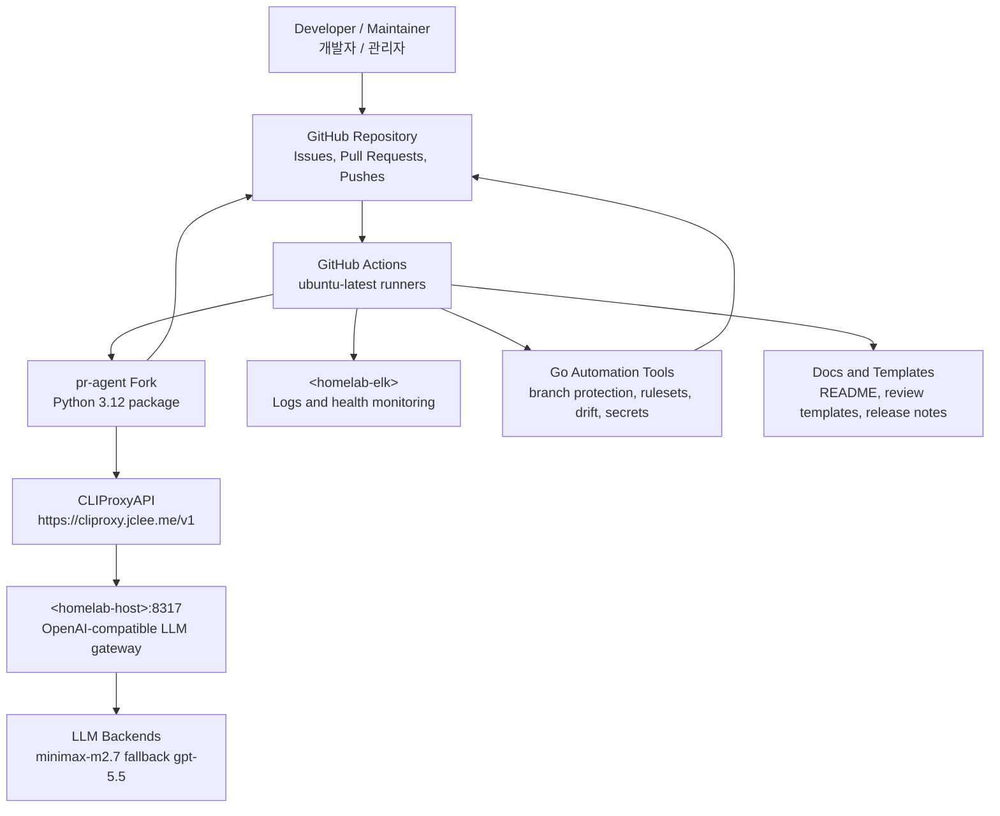

# pr-agent Fork for jclee941 | jclee941용 pr-agent 포크

> AI-powered PR reviewer and GitHub automation platform for `jclee941/*` repositories, backed by a homelab CLIProxyAPI deployment.  
> homelab CLIProxyAPI 배포를 기반으로 `jclee941/*` 저장소를 자동화하는 AI PR 리뷰어 및 GitHub 자동화 플랫폼입니다.

[](pyproject.toml)
[](pyproject.toml)
[](LICENSE)
[](https://github.com/qodo-ai/pr-agent)
[](https://cliproxy.jclee.me/v1)
[](#github-workflows-57-total--github-워크플로우-57개)
[](#go-automation-tools-8-total--go-자동화-도구-8개)

---

## Table of Contents | 목차

- [Overview | 개요](#overview--개요)
- [Features | 기능](#features--기능)
- [Architecture | 아키텍처](#architecture--아키텍처)
- [Automation Inventory | 자동화 인벤토리](#automation-inventory--자동화-인벤토리)
  - [GitHub Workflows 57 total | GitHub 워크플로우 57개](#github-workflows-57-total--github-워크플로우-57개)
  - [Go Automation Tools 8 total | Go 자동화 도구 8개](#go-automation-tools-8-total--go-자동화-도구-8개)
- [Repository Structure | 저장소 구조](#repository-structure--저장소-구조)
- [Quick Start | 빠른 시작](#quick-start--빠른-시작)
- [Local Development | 로컬 개발](#local-development--로컬-개발)
- [Commands Reference | 명령어 참조](#commands-reference--명령어-참조)
- [Contribution Guide | 기여 가이드](#contribution-guide--기여-가이드)

---

## Overview | 개요

This repository is a private hard fork of [qodo-ai/pr-agent](https://github.com/qodo-ai/pr-agent), customized for the `jclee941/*` repository ecosystem. It preserves the upstream PR-Agent capabilities while adding repository-wide GitHub automation, security checks, release workflows, issue lifecycle automation, health monitoring, and homelab-backed LLM routing.

이 저장소는 [qodo-ai/pr-agent](https://github.com/qodo-ai/pr-agent)의 private hard fork이며, `jclee941/*` 저장소 생태계에 맞게 커스터마이징되어 있습니다. upstream PR-Agent 기능을 유지하면서 저장소 전반의 GitHub 자동화, 보안 검사, 릴리스 워크플로우, 이슈 라이프사이클 자동화, 헬스 모니터링, homelab 기반 LLM 라우팅을 추가합니다.

### Primary responsibilities | 주요 역할

- AI-assisted pull request review and improvement suggestions.
- Slash-command based PR operations such as `/review`, `/improve`, `/describe`, `/ask`, and `/update_changelog`.
- Automated repository governance for branches, labels, rulesets, naming, metadata, secrets, and release hygiene.
- GitHub Actions workflow automation for CI, security, stale handling, issue classification, auto-merge, documentation sync, and deployment.
- LLM access through an OpenAI-compatible CLIProxyAPI endpoint.

- AI 기반 Pull Request 리뷰 및 개선 제안.
- `/review`, `/improve`, `/describe`, `/ask`, `/update_changelog` 등 slash command 기반 PR 작업.
- 브랜치, 라벨, ruleset, naming, metadata, secrets, release hygiene에 대한 저장소 거버넌스 자동화.
- CI, 보안, stale 처리, 이슈 분류, auto-merge, 문서 동기화, 배포를 위한 GitHub Actions 자동화.
- OpenAI 호환 CLIProxyAPI endpoint를 통한 LLM 접근.

### Runtime model routing | 런타임 모델 라우팅

- PR-Agent runtime is routed through CLIProxyAPI.
- README generation automation currently uses:
  - Primary model: `minimax-m2.7`
  - Fallback model: `gpt-5.5`
- Public API base endpoint: `https://cliproxy.jclee.me/v1`
- Internal homelab hosts are intentionally represented with placeholders such as `<homelab-host>` and `<homelab-elk>`.

---

## Features | 기능

### AI pull request automation | AI Pull Request 자동화

- Automated PR review comments.
- Code improvement suggestions.
- PR description generation.
- Interactive Q&A over pull request context.
- Changelog update support.
- Multi-model fallback support through CLIProxyAPI.
- Dynamic context and PR compression inherited from upstream PR-Agent.

### GitHub repository automation | GitHub 저장소 자동화

- Branch-to-PR and issue-to-branch automation.
- Semantic PR title checks.
- PR normalization, size labeling, stale handling, and auto-merge.
- Dependabot auto-merge support.
- Release draft, release notes, and release publish workflows.
- Documentation synchronization and template synchronization.
- Organization and repository health reporting.

### Security automation | 보안 자동화

- Gitleaks secret scanning.
- CodeQL static analysis.
- Dependency review.
- OpenSSF Scorecard.
- Dedicated security PR review workflow.
- Auto hardcode scan for private IPs, secrets, and unsafe patterns.
- Security-focused review templates.

### Operations and observability | 운영 및 관측성

- Runtime health checks.
- Bot health monitoring.
- Downstream health checks.
- ELK setup and health check workflows.
- CI failure issue creation.
- Drift detection across managed repositories.

---

## Architecture | 아키텍처



### Architecture notes | 아키텍처 설명

- GitHub events trigger workflow automation on GitHub-hosted runners.
- PR-Agent executes as a Python package and communicates with CLIProxyAPI through the public endpoint.
- CLIProxyAPI provides OpenAI-compatible routing to configured models.
- Go automation tools manage repository-level governance tasks.
- Health and monitoring workflows report runtime, downstream, bot, and ELK status.
- Private addresses and container identifiers are intentionally not documented; placeholders are used instead.

---

## Automation Inventory | 자동화 인벤토리

### GitHub Workflows 57 total | GitHub 워크플로우 57개

The repository contains 57 workflow files. File names below are listed with their real on-disk numeric prefixes.

아래 목록은 실제 디스크 상의 숫자 prefix가 포함된 워크플로우 파일명입니다.

#### PR and issue automation | PR 및 이슈 자동화

| Workflow file | Purpose |
|---|---|
| `01_branch-to-pr.yml` | Creates or manages pull requests from branch activity. |
| `02_issue-to-branch.yml` | Creates working branches from issues. |
| `03_pr-checks.yml` | Core pull request validation checks. |
| `09_semantic-pr.yml` | Validates semantic pull request titles. |
| `10_pr-review.yml` | Main AI PR review workflow using PR-Agent and CLIProxyAPI. |
| `security/11_pr-review.yml` | Security-focused PR review workflow. |
| `13_pr-auto-merge.yml` | Pull request auto-merge automation. |
| `14_bot-auto-fix.yml` | Bot-assisted automatic fixes. |
| `15_merged-pr-cleanup.yml` | Cleans up merged pull request branches or metadata. |
| `17_pr-stale-bot.yml` | Stale pull request handling. |
| `18_issue-management.yml` | General issue lifecycle automation. |
| `19_issue-backfill.yml` | Backfills issue metadata and labels. |
| `37_ci-failure-issues.yml` | Creates or updates issues for CI failures. |
| `81_auto-merge.yml` | Additional auto-merge workflow. |
| `82_issue-label.yml` | Issue labeling automation. |
| `83_issue-lifecycle.yml` | Issue lifecycle state management. |
| `85_pr-normalize.yml` | Normalizes pull request metadata. |
| `86_pr-review-security.yml` | Security-oriented PR review automation. |
| `87_pr-size.yml` | Labels pull requests by size. |
| `88_stale.yml` | Generic stale issue and PR handling. |
| `89_welcome.yml` | Welcome messages for contributors. |
| `91_issue-classification.yml` | AI or rule-based issue classification. |

#### CI, linting, and security | CI, 린팅 및 보안

| Workflow file | Purpose |
|---|---|
| `04_actionlint.yml` | Validates GitHub Actions workflow syntax and semantics. |
| `05_gitleaks.yml` | Scans for exposed secrets. |
| `06_codeql.yml` | Runs CodeQL static analysis. |
| `07_dependency-review.yml` | Reviews dependency changes in pull requests. |
| `08_scorecard.yml` | Runs OpenSSF Scorecard checks. |
| `35_auto-hardcode-scan.yml` | Scans for hardcoded private IPs, secrets, and unsafe patterns. |
| `38_e2e.yml` | End-to-end test workflow. |
| `39_e2e-live.yml` | Live end-to-end test workflow. |
| `60_ci-auto-heal.yml` | Attempts automatic remediation for CI failures. |
| `90_sanity.yml` | Repository sanity and fork CI gate. |

#### Documentation, templates, and releases | 문서, 템플릿 및 릴리스

| Workflow file | Purpose |
|---|---|
| `20_readme-gen.yml` | Generates or refreshes README content. |
| `21_docs-sync.yml` | Synchronizes documentation across repositories. |
| `22_template-sync.yml` | Synchronizes shared templates. |
| `23_release-drafter.yml` | Maintains draft releases. |
| `24_release-notes.yml` | Generates release notes. |
| `25_release-publish.yml` | Publishes releases. |

#### Health, deployment, and repository governance | 헬스체크, 배포 및 저장소 거버넌스

| Workflow file | Purpose |
|---|---|
| `12_dependabot-auto-merge.yml` | Auto-merges eligible Dependabot pull requests. |
| `16_stale-repo-identifier.yml` | Identifies stale repositories. |
| `26_elk-health-check.yml` | Checks ELK availability and health. |
| `27_elk-setup.yml` | Sets up ELK integration. |
| `28_bot-health-monitor.yml` | Monitors bot health. |
| `29_downstream-health-check.yml` | Checks downstream service health. |
| `30_runtime-health-check.yml` | Checks runtime service health. |
| `31_repo-health.yml` | Generates repository health information. |
| `32_org-health-report.yml` | Generates organization-level health reports. |
| `33_drift-detector.yml` | Detects configuration drift. |
| `34_auto-deploy.yml` | Deploys automation updates. |
| `36_build-and-push-app.yml` | Builds and pushes the GitHub App image. |
| `40_repo-review-batch.yml` | Runs batch repository review. |

#### Reusable workflows | 재사용 워크플로우

| Workflow file | Purpose |
|---|---|
| `41_reusable-ci.yml` | Reusable CI workflow. |
| `42_reusable-docs-sync.yml` | Reusable documentation sync workflow. |
| `43_reusable-issue-management.yml` | Reusable issue management workflow. |
| `44_reusable-pr-checks.yml` | Reusable PR checks workflow. |
| `45_reusable-gitleaks.yml` | Reusable Gitleaks workflow. |

#### Labeling and metadata | 라벨 및 메타데이터

| Workflow file | Purpose |
|---|---|
| `84_labeler.yml` | Applies labels based on repository rules. |

---

### Go Automation Tools 8 total | Go 자동화 도구 8개

The repository includes Go-based automation tools for repository administration and fleet-wide governance.

이 저장소에는 저장소 관리 및 여러 저장소에 대한 거버넌스를 수행하기 위한 Go 기반 자동화 도구가 포함되어 있습니다.

| Tool name | Purpose |
|---|---|
| `branch-protection` | Applies or validates branch protection settings. |
| `deploy-to-repos` | Deploys selected automation assets to managed repositories. |
| `drift-detector` | Detects drift between desired and actual repository configuration. |
| `repo-metadata` | Reads, validates, or updates repository metadata. |
| `repo-review` | Reviews repository configuration and automation posture. |
| `rulesets-manager` | Manages GitHub repository rulesets. |
| `sync-secrets` | Synchronizes required repository or organization secrets. |
| `validate-naming` | Validates naming conventions for repositories, branches, labels, or workflows. |

---

## Repository Structure | 저장소 구조

Top-level repository layout:

```text
/
├── AGENTS.md
├── CODE_OF_CONDUCT.md
├── CONTRIBUTING.md
├── Dockerfile.github_action
├── Dockerfile.github_app
├── LICENSE
├── MANIFEST.in
├── Makefile
├── NOTICE
├── README.md
├── SECURITY.md
├── config/
│   └── repos.yaml
├── docker-compose.github_app.yml
├── docker-compose.github_app.yml.lxc
├── docs/
│   ├── architecture.md
│   ├── automation-enhancement-brainstorm.md
│   ├── git-workflow-gap-analysis.md
│   ├── github-profile-enhancement-brainstorm.md
│   ├── pr-agent-upstream-README.md
│   ├── assets/
│   │   └── jclee-bot-icon.png
│   └── review-templates/
│       ├── code-review-template.md
│       ├── documentation-checklist.md
│       └── security-review-template.md
├── filebeat.yml
├── pyproject.toml
├── requirements-dev.txt
├── requirements.txt
├── setup.py
└── tests/
    └── unittest/
```

### Important files | 주요 파일

| Path | Description |
|---|---|
| `pyproject.toml` | Python package metadata, setuptools configuration, Ruff lint settings. |
| `requirements.txt` | Runtime Python dependencies. |
| `requirements-dev.txt` | Development dependencies. |
| `Makefile` | Local development command shortcuts. |
| `Dockerfile.github_action` | Dockerfile for GitHub Action execution context. |
| `Dockerfile.github_app` | Dockerfile for GitHub App deployment. |
| `docker-compose.github_app.yml` | Docker Compose configuration for GitHub App runtime. |
| `filebeat.yml` | Filebeat configuration for log shipping. |
| `config/repos.yaml` | Managed repository configuration. |
| `docs/pr-agent-upstream-README.md` | Preserved upstream PR-Agent README reference. |
| `docs/review-templates/` | Code, documentation, and security review templates. |
| `tests/unittest/` | Unit test suite for providers, parsing, config, GitHub integration, and PR-Agent behavior. |

---

## Quick Start | 빠른 시작

### 1. Clone and enter the repository | 저장소 클론

```bash
git clone <repository-url>
cd <repository-directory>
```

### 2. Create a Python 3.12 environment | Python 3.12 환경 생성

```bash
make install
```

This command creates `.venv`, upgrades `pip`, and installs the package in editable mode.

이 명령은 `.venv`를 생성하고, `pip`를 업그레이드한 뒤 패키지를 editable mode로 설치합니다.

### 3. Configure environment variables | 환경 변수 설정

Create a local `.env` file or export the required variables in your shell.

로컬 `.env` 파일을 만들거나 shell에서 필요한 환경 변수를 export합니다.

```bash
export OPENAI_API_BASE="https://cliproxy.jclee.me/v1"
export OPENAI_API_KEY="<cliproxy-api-key>"
export GITHUB_TOKEN="<github-token>"
```

Do not commit secrets. Use GitHub Actions secrets for workflow execution.

Secrets를 commit하지 마세요. Workflow 실행 시에는 GitHub Actions secrets를 사용하세요.

### 4. Run tests | 테스트 실행

```bash
make test-unit
```

### 5. Run lint | 린트 실행

```bash
make lint
```

### 6. Run PR-Agent CLI | PR-Agent CLI 실행

```bash
.venv/bin/pr-agent --help
```

---

## Local Development | 로컬 개발

### Requirements | 요구사항

- Python `>=3.12`
- `pip`
- `make`
- Docker, if testing containerized GitHub App behavior
- GitHub token with the minimum required permissions for the automation being tested
- Access to CLIProxyAPI if running LLM-backed features

### Install editable package | Editable 패키지 설치

```bash
make install
```

Equivalent manual commands:

```bash
python3.12 -m venv .venv
.venv/bin/pip install --upgrade pip
.venv/bin/pip install -e .
```

### Run unit tests | Unit 테스트 실행

```bash
make test-unit
```

The unit test suite covers provider behavior, configuration loading, token handling, PR patch processing, GitHub provider behavior, issue creation, Git flow logic, and README generation.

Unit 테스트는 provider 동작, configuration loading, token handling, PR patch processing, GitHub provider 동작, issue creation, Git flow logic, README generation 등을 검증합니다.

### Run end-to-end tests | E2E 테스트 실행

```bash
make test-e2e
```

### Run live tests | Live 테스트 실행

```bash
make test-live
```

Live tests may require real credentials, GitHub access, and external service availability.

Live 테스트에는 실제 credentials, GitHub 접근 권한, 외부 서비스 가용성이 필요할 수 있습니다.

### Run all tests | 전체 테스트 실행

```bash
make test
```

### Clean generated files | 생성 파일 정리

```bash
make clean
```

---

## Commands Reference | 명령어 참조

### Make targets | Make 명령

| Command | Description |
|---|---|
| `make install` | Creates `.venv` and installs the package in editable mode. |
| `make test-unit` | Runs unit tests under `tests/unittest`. |
| `make test-e2e` | Runs end-to-end tests under `tests/e2e`. |
| `make test-live` | Runs live end-to-end tests under `tests/e2e_live`. |
| `make test` | Runs unit, E2E, and live tests. |
| `make lint` | Runs `ruff check .`. |
| `make clean` | Removes pytest cache and Python `__pycache__` directories. |

### Python package commands | Python 패키지 명령

| Command | Description |
|---|---|
| `.venv/bin/pr-agent --help` | Shows PR-Agent CLI help. |
| `.venv/bin/python -m pytest tests/unittest -v` | Runs unit tests directly. |
| `.venv/bin/python -m ruff check .` | Runs Ruff directly. |
| `.venv/bin/pip install -e .` | Installs the package in editable mode. |

### Docker commands | Docker 명령

Build the GitHub App image:

```bash
docker build -f Dockerfile.github_app -t pr-agent-github-app:local .
```

Build the GitHub Action image:

```bash
docker build -f Dockerfile.github_action -t pr-agent-github-action:local .
```

Run the GitHub App with Docker Compose:

```bash
docker compose -f docker-compose.github_app.yml up
```

### Go automation commands | Go 자동화 명령

When the Go automation module is available in the repository checkout, run tools by tool name from the scripts module.

Go 자동화 모듈이 checkout에 포함되어 있는 경우 scripts module에서 도구 이름으로 실행합니다.

```bash
cd scripts
go run ./cmd/branch-protection
go run ./cmd/deploy-to-repos
go run ./cmd/drift-detector
go run ./cmd/repo-metadata
go run ./cmd/repo-review
go run ./cmd/rulesets-manager
go run ./cmd/sync-secrets
go run ./cmd/validate-naming
```

---

## Configuration | 설정

### Python package metadata | Python 패키지 메타데이터

The project is configured as:

| Field | Value |
|---|---|
| Package name | `pr-agent` |
| Version | `0.3.1` |
| Python | `>=3.12` |
| Maintainer | `jclee941` |
| Upstream | [qodo-ai/pr-agent](https://github.com/qodo-ai/pr-agent) |
| License | AGPL-3.0, see `LICENSE` and `NOTICE` |

### Key dependencies | 주요 의존성

The runtime stack includes:

- `fastapi`, `uvicorn`, `gunicorn` for API service execution.
- `litellm`, `openai`, `anthropic`, `google-generativeai` for model/provider integrations.
- `PyGithub`, `python-gitlab`, `azure-devops`, `atlassian-python-api`, `giteapy` for SCM provider support.
- `pytest`, `pytest-asyncio`, `pytest-cov` for testing.
- `GitPython`, `PyYAML`, `Jinja2`, `pydantic`, `httpx`, `tenacity`, `prometheus-client` for core runtime utilities.

### Lint configuration | 린트 설정

Ruff is configured in `pyproject.toml` with:

- Line length: `120`
- Selected rules:
  - `E`
  - `F`
  - `B`
  - `I001`
  - `I002`
- Fixable rule:
  - `I001`

The fork intentionally limits cosmetic rewrites in inherited upstream code to reduce merge conflicts.

이 fork는 upstream code와의 merge conflict를 줄이기 위해 inherited upstream code에 대한 불필요한 cosmetic rewrite를 제한합니다.

---

## Security | 보안

For security issues, follow `SECURITY.md`.

Security automation includes:

- `05_gitleaks.yml`
- `06_codeql.yml`
- `07_dependency-review.yml`
- `08_scorecard.yml`
- `35_auto-hardcode-scan.yml`
- `security/11_pr-review.yml`
- `86_pr-review-security.yml`

Security guidelines:

- Never commit API keys, tokens, private keys, credentials, or internal network details.
- Do not hardcode RFC1918 private IP addresses.
- Use placeholders such as `<homelab-host>` and `<homelab-elk>` in documentation.
- Use GitHub Actions secrets or an approved secret manager for automation.
- Run local scans before opening pull requests when changing workflows, deployment, or configuration.

---

## Contribution Guide | 기여 가이드

See `CONTRIBUTING.md` for the full contribution policy.

### Contribution workflow | 기여 절차

1. Create or reference an issue.
2. Create a feature branch.
3. Make focused changes.
4. Run local checks.
5. Open a pull request.
6. Wait for automated checks and AI review.
7. Address review comments.
8. Merge only after required checks pass.

```bash
make install
make lint
make test-unit
```

### Pull request expectations | PR 기대사항

- Use a clear title and description.
- Prefer small, focused pull requests.
- Include tests for behavioral changes.
- Update documentation when changing automation, workflows, configuration, or public behavior.
- Do not remove numeric prefixes from workflow file names.
- Do not document private IP addresses, internal host identifiers, or container numbers.
- Use placeholders for internal infrastructure.

### Documentation expectations | 문서 작성 기준

- Use real Markdown headings instead of bold text as section titles.
- Use GitHub-native Mermaid diagrams for architecture.
- Quote Mermaid labels that contain placeholders or URLs.
- Escape placeholder angle brackets inside Mermaid labels, for example `&lt;homelab-host&gt;`.
- Keep bilingual Korean and English explanations where possible.
- Do not link to non-existent internal repositories.

### Code style | 코드 스타일

- Python code should pass Ruff checks.
- Tests should be written with `pytest`.
- Keep upstream-compatible changes minimal where possible.
- Prefer configuration-driven automation over hardcoded values.
- Keep secrets and environment-specific values out of source control.

---

## License | 라이선스

This fork preserves upstream AGPL-3.0 licensing. See `LICENSE` and `NOTICE`.

이 fork는 upstream의 AGPL-3.0 라이선스를 유지합니다. 자세한 내용은 `LICENSE` 및 `NOTICE`를 참고하세요.

---

## References | 참고

- Upstream PR-Agent: [qodo-ai/pr-agent](https://github.com/qodo-ai/pr-agent)
- CLIProxyAPI public endpoint: [https://cliproxy.jclee.me/v1](https://cliproxy.jclee.me/v1)
- Bot endpoint: [https://bot.jclee.me](https://bot.jclee.me)
