# pr-agent Fork for jclee941 | jclee941용 pr-agent 포크

> 개인 homelab CLIProxyAPI 백엔드를 사용하는 AI 기반 PR 리뷰어 및 자동화 봇
> AI-powered PR reviewer and automation bot backed by a homelab CLIProxyAPI

[](https://github.com/qodo-ai/pr-agent)
[](https://www.python.org/)
[](LICENSE)
[](https://github.com/qodo-ai/pr-agent)


---

## Table of Contents | 목차

- [Overview | 개요](#overview--개요)
- [Features | 기능](#features--기능)
- [Architecture | 아키텍처](#architecture--아키텍처)
- [Automation Inventory | 자동화 인벤토리](#automation-inventory--자동화-인벤토리)
  - [GitHub Workflows (56 total) | GitHub 워크플로우 (56개)](#github-workflows-56-total--github-워크플로우-56개)
  - [Go Automation Tools (8 total) | Go 자동화 도구 (8개)](#go-automation-tools-8-total--go-자동화-도구-8개)
- [Quick Start | 빠른 시작](#quick-start--빠른-시작)
- [Local Development | 로컬 개발](#local-development--로컬-개발)
- [Commands Reference | 명령어 참조](#commands-reference--명령어-참조)
- [Contribution | 기여](#contribution--기여)

---

## Overview | 개요

This repository is a hard fork of [qodo-ai/pr-agent](https://github.com/qodo-ai/pr-agent), customized for `jclee941/*` repositories. It uses a homelab-hosted CLIProxyAPI (`<homelab-host>:8317`) as the primary LLM backend, accessible externally via `https://cliproxy.jclee.me/v1`.

이 저장소는 `jclee941/*` 저장소를 위해 커스터마이징된 [qodo-ai/pr-agent](https://github.com/qodo-ai/pr-agent)의 하드 포크입니다. 개인 homelab에 호스팅된 CLIProxyAPI (`<homelab-host>:8317`)를 주요 LLM 백엔드로 사용하며, 외부에서는 `https://cliproxy.jclee.me/v1`를 통해 접근합니다.

### Key Models | 주요 모델

| Model | Role | Endpoint |
|-------|------|----------|
| `kimi-k2.6` | Primary | CLIProxyAPI |
| `minimax-m2.7` | Fallback | CLIProxyAPI |
| `gpt-5.5` | Fallback | CLIProxyAPI |

### Why This Fork? | 왜 이 포크인가?

| Aspect | Upstream (qodo-ai/pr-agent) | This Fork |
|--------|---------------------------|-----------|
| LLM Backend | OpenAI / Azure / Google | CLIProxyAPI (homelab) |
| Target Repos | Public / multi-org | `jclee941/*` private |
| Runner | Self-hosted (often) | GitHub-hosted `ubuntu-latest` |
| Primary Language | English | Korean + English (bilingual) |

---

## Features | 기능

### AI-Powered PR Review | AI 기반 PR 리뷰

- **Automatic PR Review** (`/review`): Analyzes code changes, suggests improvements, identifies potential issues
- **Code Improvement** (`/improve`): Generates optimized code suggestions
- **PR Description** (`/describe`): Auto-generates descriptive PR titles and body
- **Question Answering** (`/ask`): Answer questions about the codebase
- **Changelog Updates** (`/update_changelog`): Keeps changelog current

### Advanced Capabilities | 고급 기능

- **Multi-Model Fallback**: Automatically falls back to backup models if primary fails
- **PR Compression**: Handles large PRs by compressing context
- **Dynamic Context**: Intelligently selects relevant code context
- **Multi-Provider Support**: GitHub, GitLab, Bitbucket, Azure DevOps, CodeCommit, Gitea

### Workflow Automation | 워크플로우 자동화

- **Branch Management**: Auto-create branches from issues, branch-to-PR conversion
- **Issue Management**: Lifecycle management, labeling, stale tracking
- **Release Automation**: Draft generation, publishing, changelog management
- **Security Scanning**: Gitleaks, CodeQL, dependency review, scorecard
- **Repository Health**: Health checks, drift detection, downstream monitoring

---

## Architecture | 아키텍처

```mermaid
flowchart TB
    subgraph "GitHub.com | github.com"
        subgraph "Repositories | jclee941/*"
            PR[("Pull Request")]
            Issue[("Issue")]
            Branch[("Branch")]
        end

        subgraph "GitHub Actions | ubuntu-latest"
            Workflows["56 Workflows"]
            
            subgraph "CI/CD Layer"
                01_branch-to-pr["01_branch-to-pr.yml"]
                02_issue-to-branch["02_issue-to-branch.yml"]
                03_pr-checks["03_pr-checks.yml"]
                04_actionlint["04_actionlint.yml"]
                05_gitleaks["05_gitleaks.yml"]
                06_codeql["06_codeql.yml"]
                07_dependency-review["07_dependency-review.yml"]
                08_scorecard["08_scorecard.yml"]
                09_semantic-pr["09_semantic-pr.yml"]
            end

            subgraph "PR Automation Layer"
                10_pr-review["10_pr-review.yml"]
                11_pr-review_sec["security/11_pr-review.yml"]
                12_dependabot-auto-merge["12_dependabot-auto-merge.yml"]
                13_pr-auto-merge["13_pr-auto-merge.yml"]
                14_bot-auto-fix["14_bot-auto-fix.yml"]
                15_merged-pr-cleanup["15_merged-pr-cleanup.yml"]
                17_pr-stale-bot["17_pr-stale-bot.yml"]
                81_auto-merge["81_auto-merge.yml"]
                85_pr-normalize["85_pr-normalize.yml"]
                86_pr-review-security["86_pr-review-security.yml"]
                87_pr-size["87_pr-size.yml"]
            end

            subgraph "Issue Management Layer"
                18_issue-management["18_issue-management.yml"]
                19_issue-backfill["19_issue-backfill.yml"]
                82_issue-label["82_issue-label.yml"]
                83_issue-lifecycle["83_issue-lifecycle.yml"]
                84_labeler["84_labeler.yml"]
                88_stale["88_stale.yml"]
                89_welcome["89_welcome.yml"]
            end

            subgraph "Release & Docs Layer"
                20_readme-gen["20_readme-gen.yml"]
                21_docs-sync["21_docs-sync.yml"]
                22_template-sync["22_template-sync.yml"]
                23_release-drafter["23_release-drafter.yml"]
                24_release-notes["24_release-notes.yml"]
                25_release-publish["25_release-publish.yml"]
            end

            subgraph "Health & Monitoring Layer"
                26_elk-health-check["26_elk-health-check.yml"]
                27_elk-setup["27_elk-setup.yml"]
                28_bot-health-monitor["28_bot-health-monitor.yml"]
                29_downstream-health-check["29_downstream-health-check.yml"]
                30_runtime-health-check["30_runtime-health-check.yml"]
                31_repo-health["31_repo-health.yml"]
                32_org-health-report["32_org-health-report.yml"]
            end

            subgraph "Deployment & Operations Layer"
                33_drift-detector["33_drift-detector.yml"]
                34_auto-deploy["34_auto-deploy.yml"]
                35_auto-hardcode-scan["35_auto-hardcode-scan.yml"]
                36_build-and-push-app["36_build-and-push-app.yml"]
                37_ci-failure-issues["37_ci-failure-issues.yml"]
                60_ci-auto-heal["60_ci-auto-heal.yml"]
            end

            subgraph "Testing & Validation Layer"
                38_e2e["38_e2e.yml"]
                39_e2e-live["39_e2e-live.yml"]
                40_repo-review-batch["40_repo-review-batch.yml"]
                90_sanity["90_sanity.yml"]
            end

            subgraph "Reusable Workflows"
                41_reusable-ci["41_reusable-ci.yml"]
                42_reusable-docs-sync["42_reusable-docs-sync.yml"]
                43_reusable-issue-management["43_reusable-issue-management.yml"]
                44_reusable-pr-checks["44_reusable-pr-checks.yml"]
                45_reusable-gitleaks["45_reusable-gitleaks.yml"]
            end
        end
    end

    subgraph "External Services | 외부 서비스"
        CLIProxyAPI["CLIProxyAPI<br/><homelab-host>:8317<br/>https://cliproxy.jclee.me/v1"]
        ELK["ELK Stack<br/><homelab-elk>"]
        Upstream["Upstream<br/>qodo-ai/pr-agent"]
    end

    subgraph "Go Automation Tools | Go 자동화 도구"
        branch-protection["branch-protection"]
        deploy-to-repos["deploy-to-repos"]
        drift-detector["drift-detector"]
        repo-metadata["repo-metadata"]
        repo-review["repo-review"]
        rulesets-manager["rulesets-manager"]
        sync-secrets["sync-secrets"]
        validate-naming["validate-naming"]
    end

    PR --> Workflows
    Issue --> Workflows
    Branch --> Workflows

    Workflows --> CLIProxyAPI
    26_elk-health-check --> ELK
    27_elk-setup --> ELK
    28_bot-health-monitor --> ELK
    29_downstream-health-check --> ELK
    30_runtime-health-check --> ELK

    01_branch-to-pr --> branch-protection
    34_auto-deploy --> deploy-to-repos
    33_drift-detector --> drift-detector
    40_repo-review-batch --> repo-review
    16_stale-repo-identifier --> rulesets-manager
    21_docs-sync --> sync-secrets
    09_semantic-pr --> validate-naming
    31_repo-health --> repo-metadata

    20_readme-gen -.-> Upstream
    22_template-sync -.-> Upstream
```



---

## Automation Inventory | 자동화 인벤토리

### GitHub Workflows (56 total) | GitHub 워크플로우 (56개)

#### Branch & PR Management | 브랜치 및 PR 관리

| File | Description | Trigger |
|------|-------------|---------|
| `01_branch-to-pr.yml` | Convert branches to PRs automatically | push, manual |
| `02_issue-to-branch.yml` | Create branches from issues | issues, manual |
| `10_pr-review.yml` | AI-powered PR review via CLIProxyAPI | pull_request |
| `security/11_pr-review.yml` | Deep security-focused PR review | pull_request, labeled |
| `13_pr-auto-merge.yml` | Auto-merge PRs meeting criteria | pull_request |
| `14_bot-auto-fix.yml` | Bot-applied fixes automation | push, pull_request |
| `15_merged-pr-cleanup.yml` | Cleanup after PR merge | push |
| `17_pr-stale-bot.yml` | Mark stale PRs | schedule, manual |
| `81_auto-merge.yml` | Generic auto-merge workflow | pull_request |
| `85_pr-normalize.yml` | Normalize PR content/format | pull_request |
| `86_pr-review-security.yml` | Security-specific PR review | pull_request |
| `87_pr-size.yml` | PR size labeling | pull_request |

#### CI/CD & Quality Checks | CI/CD 및 품질 검사

| File | Description | Trigger |
|------|-------------|---------|
| `03_pr-checks.yml` | PR validation checks | pull_request |
| `04_actionlint.yml` | GitHub Actions YAML linting | push, pull_request |
| `05_gitleaks.yml` | Secret scanning | push, pull_request |
| `06_codeql.yml` | CodeQL security analysis | push, schedule |
| `07_dependency-review.yml` | Dependency vulnerability review | pull_request |
| `08_scorecard.yml` | OpenSSF Scorecard security check | schedule |
| `09_semantic-pr.yml` | Semantic PR validation | pull_request |
| `38_e2e.yml` | End-to-end tests | push, pull_request |
| `39_e2e-live.yml` | Live environment E2E tests | schedule, manual |
| `41_reusable-ci.yml` | Reusable CI workflow | workflow_call |
| `44_reusable-pr-checks.yml` | Reusable PR checks | workflow_call |
| `45_reusable-gitleaks.yml` | Reusable gitleaks scan | workflow_call |
| `60_ci-auto-heal.yml` | Auto-heal failing CI | push, pull_request |
| `90_sanity.yml` | Fork CI gate (sanity checks) | push, pull_request |

#### Issue Management | 이슈 관리

| File | Description | Trigger |
|------|-------------|---------|
| `18_issue-management.yml` | Issue lifecycle management | issues |
| `19_issue-backfill.yml` | Backfill issue data | manual |
| `82_issue-label.yml` | Auto-label issues | issues |
| `83_issue-lifecycle.yml` | Issue lifecycle automation | issues, schedule |
| `84_labeler.yml` | PR/Issue labeler | pull_request, issues |
| `88_stale.yml` | Mark stale issues/PRs | schedule |
| `89_welcome.yml` | Welcome message for new contributors | pull_request |
| `43_reusable-issue-management.yml` | Reusable issue management | workflow_call |

#### Release & Documentation | 릴리스 및 문서

| File | Description | Trigger |
|------|-------------|---------|
| `20_readme-gen.yml` | Generate README documentation | push, schedule, manual |
| `21_docs-sync.yml` | Synchronize documentation | push |
| `22_template-sync.yml` | Sync issue/PR templates | push |
| `23_release-drafter.yml` | Draft releases | push, pull_request |
| `24_release-notes.yml` | Generate release notes | release |
| `25_release-publish.yml` | Publish releases | release |
| `42_reusable-docs-sync.yml` | Reusable docs sync | workflow_call |

#### Health, Monitoring & Deployment | 헬스, 모니터링 및 배포

| File | Description | Trigger |
|------|-------------|---------|
| `26_elk-health-check.yml` | ELK stack health check | schedule |
| `27_elk-setup.yml` | Setup ELK stack | manual |
| `28_bot-health-monitor.yml` | Monitor bot health | schedule |
| `29_downstream-health-check.yml` | Check downstream repos | schedule |
| `30_runtime-health-check.yml` | Runtime health monitoring | schedule |
| `31_repo-health.yml` | Repository health metrics | schedule |
| `32_org-health-report.yml` | Organization health report | schedule |
| `33_drift-detector.yml` | Detect infrastructure drift | schedule, manual |
| `34_auto-deploy.yml` | Auto-deploy to repos | push, manual |
| `35_auto-hardcode-scan.yml` | Scan for hardcoded secrets | schedule |
| `36_build-and-push-app.yml` | Build and push Docker images | push, manual |
| `37_ci-failure-issues.yml` | Create issues for CI failures | workflow_run |

#### Batch & Utility | 배치 및 유틸리티

| File | Description | Trigger |
|------|-------------|---------|
| `12_dependabot-auto-merge.yml` | Auto-merge Dependabot PRs | pull_request |
| `16_stale-repo-identifier.yml` | Identify stale repositories | schedule |
| `40_repo-review-batch.yml` | Batch repository reviews | schedule, manual |

---

### Go Automation Tools (8 total) | Go 자동화 도구 (8개)

Located in `_bot-scripts/scripts/cmd/` | `_bot-scripts/scripts/cmd/`에 위치

| Tool | Description | Entry Point |
|------|-------------|-------------|
| `branch-protection` | Manage branch protection rules | `scripts/cmd/branch-protection/main.go` |
| `deploy-to-repos` | Deploy workflows to repositories | `scripts/cmd/deploy-to-repos/main.go` |
| `drift-detector` | Detect configuration drift | `scripts/cmd/drift-detector/main.go` |
| `repo-metadata` | Collect repository metadata | `scripts/cmd/repo-metadata/main.go` |
| `repo-review` | Review repository configuration | `scripts/cmd/repo-review/main.go` |
| `rulesets-manager` | Manage GitHub Rulesets | `scripts/cmd/rulesets-manager/main.go` |
| `sync-secrets` | Synchronize secrets across repos | `scripts/cmd/sync-secrets/main.go` |
| `validate-naming` | Validate naming conventions | `scripts/cmd/validate-naming/main.go` |

Invoke via:

```bash
cd _bot-scripts/scripts && go run ./cmd/<tool-name>
```

---

## Quick Start | 빠른 시작

### Prerequisites | 사전 요구사항

- Python 3.12+
- Go 1.21+ (for Go tools)
- Docker (optional, for containerized development)

### Installation | 설치

```bash
# Clone the repository
git clone https://github.com/jclee941/.github
cd github-bot

# Create virtual environment
python3.12 -m venv .venv
source .venv/bin/activate

# Install dependencies
pip install --upgrade pip
pip install -e .
```

### Environment Setup | 환경 설정

```bash
# Copy environment template
cp _bot-scripts/.env.example _bot-scripts/.env

# Edit with your credentials
vim _bot-scripts/.env
```

Required environment variables:

```bash
# CLIProxyAPI Configuration
CLI_PROXY_API_BASE=https://cliproxy.jclee.me/v1
CLI_PROXY_API_KEY=<your-api-key>

# GitHub Configuration
GITHUB_TOKEN=<your-github-token>

# Model Configuration (optional, defaults provided)
MODEL=kimi-k2.6
FALLBACK_MODELS=["minimax-m2.7", "gpt-5.5"]
```

---

## Local Development | 로컬 개발

### Repository Structure | 저장소 구조

```
github-bot/
├── _bot-scripts/              # Bot automation scripts (CI working directory)
│   ├── scripts/              # Go automation tools source
│   │   ├── cmd/              # Individual tool entry points
│   │   │   ├── branch-protection/
│   │   │   ├── deploy-to-repos/
│   │   │   ├── drift-detector/
│   │   │   ├── repo-metadata/
│   │   │   ├── repo-review/
│   │   │   ├── rulesets-manager/
│   │   │   ├── sync-secrets/
│   │   │   └── validate-naming/
│   │   ├── go.mod
│   │   └── go.sum
│   ├── .github/              # GitHub configuration
│   │   ├── workflows/        # 56 workflow files
│   │   ├── CODEOWNERS
│   │   ├── ISSUE_TEMPLATE/
│   │   └── PULL_REQUEST_TEMPLATE.md
│   ├── pr_agent/             # PR Agent core (upstream fork)
│   ├── tests/
│   │   ├── unittest/         # Unit tests (80+ test files)
│   │   ├── e2e/              # End-to-end tests
│   │   └── e2e_live/         # Live environment tests
│   ├── docs/                 # Documentation
│   │   ├── review-templates/
│   │   └── assets/
│   ├── config/
│   │   └── repos.yaml        # Repository configuration
│   ├── requirements.txt
│   ├── requirements-dev.txt
│   ├── pyproject.toml
│   ├── setup.py
│   └── Makefile
├── pr_agent/                 # Fork source (symlink or copy)
├── docs/                     # Documentation (root level)
├── tests/                    # Tests (root level)
└── config/                   # Config (root level)
```

### Development Workflow | 개발 워크플로우

```bash
# 1. Activate virtual environment
source .venv/bin/activate

# 2. Run linting
make lint

# 3. Run unit tests
make test-unit

# 4. Run e2e tests
make test-e2e

# 5. Run live tests (requires real credentials)
make test-live

# 6. Run all tests
make test
```

### Running Go Tools Locally | Go 도구 로컬 실행

```bash
cd _bot-scripts/scripts

# Run a specific tool
go run ./cmd/branch-protection
go run ./cmd/repo-review
go run ./cmd/drift-detector

# Run tests for Go tools
go test ./cmd/...
```

---

## Commands Reference | 명령어 참조

### Makefile Targets | Makefile 타겟

| Command | Description |
|---------|-------------|
| `make install` | Install project in development mode |
| `make test` | Run all tests (unit + e2e + live) |
| `make test-unit` | Run unit tests only |
| `make test-e2e` | Run end-to-end tests |
| `make test-live` | Run live environment tests |
| `make lint` | Run ruff linter |
| `make clean` | Clean up build artifacts |

### Python Scripts | Python 스크립트

Located in `_bot-scripts/scripts/`:

| Script | Purpose |
|--------|---------|
| `generate_readme.py` | Generate README documentation |
| `repo_review.py` | Review repository configuration |
| `pr_review_runner.py` | Run PR review process |
| `redact_exposed_secrets.py` | Redact exposed secrets |
| `check_private_ips.py` | Scan for private IP addresses |
| `check_workflow_scripts.py` | Validate workflow scripts |
| `check_hardcode_scan_patterns_test.py` | Test hardcode scan patterns |

### Go Tools | Go 도구

| Tool | Purpose |
|------|---------|
| `branch-protection` | List, apply, or delete branch protection rules |
| `deploy-to-repos` | Deploy `10_pr-review.yml` and other workflows |
| `drift-detector` | Detect configuration drift across repositories |
| `repo-metadata` | Collect and report repository metadata |
| `repo-review` | Review repository health and configuration |
| `rulesets-manager` | Manage GitHub Rulesets (list/apply/delete) |
| `sync-secrets` | Synchronize secrets across repositories |
| `validate-naming` | Validate repository and branch naming conventions |

---

## Contribution | 기여

Please read our [CONTRIBUTING.md](CONTRIBUTING.md) and [CODE_OF_CONDUCT.md](CODE_OF_CONDUCT.md) before contributing.

기여하기 전에 [CONTRIBUTING.md](CONTRIBUTING.md) 및 [CODE_OF_CONDUCT.md](CODE_OF_CONDUCT.md)를 읽어주세요.

### Contribution Guidelines | 기여 지침

1. **Fork** the repository
2. **Create** a feature branch: `git checkout -b feature/my-feature`
3. **Follow** the coding standards (ruff linting must pass)
4. **Write** tests for new functionality
5. **Ensure** all tests pass: `make test`
6. **Commit** using conventional commits format
7. **Push** to your fork and submit a Pull Request

### Code Standards | 코드 표준

- Python code must pass `make lint` (ruff checks)
- Go code must pass `go vet` and `go test`
- All new features require tests
- Korean/English bilingual documentation for user-facing changes

### Reporting Issues | 이슈 신고

- Use GitHub Issues for bug reports and feature requests
- For security vulnerabilities, see [SECURITY.md](SECURITY.md)
- Include reproduction steps when reporting bugs

---

## License | 라이선스

This project is licensed under the **AGPL-3.0** license. See [LICENSE](LICENSE) for details.

This is a derivative work of [qodo-ai/pr-agent](https://github.com/qodo-ai/pr-agent). See [NOTICE](NOTICE) for attribution requirements.

---

## Links | 링크

| Resource | URL |
|----------|-----|
| This Repository | <https://github.com/jclee941/.github> |
| Upstream (qodo-ai/pr-agent) | <https://github.com/qodo-ai/pr-agent> |
| CLIProxyAPI (Homelab) | <https://cliproxy.jclee.me/v1> |
| PR Agent Upstream README | [docs/pr-agent-upstream-README.md](docs/pr-agent-upstream-README.md) |

---

*Generated with `generate_readme.py` | `generate_readme.py`로 생성됨*
