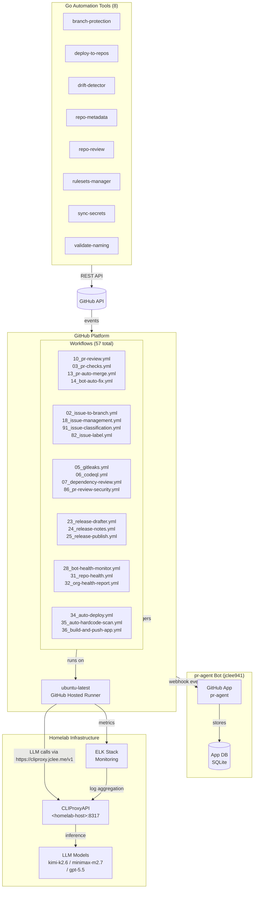

# pr-agent Fork for jclee941 | jclee941용 pr-agent 포크

> AI-powered PR reviewer and GitHub automation platform for `jclee941/*` repositories, backed by a homelab CLIProxyAPI deployment.
> homelab CLIProxyAPI 배포를 기반으로 `jclee941/*` 저장소를 자동화하는 AI PR 리뷰어 및 GitHub 자동화 플랫폼입니다.

[](pyproject.toml)
[](pyproject.toml)
[](LICENSE)
[](https://github.com/qodo-ai/pr-agent)
[](https://cliproxy.jclee.me/v1)
[](#github-workflows-57-total--github-워크플로우-57개)
[](#go-automation-tools-8-total--go-자동화-도구-8개)

---

## Table of Contents | 목차

- [Overview | 개요](#overview--개요)
- [Features | 기능](#features--기능)
- [Architecture | 아키텍처](#architecture--아키텍처)
- [Automation Inventory | 자동화 인벤토리](#automation-inventory--자동화-인벤토리)
  - [GitHub Workflows 57 total | GitHub 워크플로우 57개](#github-workflows-57-total--github-워크플로우-57개)
  - [Go Automation Tools 8 total | Go 자동화 도구 8개](#go-automation-tools-8-total--go-자동화-도구-8개)
- [Repository Structure | 저장소 구조](#repository-structure--저장소-구조)
- [Quick Start | 빠른 시작](#quick-start--빠른-시작)
- [Local Development | 로컬 개발](#local-development--로컬-개발)
- [Commands Reference | 명령어 참조](#commands-reference--명령어-참조)
- [Contribution Guide | 기여 가이드](#contribution-guide--기여-가이드)

---

## Overview | 개요

This repository is a private hard fork of [qodo-ai/pr-agent](https://github.com/qodo-ai/pr-agent), customized for the `jclee941/*` repository ecosystem. It preserves the upstream PR-Agent capabilities while adding repository-wide GitHub automation, security checks, release workflows, issue lifecycle automation, and a homelab-backed LLM gateway.

### Key Characteristics | 주요 특징

| Attribute | Value |
|-----------|-------|
| **Version** | 0.3.1 |
| **Language** | Python 3.12+ |
| **License** | AGPL-3.0 (upstream) + proprietary fork |
| **LLM Backend** | CLIProxyAPI (`https://cliproxy.jclee.me/v1`) |
| **Upstream** | [qodo-ai/pr-agent](https://github.com/qodo-ai/pr-agent) |
| **Workflows** | 57 GitHub Actions workflows |
| **Go Tools** | 8 automation CLI tools |
| **Runner** | GitHub-hosted `ubuntu-latest` + homelab self-hosted |

---

## Features | 기능

### Core PR Agent Features (Upstream Preserved)

- **`/review`** — AI-powered PR review with inline comments
- **`/improve`** — Suggest code improvements
- **`/describe`** — Auto-generate PR description
- **`/ask`** — Question answering on code
- **`/update_changelog`** — Changelog generation
- **Multi-model fallback** — Supports `kimi-k2.6`, `minimax-m2.7`, `gpt-5.5`
- **Dynamic context** — Adaptive token budgeting
- **Slash commands** — Interactive PR commands

### Fork-Specific Automation

| Category | Features |
|----------|----------|
| **PR Automation** | Auto-review, auto-merge, PR checks, stale bot, size labels |
| **Issue Automation** | Lifecycle management, backfill, classification, labeling |
| **Security** | Gitleaks secret scan, CodeQL SAST, dependency review, scorecard |
| **Release** | Release drafter, semantic versioning, auto-tag, publish |
| **Repository Health** | Drift detection, health reports, org-wide monitoring |
| **Documentation** | README generation, docs sync, template sync |
| **CI/CD** | Auto-deploy, e2e testing, healing, reusable workflows |

---

## Architecture | 아키텍처



### Data Flow | 데이터 흐름

1. **PR/Issue Event** → GitHub Webhook → GitHub App
2. **Workflow Trigger** → `ubuntu-latest` runner → CLI calls via `https://cliproxy.jclee.me/v1`
3. **LLM Inference** → Homelab CLIProxy → Model selection (kimi-k2.6 → minimax-m2.7 → gpt-5.5)
4. **Go Tools** → Direct GitHub API → Repository/Org operations

---

## Automation Inventory | 자동화 인벤토리

### GitHub Workflows (57 total) | GitHub 워크플로우 57개

#### PR Automation | PR 자동화

| Workflow File | Purpose |
|---------------|---------|
| `01_branch-to-pr.yml` | Convert branch to PR |
| `03_pr-checks.yml` | PR validation checks |
| `09_semantic-pr.yml` | Semantic PR title enforcement |
| `10_pr-review.yml` | AI PR review (main) |
| `13_pr-auto-merge.yml` | Auto-merge on approval |
| `14_bot-auto-fix.yml` | Auto-fix PR issues |
| `15_merged-pr-cleanup.yml` | Post-merge cleanup |
| `17_pr-stale-bot.yml` | Mark stale PRs |
| `85_pr-normalize.yml` | PR normalization |
| `86_pr-review-security.yml` | Security-focused review |
| `87_pr-size.yml` | PR size labeling |
| `security/11_pr-review.yml` | Deep security review |

#### Issue Automation | 이슈 자동화

| Workflow File | Purpose |
|---------------|---------|
| `02_issue-to-branch.yml` | Issue to branch creation |
| `18_issue-management.yml` | Issue management |
| `19_issue-backfill.yml` | Issue backfill |
| `82_issue-label.yml` | Auto-labeling |
| `83_issue-lifecycle.yml` | Lifecycle management |
| `84_labeler.yml` | Label management |
| `89_welcome.yml` | New issue welcome |
| `90_sanity.yml` | Fork CI gate |
| `91_issue-classification.yml` | Issue classification |

#### Security & Scanning | 보안 및 스캐닝

| Workflow File | Purpose |
|---------------|---------|
| `04_actionlint.yml` | YAML linting |
| `05_gitleaks.yml` | Secret scanning |
| `06_codeql.yml` | SAST analysis |
| `07_dependency-review.yml` | Dependency check |
| `08_scorecard.yml` | Security scorecard |
| `35_auto-hardcode-scan.yml` | Hardcode pattern scan |

#### Release & Deployment | 배포 및 릴리스

| Workflow File | Purpose |
|---------------|---------|
| `23_release-drafter.yml` | Release draft generation |
| `24_release-notes.yml` | Release notes generation |
| `25_release-publish.yml` | Release publishing |
| `34_auto-deploy.yml` | Auto-deployment |
| `36_build-and-push-app.yml` | Docker image build/push |

#### Health & Monitoring | 상태 및 모니터링

| Workflow File | Purpose |
|---------------|---------|
| `26_elk-health-check.yml` | ELK stack health |
| `27_elk-setup.yml` | ELK setup |
| `28_bot-health-monitor.yml` | Bot health monitoring |
| `29_downstream-health-check.yml` | Downstream repo health |
| `30_runtime-health-check.yml` | Runtime health |
| `31_repo-health.yml` | Repository health |
| `32_org-health-report.yml` | Organization health |
| `33_drift-detector.yml` | Drift detection |

#### Documentation & Sync | 문서화 및 동기화

| Workflow File | Purpose |
|---------------|---------|
| `20_readme-gen.yml` | README generation |
| `21_docs-sync.yml` | Documentation sync |
| `22_template-sync.yml` | Template sync |

#### CI/CD & Testing | CI/CD 및 테스트

| Workflow File | Purpose |
|---------------|---------|
| `38_e2e.yml` | End-to-end tests |
| `39_e2e-live.yml` | Live e2e tests |
| `40_repo-review-batch.yml` | Batch repo review |
| `41_reusable-ci.yml` | Reusable CI template |
| `42_reusable-docs-sync.yml` | Reusable docs sync |
| `43_reusable-issue-management.yml` | Reusable issue management |
| `44_reusable-pr-checks.yml` | Reusable PR checks |
| `45_reusable-gitleaks.yml` | Reusable gitleaks |
| `60_ci-auto-heal.yml` | CI auto-healing |

#### Automation & Maintenance | 자동화 및 유지보수

| Workflow File | Purpose |
|---------------|---------|
| `12_dependabot-auto-merge.yml` | Dependabot auto-merge |
| `16_stale-repo-identifier.yml` | Stale repo identification |
| `37_ci-failure-issues.yml` | CI failure issue creation |
| `81_auto-merge.yml` | General auto-merge |

#### Stale Management | 만료 관리

| Workflow File | Purpose |
|---------------|---------|
| `88_stale.yml` | Generic stale management |

---

### Go Automation Tools (8 total) | Go 자동화 도구 8개

| Tool | Purpose | Entry Point |
|------|---------|-------------|
| `branch-protection` | Manage branch protection rules | `scripts/cmd/branch-protection/main.go` |
| `deploy-to-repos` | Deploy workflows to `jclee941/*` repos | `scripts/cmd/deploy-to-repos/main.go` |
| `drift-detector` | Detect infrastructure drift | `scripts/cmd/drift-detector/main.go` |
| `repo-metadata` | Manage repository metadata | `scripts/cmd/repo-metadata/main.go` |
| `repo-review` | Batch repository review | `scripts/cmd/repo-review/main.go` |
| `rulesets-manager` | GitHub Rulesets management | `scripts/cmd/rulesets-manager/main.go` |
| `sync-secrets` | Synchronize secrets across repos | `scripts/cmd/sync-secrets/main.go` |
| `validate-naming` | Validate naming conventions | `scripts/cmd/validate-naming/main.go` |

### Tool Invocation | 도구 호출 방법

```bash
# From scripts/ directory
cd scripts && go run ./cmd/<tool-name>

# Example: deploy workflow to repos
cd scripts && go run ./cmd/deploy-to-repos

# Example: manage branch protection
cd scripts && go run ./cmd/branch-protection

# Example: detect drift
cd scripts && go run ./cmd/drift-detector
```

---

## Repository Structure | 저장소 구조

```
.
├── .github/
│   ├── workflows/          # 57 workflow YAML files
│   │   ├── 01_branch-to-pr.yml
│   │   ├── 02_issue-to-branch.yml
│   │   ├── 03_pr-checks.yml
│   │   ├── ...
│   │   ├── 90_sanity.yml
│   │   ├── 91_issue-classification.yml
│   │   └── security/
│   │       └── 11_pr-review.yml
│   ├── CODEOWNERS
│   ├── PULL_REQUEST_TEMPLATE.md
│   └── ISSUE_TEMPLATE/
├── pr_agent/               # Upstream pr-agent package (AI PR reviewer)
│   ├── api/
│   ├── bins/
│   ├── clips/
│   ├── modules/
│   ├── tools/
│   └── ...
├── scripts/                # Go automation tools
│   ├── cmd/
│   │   ├── branch-protection/
│   │   ├── deploy-to-repos/
│   │   ├── drift-detector/
│   │   ├── repo-metadata/
│   │   ├── repo-review/
│   │   ├── rulesets-manager/
│   │   ├── sync-secrets/
│   │   └── validate-naming/
│   ├── go.mod
│   └── (test files)
├── tests/
│   ├── unittest/           # Unit tests (50+ test files)
│   ├── e2e/                # End-to-end tests
│   └── e2e_live/           # Live e2e tests
├── docs/                   # Documentation
│   ├── architecture.md
│   ├── automation-enhancement-brainstorm.md
│   ├── git-workflow-gap-analysis.md
│   ├── github-profile-enhancement-brainstorm.md
│   ├── pr-agent-upstream-README.md
│   └── review-templates/
├── config/
│   └── repos.yaml          # Repository configuration
├── Dockerfiles/
│   ├── Dockerfile.github_action
│   └── Dockerfile.github_app
├── docker-compose/
│   ├── github_app.yml
│   └── github_app.yml.lxc
├── filebeat.yml            # ELK logging configuration
├── Makefile                # Development commands
├── pyproject.toml          # Python project config (v0.3.1)
├── requirements.txt        # Python dependencies
├── requirements-dev.txt    # Dev dependencies
├── setup.py                # Legacy setup compatibility
├── AGENTS.md               # Project knowledge base
├── CODE_OF_CONDUCT.md
├── CONTRIBUTING.md
├── LICENSE
├── NOTICE                  # AGPL-3.0 attribution
├── README.md               # This file
└── SECURITY.md
```

---

## Quick Start | 빠른 시작

### Prerequisites | 사전 요구사항

- Python 3.12+
- GitHub App installed on target repos
- Access to `https://cliproxy.jclee.me/v1` (LLM gateway)

### Installation | 설치

```bash
# Clone repository
git clone https://github.com/jclee941/.github
cd github-bot

# Create virtual environment
python3.12 -m venv .venv
source .venv/bin/activate

# Install dependencies
pip install --upgrade pip
pip install -e .

# Or use Makefile
make install
```

### Configuration | 설정

```bash
# Copy environment template
cp .env.example .env

# Edit .env with your values
# Required variables:
#   CLI_PROXY_API_KEY=<your-api-key>
#   CLI_PROXY_API_BASE=https://cliproxy.jclee.me/v1
#   GITHUB_APP_ID=<your-app-id>
#   GITHUB_APP_PRIVATE_KEY=<your-private-key>
```

### Run pr-agent CLI | pr-agent CLI 실행

```bash
# Interactive mode
pr-agent

# Or via Python module
python -m pr_agent.cli run
```

---

## Local Development | 로컬 개발

### Development Setup | 개발 환경 설정

```bash
# Activate virtual environment
source .venv/bin/activate

# Install dev dependencies
pip install -r requirements-dev.txt

# Install pre-commit hooks (if configured)
# (none configured in this repo)
```

### Running Tests | 테스트 실행

```bash
# Run all tests (unit + e2e + live)
make test

# Unit tests only
make test-unit

# End-to-end tests
make test-e2e

# Live e2e tests
make test-live

# Run with coverage
python -m pytest tests/unittest --cov=pr_agent --cov-report=html
```

### Linting | 린팅

```bash
# Run ruff linter
make lint

# Or directly
.venv/bin/python -m ruff check .
```

### Clean | 정리

```bash
# Remove cache files
make clean

# Or manually
rm -rf .pytest_cache
find . -type d -name __pycache__ -exec rm -rf {} +
```

---

## Commands Reference | 명령어 참조

### Makefile Targets | Makefile 타겟

| Command | Description |
|---------|-------------|
| `make install` | Install project and dependencies |
| `make test` | Run unit + e2e + live tests |
| `make test-unit` | Run unit tests only |
| `make test-e2e` | Run end-to-end tests |
| `make test-live` | Run live e2e tests |
| `make lint` | Run ruff linter |
| `make clean` | Remove cache and pycache |

### Go Tools | Go 도구

```bash
# Branch protection management
cd scripts && go run ./cmd/branch-protection

# Deploy workflows to repos
cd scripts && go run ./cmd/deploy-to-repos

# Drift detection
cd scripts && go run ./cmd/drift-detector

# Repository metadata
cd scripts && go run ./cmd/repo-metadata

# Batch repo review
cd scripts && go run ./cmd/repo-review

# Rulesets management
cd scripts && go run ./cmd/rulesets-manager

# Secrets synchronization
cd scripts && go run ./cmd/sync-secrets

# Naming validation
cd scripts && go run ./cmd/validate-naming

# Run all tests in Go tools
cd scripts && go test ./...
```

### pr-agent CLI | pr-agent CLI

```bash
# Start pr-agent
pr-agent

# Or via module
python -m pr_agent.cli run

# Get help
pr-agent --help
```

---

## Contribution Guide | 기여 가이드

### Fork Delta Expectations | 포크 델타 기대사항

This is a **hard fork** of [qodo-ai/pr-agent](https://github.com/qodo-ai/pr-agent). Contributions should focus on:

1. **Fork-specific automation** — Workflows, Go tools, GitHub App integration
2. **Homelab integration** — CLIProxyAPI, ELK stack, self-hosted runner adaptation
3. **Security enhancements** — Additional scanning, hardening, compliance
4. **Bug fixes** — Issues specific to the fork's environment

### Upstream Preservation | 업스트림 유지

- Do **not** modify `pr_agent/` core logic unless absolutely necessary
- Upstream pr-agent features are preserved as-is
- If upstream has relevant fixes, consider rebasing rather than patching

### Workflow Development | 워크플로우 개발

When adding new workflows:

1. Follow the numeric prefix convention (e.g., `92_new-workflow.yml`)
2. Use `ubuntu-latest` for GitHub-hosted runners
3. Reference `https://cliproxy.jclee.me/v1` for LLM calls
4. Add corresponding test coverage
5. Update `README.md` automation inventory

### Go Tool Development | Go 도구 개발

When adding new Go tools:

1. Create under `scripts/cmd/<tool-name>/`
2. Include `main.go` and `main_test.go`
3. Use table-driven tests for pure logic
4. Update `README.md` automation inventory
5. Document in `AGENTS.md`

### Code Style | 코드 스타일

- **Python** — ruff (line-length: 120)
- **Go** — Standard Go formatting (`go fmt`)
- **YAML** — actionlint validated
- **Markdown** — mardownlint (config in `.markdownlint.json`)

### Reporting Issues | 이슈 보고

- Use GitHub Issues for bug reports
- Use issue templates in `.github/ISSUE_TEMPLATE/`
- Security vulnerabilities → See `SECURITY.md`

### License | 라이선스

- **Upstream**: AGPL-3.0 (qodo-ai/pr-agent)
- **Fork modifications**: Proprietary to jclee941
- See [NOTICE](NOTICE) for upstream attribution

---

## Links | 링크

| Resource | URL |
|----------|-----|
| Repository | <https://github.com/jclee941/.github> |
| Upstream | <https://github.com/qodo-ai/pr-agent> |
| CLIProxy Gateway | <https://cliproxy.jclee.me/v1> |
| Documentation | <https://github.com/jclee941/.github#readme> |
| Bot Profile | <https://bot.jclee.me> |

---

*Generated by README generation workflow (20_readme-gen.yml) — Model: minimax-m2.7 via CLIProxyAPI*
