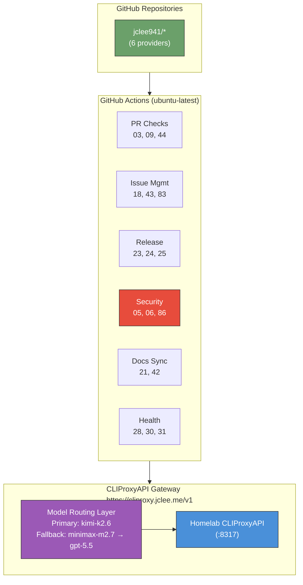

# pr-agent Fork for jclee941 | jclee941용 pr-agent 포크

> 개인 homelab CLIProxyAPI 백엔드를 사용하는 AI 기반 PR 리뷰어 및 자동화 봇
> AI-powered PR reviewer and automation bot backed by a homelab CLIProxyAPI

[](https://github.com/qodo-ai/pr-agent)
[](https://www.python.org/)
[](LICENSE)
[](https://github.com/qodo-ai/pr-agent)


---

## Table of Contents | 목차

- [Overview | 개요](#overview--개요)
- [Features | 기능](#features--기능)
- [Architecture | 아키텍처](#architecture--아키텍처)
- [Automation Inventory | 자동화 인벤토리](#automation-inventory--자동화-인벤토리)
  - [GitHub Workflows (56 total) | GitHub 워크플로우 (56개)](#github-workflows-56-total--github-워크플로우-56개)
  - [Go Automation Tools (8 total) | Go 자동화 도구 (8개)](#go-automation-tools-8-total--go-자동화-도구-8개)
- [Quick Start | 빠른 시작](#quick-start--빠른-시작)
- [Local Development | 로컬 개발](#local-development--로컬-개발)
- [Commands Reference | 명령어 참조](#commands-reference--명령어-참조)
- [Contribution | 기여](#contribution--기여)

---

## Overview | 개요

This repository is a hard fork of [qodo-ai/pr-agent](https://github.com/qodo-ai/pr-agent), customized for `jclee941/*` repositories. It uses a homelab-hosted CLIProxyAPI (`<homelab-host>:8317`) as the primary LLM backend, accessible externally via `https://cliproxy.jclee.me/v1`.

이 저장소는 `jclee941/*` 저장소를 위해 커스터마이징된 [qodo-ai/pr-agent](https://github.com/qodo-ai/pr-agent)의 하드 포크입니다. 개인 homelab에 호스팅된 CLIProxyAPI (`<homelab-host>:8317`)를 주요 LLM 백엔드로 사용하며, 외부에서는 `https://cliproxy.jclee.me/v1`를 통해 접근합니다.

### Key Models | 주요 모델

| Model | Role | Endpoint |
|-------|------|----------|
| `kimi-k2.6` | Primary | CLIProxyAPI |
| `minimax-m2.7` | Fallback | CLIProxyAPI CLI |
| `gpt-5.5` | Fallback | CLIProxyAPI CLI |

### Multi-Provider Support | 멀티 프로바이더 지원

- **GitHub** (Actions + App)
- **GitLab**
- **Bitbucket**
- **Azure DevOps**
- **Gitea**
- **AWS CodeCommit**

---

## Features | 기능

### AI-Powered PR Commands | AI 기반 PR 명령어

| Command | Description | 설명 |
|---------|-------------|------|
| `/review` | Generates a comprehensive PR review | 포괄적인 PR 리뷰 생성 |
| `/improve` | Suggests code improvements | 코드 개선 제안 |
| `/describe` | Generates PR description | PR 설명 생성 |
| `/ask` | Answers questions about the PR | PR 관련 질문 답변 |
| `/update_changelog` | Updates changelog file | 체인지로그 파일 업데이트 |
| `/generate_labels` | Auto-generates PR labels | PR 라벨 자동 생성 |
| `/add_docs` | Adds documentation | 문서 추가 |
| `/test` | Generates tests | 테스트 생성 |
| `/refactor` | Refactors code | 코드 리팩토링 |

### Workflow Automation | 워크플로우 자동화

- **Branch Management**: Auto-create PRs from branches, issue-to-branch mapping
- **PR Checks**: Semantic PR validation, dependency review, security scanning
- **Auto-Merge**: Automatic PR merging with configurable conditions
- **Issue Management**: Lifecycle management, labeling, stale detection
- **Release Automation**: Release drafter, changelog generation, publishing
- **Health Monitoring**: Runtime health checks, downstream dependency monitoring
- **Documentation Sync**: Cross-repository documentation synchronization

### Security Features | 보안 기능

- **Secret Scanning**: Gitleaks integration for detecting exposed secrets
- **CodeQL Analysis**: Static application security testing (SAST)
- **Dependency Review**: Vulnerability scanning for dependencies
- **Security PR Review**: Deep security review workflow with Korean language support
- **Hardcode Detection**: Weekly scanning for hardcoded credentials

---

## Architecture | 아키텍처



### Key Architecture Decisions | 주요 아키텍처 결정

| Component | Technology | Purpose |
|-----------|------------|---------|
| LLM Backend | CLIProxyAPI | Homelab-hosted inference server |
| Primary Model | kimi-k2.6 | Main reasoning model via OpenAI-compatible API |
| Fallback Chain | minimax-m2.7 → gpt-5.5 | Reliability through model diversity |
| Runner | ubuntu-latest | GitHub-hosted runners for workflow execution |
| External Access | cliproxy.jclee.me | Public-facing proxy to homelab API |

---

## Automation Inventory | 자동화 인벤토리

### GitHub Workflows (56 total) | GitHub 워크플로우 (56개)

#### Pull Request Workflows | PR 워크플로우

| Workflow | File | Description | 설명 |
|----------|------|-------------|------|
| **Branch to PR** | `01_branch-to-pr.yml` | Auto-create PR from branch | 브랜치에서 PR 자동 생성 |
| **PR Checks** | `03_pr-checks.yml` | Comprehensive PR validation suite | 포괄적인 PR 검증 스위트 |
| **Semantic PR** | `09_semantic-pr.yml` | Enforce semantic commit conventions | 시맨틱 커밋 규칙 강제 |
| **PR Review** | `10_pr-review.yml` | AI-powered PR review (primary) | AI 기반 PR 리뷰 (주) |
| **Security PR Review** | `security/11_pr-review.yml` | Deep security review with Korean support | 한국어 지원 보안 심층 리뷰 |
| **PR Auto-Merge** | `13_pr-auto-merge.yml` | Automatic PR merging | 자동 PR 병합 |
| **Bot Auto-Fix** | `14_bot-auto-fix.yml` | Bot-initiated automatic fixes | 봇 시작 자동 수정 |
| **Merged PR Cleanup** | `15_merged-pr-cleanup.yml` | Post-merge cleanup tasks | 병합 후 정리 작업 |
| **PR Stale Bot** | `17_pr-stale-bot.yml` | Mark stale PRs | 오래된 PR 표시 |
| **Dependabot Auto-Merge** | `12_dependabot-auto-merge.yml` | Auto-merge dependency updates | 의존성 업데이트 자동 병합 |
| **CI Auto-Heal** | `60_ci-auto-heal.yml` | Automatic CI failure recovery | CI 실패 자동 복구 |
| **Auto-Merge** | `81_auto-merge.yml` | Generic auto-merge workflow | 범용 자동 병합 워크플로우 |
| **PR Normalize** | `85_pr-normalize.yml` | Standardize PR format | PR 형식 표준화 |
| **PR Size** | `87_pr-size.yml` | Track PR size metrics | PR 크기 메트릭 추적 |

#### Issue Management Workflows | 이슈 관리 워크플로우

| Workflow | File | Description | 설명 |
|----------|------|-------------|------|
| **Issue to Branch** | `02_issue-to-branch.yml` | Create branch from issue | 이슈에서 브랜치 생성 |
| **Issue Management** | `18_issue-management.yml` | Comprehensive issue handling | 포괄적 이슈 처리 |
| **Issue Backfill** | `19_issue-backfill.yml` | Populate missing issue data | 누락된 이슈 데이터 채우기 |
| **Reusable Issue Management** | `43_reusable-issue-management.yml` | Shared issue logic | 공유 이슈 로직 |
| **Issue Label** | `82_issue-label.yml` | Automatic issue labeling | 자동 이슈 라벨링 |
| **Issue Lifecycle** | `83_issue-lifecycle.yml` | Manage issue lifecycle | 이슈 라이프사이클 관리 |
| **Stale Repo Identifier** | `16_stale-repo-identifier.yml` | Identify inactive repositories | 비활성 저장소 식별 |
| **Stale** | `88_stale.yml` | Generic stale issue/PR management | 범용 오래된 이슈/PR 관리 |
| **Welcome** | `89_welcome.yml` | Welcome message for contributors | 기여자 환영 메시지 |

#### Security Workflows | 보안 워크플로우

| Workflow | File | Description | 설명 |
|----------|------|-------------|------|
| **Actionlint** | `04_actionlint.yml` | GitHub Actions YAML linting | GitHub Actions YAML 린팅 |
| **Gitleaks** | `05_gitleaks.yml` | Secret pattern scanning | 시크릿 패턴 스캐닝 |
| **CodeQL** | `06_codeql.yml` | Static application security testing | 정적 애플리케이션 보안 테스트 |
| **Dependency Review** | `07_dependency-review.yml` | Dependency vulnerability scanning | 의존성 취약점 스캐닝 |
| **Scorecard** | `08_scorecard.yml` | Security scorecard analysis | 보안 점수 분석 |
| **Security PR Review** | `86_pr-review-security.yml` | Security-focused PR review | 보안 중심 PR 리뷰 |
| **Auto Hardcode Scan** | `35_auto-hardcode-scan.yml` | Weekly hardcoded credential scan | 주간 하드코딩 자격증명 스캔 |

#### Documentation Workflows | 문서 워크플로우

| Workflow | File | Description | 설명 |
|----------|------|-------------|------|
| **README Gen** | `20_readme-gen.yml` | Auto-generate README files | README 파일 자동 생성 |
| **Docs Sync** | `21_docs-sync.yml` | Synchronize documentation | 문서 동기화 |
| **Reusable Docs Sync** | `42_reusable-docs-sync.yml` | Shared documentation logic | 공유 문서 로직 |
| **Template Sync** | `22_template-sync.yml` | Sync repository templates | 저장소 템플릿 동기화 |

#### Release Workflows | 릴리스 워크플로우

| Workflow | File | Description | 설명 |
|----------|------|-------------|------|
| **Release Drafter** | `23_release-drafter.yml` | Draft release notes | 릴리스 노트 초안 작성 |
| **Release Notes** | `24_release-notes.yml` | Generate release notes | 릴리스 노트 생성 |
| **Release Publish** | `25_release-publish.yml` | Publish releases | 릴리스 게시 |

#### Health & Monitoring Workflows | 상태 및 모니터링 워크플로우

| Workflow | File | Description | 설명 |
|----------|------|-------------|------|
| **ELK Health Check** | `26_elk-health-check.yml` | Elasticsearch/Logstash/Kibana health | ELK 스택 상태 확인 |
| **ELK Setup** | `27_elk-setup.yml` | ELK stack configuration | ELK 스택 구성 |
| **Bot Health Monitor** | `28_bot-health-monitor.yml` | Bot service health monitoring | 봇 서비스 상태 모니터링 |
| **Downstream Health Check** | `29_downstream-health-check.yml` | Check downstream dependencies | 다운스트림 의존성 확인 |
| **Runtime Health Check** | `30_runtime-health-check.yml` | Runtime environment health | 런타임 환경 상태 |
| **Repo Health** | `31_repo-health.yml` | Repository health metrics | 저장소 상태 메트릭 |
| **Org Health Report** | `32_org-health-report.yml` | Organization-level health report | 조직 수준 상태 보고서 |
| **Drift Detector** | `33_drift-detector.yml` | Detect configuration drift | 구성 드리프트 감지 |

#### Deployment & Build Workflows | 배포 및 빌드 워크플로우

| Workflow | File | Description | 설명 |
|----------|------|-------------|------|
| **Auto Deploy** | `34_auto-deploy.yml` | Automatic deployment pipeline | 자동 배포 파이프라인 |
| **Build and Push App** | `36_build-and-push-app.yml` | Build and push container images | 컨테이너 이미지 빌드 및 푸시 |
| **CI Failure Issues** | `37_ci-failure-issues.yml` | Create issues for CI failures | CI 실패 시 이슈 생성 |

#### Testing Workflows | 테스트 워크플로우

| Workflow | File | Description | 설명 |
|----------|------|-------------|------|
| **E2E** | `38_e2e.yml` | End-to-end tests | 엔드투엔드 테스트 |
| **E2E Live** | `39_e2e-live.yml` | Live environment E2E tests | 라이브 환경 엔드투엔드 테스트 |

#### Repository Management Workflows | 저장소 관리 워크플로우

| Workflow | File | Description | 설명 |
|----------|------|-------------|------|
| **Repo Review Batch** | `40_repo-review-batch.yml` | Batch repository reviews | 배치 저장소 리뷰 |
| **Reusable CI** | `41_reusable-ci.yml` | Shared CI logic | 공유 CI 로직 |
| **Reusable Gitleaks** | `45_reusable-gitleaks.yml` | Shared secret scanning logic | 공유 시크릿 스캐닝 로직 |
| **Sanity** | `90_sanity.yml` | Fork CI gate (replaces upstream CI) | 포크 CI 게이트 |
| **Labeler** | `84_labeler.yml` | Automated label assignment | 자동 라벨 할당 |

---

### Go Automation Tools (8 total) | Go 자동화 도구 (8개)

| Tool | Path | Description | 설명 |
|------|------|-------------|------|
| **branch-protection** | `scripts/cmd/branch-protection/` | Manage branch protection rules | 브랜치 보호 규칙 관리 |
| **deploy-to-repos** | `scripts/cmd/deploy-to-repos/` | Deploy workflows to repositories | 저장소에 워크플로우 배포 |
| **drift-detector** | `scripts/cmd/drift-detector/` | Detect infrastructure drift | 인프라 드리프트 감지 |
| **repo-metadata** | `scripts/cmd/repo-metadata/` | Extract repository metadata | 저장소 메타데이터 추출 |
| **repo-review** | `scripts/cmd/repo-review/` | Review repository configurations | 저장소 구성 검토 |
| **rulesets-manager** | `scripts/cmd/rulesets-manager/` | Manage GitHub Rulesets | GitHub Rulesets 관리 |
| **sync-secrets** | `scripts/cmd/sync-secrets/` | Synchronize secrets across repos | 저장소 간 시크릿 동기화 |
| **validate-naming** | `scripts/cmd/validate-naming/` | Validate naming conventions | 명명 규칙 검증 |

---

## Quick Start | 빠른 시작

### Prerequisites | 사전 요구사항

- Python 3.12+
- GitHub CLI (`gh`)
- Docker (for containerized development)
- Access to CLIProxyAPI at `https://cliproxy.jclee.me/v1`

### Installation | 설치

```bash
# Clone the repository
git clone https://github.com/qodo-ai/pr-agent.git
cd pr-agent

# Create virtual environment
python3.12 -m venv .venv
source .venv/bin/activate

# Install dependencies
pip install --upgrade pip
pip install -e .
```

### Configuration | 구성

1. **Environment Variables** | 환경 변수:

```bash
# Required for CLIProxyAPI
export OPENAI_API_KEY="your-api-key"
export OPENAI_API_BASE="https://cliproxy.jclee.me/v1"

# Model configuration
export AI_MODEL="kimi-k2.6"
export FALLBACK_MODELS="minimax-m2.7,gpt-5.5"
```

2. **Configuration File** | 구성 파일:

Create `.pr_agent.toml` in your repository root:

```toml
[config]
model = "kimi-k2.6"
fallback_models = ["minimax-m2.7", "gpt-5.5"]

[openai]
api_base = "https://cliproxy.jclee.me/v1"

[litellm]
request_timeout = 120
```

### Using PR Commands | PR 명령어 사용

After installation, comment on any PR with:

```
/review
/improve
/describe
/ask What does this PR do?
/update_changelog
```

---

## Local Development | 로컬 개발

### Development Environment Setup | 개발 환경 설정

```bash
# Install development dependencies
pip install -r requirements-dev.txt

# Install pre-commit hooks
pre-commit install
```

### Running Tests | 테스트 실행

```bash
# Run all tests
make test

# Run unit tests only
make test-unit

# Run e2e tests
make test-e2e

# Run live tests (against real providers)
make test-live

# Run with coverage
pytest tests/unittest --cov=pr_agent --cov-report=html
```

### Linting | 린팅

```bash
# Run ruff linter
make lint

# Auto-fix linting issues
ruff check --fix
```

### Docker Development | Docker 개발

```bash
# Build GitHub Action image
docker build -f Dockerfile.github_action -t pr-agent-action .

# Build GitHub App image
docker build -f Dockerfile.github_app -t pr-agent-app .

# Run with docker-compose
docker-compose -f docker-compose.github_app.yml up
```

### Go Tools Development | Go 도구 개발

```bash
cd scripts

# Build all tools
go build ./...

# Run specific tool
go run ./cmd/branch-protection

# Run tests
go test ./cmd/...
```

---

## Commands Reference | 명령어 참조

### Makefile Commands | Makefile 명령어

| Command | Description | 설명 |
|---------|-------------|------|
| `make install` | Install package and dependencies | 패키지 및 의존성 설치 |
| `make test` | Run all tests (unit + e2e + live) | 모든 테스트 실행 |
| `make test-unit` | Run unit tests only | 유닛 테스트만 실행 |
| `make test-e2e` | Run e2e tests only | E2E 테스트만 실행 |
| `make test-live` | Run live tests against real providers | 실제 프로바이더 대상 라이브 테스트 |
| `make lint` | Run ruff linter | ruff 린터 실행 |
| `make clean` | Clean build artifacts and cache | 빌드 산출물 및 캐시 정리 |

### PR Agent CLI Commands | PR Agent CLI 명령어

```bash
# Run pr-agent directly
pr-agent review --pr_url https://github.com/owner/repo/pull/123

# Help
pr-agent --help
```

### Go Tools Commands | Go 도구 명령어

```bash
# branch-protection
go run ./cmd/branch-protection --repo owner/repo --protection '{"required_status_checks": ...}'

# deploy-to-repos
go run ./cmd/deploy-to-repos --repos "owner/repo1,owner/repo2" --workflow 10_pr-review.yml

# drift-detector
go run ./cmd/drift-detector --repo owner/repo --baseline baseline.json

# repo-metadata
go run ./cmd/repo-metadata --repo owner/repo

# repo-review
go run ./cmd/repo-review --repo owner/repo

# rulesets-manager
go run ./cmd/rulesets-manager --repo owner/repo --action list

# sync-secrets
go run ./cmd/sync-secrets --source owner/repo --targets "repo1,repo2"

# validate-naming
go run ./cmd/validate-naming --patterns "*.yml,*.yaml"
```

---

## Contribution | 기여

### Contributing Guidelines | 기여 지침

Please read our [CONTRIBUTING.md](CONTRIBUTING.md) for details on our development workflow and contribution guidelines.

세부 사항과 기여 지침은 [CONTRIBUTING.md](CONTRIBUTING.md)를 참고하세요.

### Code of Conduct | 행동 강령

Please read our [CODE_OF_CONDUCT.md](CODE_OF_CONDUCT.md) for details on our community expectations.

커뮤니티 기대치에 대한 세부 사항은 [CODE_OF_CONDUCT.md](CODE_OF_CONDUCT.md)를 참고하세요.

### Security Policy | 보안 정책

For security vulnerabilities, please read [SECURITY.md](SECURITY.md).

보안 취약점については [SECURITY.md](SECURITY.md)를 참고하세요.

### Repository Structure | 저장소 구조

```
.github/                       # this repository (jclee941/.github)
├── .github/
│   ├── workflows/             # GitHub Actions workflows (56 total)
│   ├── CODEOWNERS             # Auto-reviewer assignment
│   ├── PULL_REQUEST_TEMPLATE.md
│   └── ISSUE_TEMPLATE/        # Bug / Feature / Security templates
├── pr_agent/                  # Python package source (upstream fork)
├── scripts/                   # Go automation tools + Python runners
│   ├── cmd/                   # Go tool entry points (8 tools)
│   ├── internal/              # Shared Go packages
│   ├── go.mod
│   ├── generate_readme.py
│   ├── pr_review_runner.py
│   └── repo_review.py
├── github_action/
│   └── entrypoint.sh          # Docker entrypoint for GitHub Action
├── docs/                      # Documentation
│   ├── architecture.md
│   ├── review-templates/      # Code review, security, documentation templates
│   └── assets/                # Images and static assets
├── config/
│   └── repos.yaml             # Repository configuration
├── templates/                 # Bilingual PR/issue/contributing templates
├── tests/                     # pytest suite (unit + e2e)
├── Dockerfile.github_action
├── Dockerfile.github_app
├── docker-compose.github_app.yml
├── .pr_agent.toml             # Fork config (CLIProxyAPI + review overrides)
├── pyproject.toml
├── requirements.txt
├── requirements-dev.txt
└── Makefile
```

### Reporting Issues | 이슈 보고

- **Bug Reports**: Use GitHub Issues with the Bug template
- **Feature Requests**: Use GitHub Issues with the Feature template
- **Security Issues**: See [SECURITY.md](SECURITY.md) for responsible disclosure

---

## Documentation References | 문서 참고

- [Upstream README](docs/pr-agent-upstream-README.md) — Original pr-agent documentation
- [Architecture](docs/architecture.md) — Detailed system architecture
- [Automation Enhancement Brainstorm](docs/automation-enhancement-brainstorm.md) — Future automation ideas
- [Git Workflow Gap Analysis](docs/git-workflow-gap-analysis.md) — Workflow analysis report

### Review Templates | 리뷰 템플릿

- [Code Review Template](docs/review-templates/code-review-template.md)
- [Documentation Checklist](docs/review-templates/documentation-checklist.md)
- [Security Review Template](docs/review-templates/security-review-template.md)

---

## License | 라이선스

This project is licensed under the **AGPL-3.0** license. See [LICENSE](LICENSE) for details.

This is a derivative work of [qodo-ai/pr-agent](https://github.com/qodo-ai/pr-agent). See [NOTICE](NOTICE) for attribution.

---

<div align="center">

**Maintained by jclee941** | **Maintained by jclee941**

*Powered by* [CLIProxyAPI](https://cliproxy.jclee.me) | *Powered by* [CLIProxyAPI](https://cliproxy.jclee.me)

</div>
