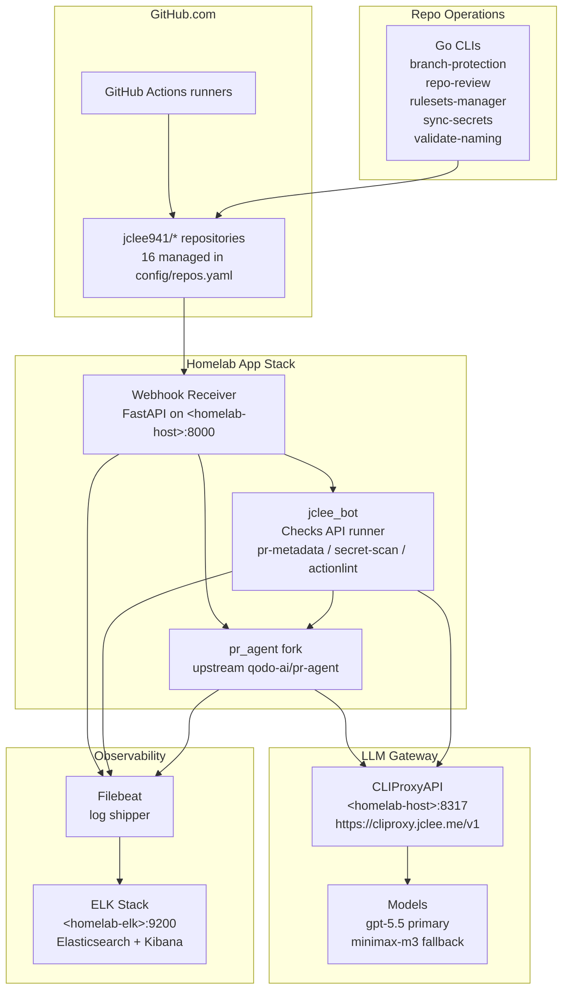

# pr-agent Fork for jclee941 | jclee941용 pr-agent 포크

> AI-powered PR reviewer and GitHub automation platform for `jclee941/*` repositories, backed by a homelab CLIProxyAPI deployment.
> homelab CLIProxyAPI 배포를 기반으로 `jclee941/*` 저장소를 자동화하는 AI PR 리뷰어 및 GitHub 자동화 플랫폼입니다.

[](pyproject.toml)
[](pyproject.toml)
[](LICENSE)
[](https://github.com/qodo-ai/pr-agent)
[](https://cliproxy.jclee.me/v1)
[](#github-workflows-33-total--github-워크플로우-33개)
[](#go-automation-tools-5-total--go-자동화-도구-5개)

---

## Table of Contents | 목차

- [Overview | 개요](#overview--개요)
- [Features | 기능](#features--기능)
- [Architecture | 아키텍처](#architecture--아키텍처)
- [Automation Inventory | 자동화 인벤토리](#automation-inventory--자동화-인벤토리)
  - [GitHub Workflows 33 total | GitHub 워크플로우 33개](#github-workflows-33-total--github-워크플로우-33개)
  - [Go Automation Tools 5 total | Go 자동화 도구 5개](#go-automation-tools-5-total--go-자동화-도구-5개)
- [Repository Structure | 저장소 구조](#repository-structure--저장소-구조)
- [Quick Start | 빠른 시작](#quick-start--빠른-시작)
- [Local Development | 로컬 개발](#local-development--로컬-개발)
- [Commands Reference | 명령어 참조](#commands-reference--명령어-참조)
- [Configuration | 설정](#configuration--설정)
- [Documentation Generation | 문서 자동 생성](#documentation-generation--문서-자동-생성)
- [Contribution Guide | 기여 가이드](#contribution-guide--기여-가이드)
- [License | 라이선스](#license--라이선스)

---

## Overview | 개요

This repository is a private hard fork of [qodo-ai/pr-agent](https://github.com/qodo-ai/pr-agent), customized for the `jclee941/*` repository ecosystem. It preserves the upstream PR-Agent capabilities (AI review, description generation, code suggestions, Q&A, changelog updates, documentation help) while layering on:

- a fork-owned `jclee_bot` GitHub App checks runner that posts `pr-metadata`, `secret-scan`, and `actionlint` via the Checks API,
- a homelab CLIProxyAPI deployment (`https://cliproxy.jclee.me/v1`) that serves as the LLM gateway,
- **33 GitHub Actions workflows** and **5 Go automation CLIs** that manage 16 downstream repositories end-to-end,
- an ELK observability stack (Elasticsearch + Kibana) with Filebeat log shipping,
- issue/PR templates and review prompt packs localized for Korean-first review output.

Production review behavior is **App-era**: the homelab GitHub App posts Checks API runs and reviews; per-repo workflow deployment is no longer the primary rollout path. Workflows and Go tools are still in use for housekeeping, releases, security scanning, and CI healing.

이 저장소는 `jclee941/*` 저장소 생태계 전용으로 커스터마이즈된 [qodo-ai/pr-agent](https://github.com/qodo-ai/pr-agent)의 비공개 하드 포크입니다. 업스트림 PR-Agent의 핵심 기능(AI 리뷰, PR 설명 생성, 코드 제안, Q&A, 체인지로그, 문서화 도움말)을 그대로 유지하면서 다음을 추가합니다:

- Checks API를 통해 `pr-metadata`, `secret-scan`, `actionlint`를 게시하는 포크 전용 `jclee_bot` GitHub App 검사 러너,
- LLM 게이트웨이 역할을 하는 homelab CLIProxyAPI 배포(`https://cliproxy.jclee.me/v1`),
- 16개의 다운스트림 저장소를 종단(end-to-end)으로 관리하는 **33개의 GitHub Actions 워크플로우**와 **5개의 Go 자동화 CLI**,
- Filebeat 로그 수집을 포함한 ELK 관측 가능성 스택(Elasticsearch + Kibana),
- 한국어 우선 리뷰 출력에 맞춘 이슈/PR 템플릿과 리뷰 프롬프트 팩.

운영 리뷰 동작은 **App 시대**입니다. homelab GitHub App이 Checks API 실행과 리뷰를 게시하며, 저장소별 워크플로우 배포는 더 이상 주요 롤아웃 경로가 아닙니다. 워크플로우와 Go 도구는 housekeeping, 릴리스, 보안 스캔, CI 자가 치유에 여전히 사용됩니다.

---

## Features | 기능

### AI Review & PR Authoring | AI 리뷰 및 PR 작성

- AI-powered PR review (Korean-first), PR description generation, code suggestions, inline questions, and changelog updates via the `pr_agent` CLI.
- Routes all LLM traffic through the homelab **CLIProxyAPI** gateway (`https://cliproxy.jclee.me/v1`), with primary/fallback model chains configured per repo.
- Local `pr-agent` console script entry point: `pr-agent --help`.

### GitHub App Checks | GitHub App 검사

- `jclee_bot` posts three Check Runs on every opened/synchronised PR:
  - **`pr-metadata`** — title/body linting and template conformance.
  - **`secret-scan`** — credential and token pattern detection on the diff.
  - **`actionlint`** — workflow YAML static analysis for the touched `.github/workflows/**` files.
- Tees the upstream review webhook into App checks so review and Checks API state stay aligned.

### Repository Automation | 저장소 자동화

- **Dependabot auto-merge** for trusted patch/minor updates.
- **Bot auto-merge** for routine bot PRs after checks pass.
- **Merged-PR cleanup**, **stale PR/issue handling**, and **issue backfill** workflows.
- **Release pipeline** (drafter → notes → publish) and **Pages deploy**.
- **CI auto-heal** and **CI failure issue** creation to keep repos green.
- **Hardcode auto-scan** and **NAS cache prune** for hygiene and storage.

### Observability | 관측 가능성

- FastAPI webhook server and `jclee_bot` runner emit structured JSON logs.
- **Filebeat** ships logs to a homelab **ELK** stack; health is checked continuously by dedicated workflows (`26_elk-health-check.yml`, `30_runtime-health-check.yml`, `28_bot-health-monitor.yml`).

### Repo Governance | 저장소 거버넌스

- Five Go CLIs (`branch-protection`, `rulesets-manager`, `repo-review`, `sync-secrets`, `validate-naming`) roll out branch protection, GitHub Rulesets, secret sync, periodic repo review, and naming/inventory enforcement across the 16 managed repos.
- `config/repos.yaml` is the canonical managed-repo inventory; `pr-agent` itself is excluded from auto-deploy.

---

## Architecture | 아키텍처



> **Diagram conventions | 다이어그램 표기 규약**
> - `<homelab-host>` / `<homelab-elk>` are placeholders for the homelab LXC endpoints. No private IPs or LXC numbers are hardcoded.
> - The CLIProxyAPI public endpoint is `https://cliproxy.jclee.me/v1`.

---

## Automation Inventory | 자동화 인벤토리

### GitHub Workflows 33 total | GitHub 워크플로우 33개

Workflow files live under `.github/workflows/` with a numeric stage prefix. The prefix is meaningful: lower numbers run earlier in the PR/issue lifecycle; higher numbers are housekeeping/observability/sanity.

| # | Workflow | Stage | Purpose | 목적 |
|---|----------|-------|---------|------|
| 1 | `01_branch-to-pr.yml` | Branching | Convert a branch to a PR draft via the App | 브랜치를 PR 드래프트로 변환 |
| 2 | `10_pr-review.yml` | PR | AI review of opened/updated PRs (legacy path) | PR AI 리뷰(레거시 경로) |
| 3 | `11_security-pr-review.yml` | PR | Security-focused PR review | 보안 중심 PR 리뷰 |
| 4 | `12_dependabot-auto-merge.yml` | PR | Auto-merge Dependabot patch/minor | Dependabot 자동 병합 |
| 5 | `13_pr-auto-merge.yml` | PR | Auto-merge routine bot PRs | 봇 PR 자동 병합 |
| 6 | `14_bot-auto-fix.yml` | PR | Bot-driven trivial fixes | 봇 자가 수정 |
| 7 | `15_merged-pr-cleanup.yml` | PR | Cleanup branches/refs after merge | 병합 후 정리 |
| 8 | `16_stale-repo-identifier.yml` | PR | Flag repos without recent activity | 비활성 저장소 식별 |
| 9 | `17_pr-stale-bot.yml` | PR | Stale PR labelling/closure | 오래된 PR 처리 |
| 10 | `19_issue-backfill.yml` | Issue | Backfill missing issue metadata | 이슈 메타데이터 보강 |
| 11 | `23_release-drafter.yml` | Release | Draft release notes from PRs | 릴리스 노트 초안 |
| 12 | `24_release-notes.yml` | Release | Compile release notes | 릴리스 노트 생성 |
| 13 | `25_release-publish.yml` | Release | Publish GitHub release | 릴리스 게시 |
| 14 | `26_elk-health-check.yml` | Obs | ELK stack health probe | ELK 헬스 체크 |
| 15 | `27_elk-setup.yml` | Obs | Bootstrap ELK indices/templates | ELK 초기 설정 |
| 16 | `28_bot-health-monitor.yml` | Obs | GitHub App liveness | App 헬스 모니터 |
| 17 | `29_downstream-health-check.yml` | Obs | Downstream repo health | 다운스트림 헬스 |
| 18 | `30_runtime-health-check.yml` | Obs | Runtime process health | 런타임 헬스 |
| 19 | `31_repo-health.yml` | Obs | Per-repo health snapshot | 저장소 헬스 |
| 20 | `32_org-health-report.yml` | Obs | Org-wide health digest | 조직 헬스 리포트 |
| 21 | `33_issue-maintenance.yml` | Issue | Issue lifecycle housekeeping | 이슈 유지보수 |
| 22 | `34_readme-automation.yml` | Repo | Automated README updates | README 자동화 |
| 23 | `35_auto-hardcode-scan.yml` | Repo | Scan for hardcoded secrets/URLs | 하드코드 자동 스캔 |
| 24 | `36_build-and-push-app.yml` | Build | Build/push `jclee_bot` image | App 이미지 빌드/푸시 |
| 25 | `37_ci-failure-issues.yml` | CI | Open issue on CI failure | CI 실패 이슈 생성 |
| 26 | `38_e2e.yml` | Test | Mocked end-to-end tests | 모의 E2E 테스트 |
| 27 | `39_e2e-live.yml` | Test | Live GitHub e2e tests | 라이브 GitHub E2E |
| 28 | `40_repo-review-batch.yml` | Repo | Batch review of managed repos | 일괄 리뷰 |
| 29 | `41_pages-deploy.yml` | Build | GitHub Pages deploy | Pages 배포 |
| 30 | `46_nas-cache-prune.yml` | Ops | Prune NAS caches | NAS 캐시 정리 |
| 31 | `60_ci-auto-heal.yml` | CI | Auto-recover failed CI | CI 자가 치유 |
| 32 | `90_sanity.yml` | Sanity | Workflow/inventory sanity check | 인벤토리 검증 |
| 33 | `91_issue-classification.yml` | Issue | Auto-classify incoming issues | 이슈 자동 분류 |

> **Invariant | 규칙** — `scripts/cmd/validate-naming` (and CI) enforces that every workflow keeps its numeric prefix and that the on-disk file list matches the declared inventory.

### Go Automation Tools 5 total | Go 자동화 도구 5개

All Go CLIs live under `scripts/cmd/<tool>/main.go` and are intended to be run from the repo root via the convention shown in *Commands Reference*. They are statically linked single-binary tools with no runtime dependencies beyond `git` and the `GITHUB_TOKEN` / `GH_TOKEN` env var.

| # | Tool | Purpose | 목적 |
|---|------|---------|------|
| 1 | `branch-protection` | Roll out branch protection rules across the 16 managed repos | 분기 보호 규칙 롤아웃 |
| 2 | `repo-review` | Periodic repo review pass (readme, workflows, CODEOWNERS) | 저장소 주기 리뷰 |
| 3 | `rulesets-manager` | GitHub Rulesets rollout and drift correction | GitHub Rulesets 롤아웃 |
| 4 | `sync-secrets` | Sync repo/org secrets from a canonical source | 시크릿 동기화 |
| 5 | `validate-naming` | Enforce workflow prefixes, template inventory, README links | 명명/인벤토리 검증 |

---

## Repository Structure | 저장소 구조

```text
github-bot/
├── AGENTS.md                            # machine-readable project knowledge base
├── CODE_OF_CONDUCT.md
├── CONTRIBUTING.md
├── Dockerfile.github_action             # Action-mode image
├── Dockerfile.github_app                # GitHub App-mode image (homelab runner)
├── LICENSE                              # AGPL-3.0
├── MANIFEST.in
├── Makefile                             # install / test / lint / clean
├── NOTICE
├── README.md                            # this file
├── SECURITY.md
├── docker-compose.github_app.yml        # App stack compose
├── docker-compose.github_app.yml.lxc    # LXC-tuned override
├── filebeat.yml                         # log shipper config
├── pyproject.toml                       # Python package + ruff lint config
├── requirements-dev.txt
├── requirements.txt                     # runtime deps (litellm, openai, anthropic, …)
├── setup.py                             # legacy shim for editable installs
├── .github/                             # workflows, local actions, templates, CODEOWNERS
├── jclee_bot/                           # fork-owned GitHub App checks runner
├── scripts/                             # Go CLIs + Python helpers
├── tests/                               # unit / e2e (mocked) / e2e_live (real GitHub)
├── docs/                                # architecture, review templates, ops notes
├── templates/                           # downstream community-file sources
├── config/
│   └── repos.yaml                       # canonical managed-repo inventory (16 repos)
└── pr_agent/                            # upstream qodo-ai/pr-agent fork
    ├── cli.py                           # `pr-agent` console-script entry
    ├── cli_pip.py
    ├── config_loader.py
    ├── custom_merge_loader.py
    ├── algo/                            # PR processing, file filter, language handler
    │   └── ai_handlers/                 # litellm / openai / langchain handlers
    ├── git_providers/                   # github / gitlab / bitbucket / azuredevops / gerrit / gitea
    ├── secret_providers/                # aws_secrets_manager, gcs, base interface
    ├── servers/                         # github_app / github_action_runner / lambdas / polling
    └── settings/                        # *.toml prompts and configuration
```

> **Edit policy | 편집 규칙** — Edit `pr_agent/` config and prompts freely for fork behaviour, but avoid restructuring upstream modules; prefer the `jclee_bot/` package for fork-owned logic so upstream syncs stay clean.

---

## Quick Start | 빠른 시작

### Prerequisites | 사전 요구사항

- Python **3.12+**
- `git`, `make`, `curl`
- A GitHub personal access token or GitHub App credentials with `repo` and `checks:write` scope
- Network reachability to the homelab CLIProxyAPI endpoint (`https://cliproxy.jclee.me/v1`) and the homelab LXC host

### Clone and install | 클론 및 설치

```bash
git clone <repo-url> github-bot
cd github-bot
make install         # creates .venv, installs -e .
```

### Configure secrets | 시크릿 설정

Create a `.env` (or export in your shell) with the GitHub credentials and the CLIProxyAPI base. The fork uses literal-dot Dynaconf spelling inside workflows (e.g. `OPENAI.KEY`, `OPENAI.API_BASE`, `CONFIG.MODEL`); `GITHUB__USER_TOKEN` is the documented GitHub-token exception.

```bash
export GITHUB__USER_TOKEN=ghp_...
export OPENAI__KEY=sk-...
export OPENAI__API_BASE=https://cliproxy.jclee.me/v1
export CONFIG__MODEL=gpt-5.5
export CONFIG__FALLBACK_MODELS='["minimax-m3"]'
```

### First run | 첫 실행

```bash
pr-agent --help
pr-agent review --pr_url=https://github.com/jclee941/<repo>/pull/<n>
```

### Run the App stack | App 스택 실행

```bash
docker compose -f docker-compose.github_app.yml up -d
docker compose -f docker-compose.github_app.yml logs -f jclee_bot
```

The App exposes the webhook receiver on `<homelab-host>:8000` and posts Check Runs back to GitHub on every opened/synchronised PR.

---

## Local Development | 로컬 개발

### Tests | 테스트

The test suite is split into three layers. Use the `Makefile` targets rather than invoking `pytest` directly so the venv is used:

```bash
make test-unit   # tests/unittest
make test-e2e    # tests/e2e (mocked)
make test-live   # tests/e2e_live (real GitHub; guarded)
make test        # all three
```

`tests/e2e_live/` has its own mutation-guard instructions — read them before adding live tests.

### Linting | 린팅

Ruff is configured in `pyproject.toml` and treats upstream `pr_agent/` code more leniently than fork-owned code (cosmetic rules suppressed per-file; correctness rules enforced). Fork-owned code under `scripts/`, `tests/e2e/`, and `tests/e2e_live/` is held to the full ruleset.

```bash
make lint
# or
.venv/bin/ruff check .
```

### Working on the App | App 개발

```bash
# Edit jclee_bot/, then rebuild
docker compose -f docker-compose.github_app.yml build
docker compose -f docker-compose.github_app.yml up -d
```

### Working on workflows | 워크플로우 개발

1. Edit the relevant `.github/workflows/<NN>_*.yml` file in a feature branch.
2. Open a PR — `90_sanity.yml` and `91_issue-classification.yml` run on every PR.
3. Locally, dry-run the naming check with the Go tool:

```bash
go run ./scripts/cmd/validate-naming
```

### Working on Go tools | Go 도구 개발

```bash
go run ./scripts/cmd/branch-protection --help
go run ./scripts/cmd/repo-review --help
go run ./scripts/cmd/rulesets-manager --help
go run ./scripts/cmd/sync-secrets --help
go run ./scripts/cmd/validate-naming --help
```

---

## Commands Reference | 명령어 참조

### `Makefile` targets | Makefile 타겟

| Target | Description | 설명 |
|--------|-------------|------|
| `make install` | Create `.venv` and install the package in editable mode | venv 생성 및 패키지 설치 |
| `make test-unit` | Run unit tests | 단위 테스트 |
| `make test-e2e` | Run mocked end-to-end tests | 모의 E2E 테스트 |
| `make test-live` | Run live GitHub e2e tests (guarded) | 라이브 E2E 테스트 |
| `make test` | Run all three test layers | 전체 테스트 |
| `make lint` | Run `ruff check .` | 린트 실행 |
| `make clean` | Remove pytest caches and `__pycache__` | 캐시 정리 |

### `pr-agent` CLI | pr-agent CLI

Installed as a console script (`pr-agent = "pr_agent.cli:run"`).

```text
pr-agent review          --pr_url=<url>
pr-agent describe        --pr_url=<url>
pr-agent improve         --pr_url=<url>
pr-agent ask             --pr_url=<url> --question="..."
pr-agent update_changelog --pr_url=<url>
pr-agent help_docs       --pr_url=<url>
pr-agent add_docs        --pr_url=<url>
pr-agent generate_labels --pr_url=<url>
pr-agent custom_labels   --pr_url=<url>
pr-agent similarity      --pr_url=<url>
pr-agent config          --pr_url=<url>
```

### Go CLIs | Go CLI

| Command | Description | 설명 |
|---------|-------------|------|
| `go run ./scripts/cmd/branch-protection` | Roll out branch protection to managed repos | 분기 보호 롤아웃 |
| `go run ./scripts/cmd/repo-review` | Periodic repo review pass | 저장소 주기 리뷰 |
| `go run ./scripts/cmd/rulesets-manager` | GitHub Rulesets rollout | Rulesets 롤아웃 |
| `go run ./scripts/cmd/sync-secrets` | Sync secrets across managed repos | 시크릿 동기화 |
| `go run ./scripts/cmd/validate-naming` | Enforce naming/inventory invariants | 명명 검증 |

---

## Configuration | 설정

- **Managed repo inventory | 관리 저장소 목록** — `config/repos.yaml` is the single source of truth. Do not duplicate repo counts or default branches by hand; tooling reads this file.
- **PR-Agent defaults | PR-Agent 기본값** — `pr_agent/settings/configuration.toml` and the per-tool `pr_*.toml` prompt packs. Keep fork overrides in this directory rather than scattering them in upstream code.
- **Dynaconf env vars | Dynaconf 환경 변수** — Inside Actions, use the literal-dot spelling: `OPENAI.KEY`, `OPENAI.API_BASE`, `CONFIG.MODEL`, `CONFIG.FALLBACK_MODELS`. The one exception is `GITHUB__USER_TOKEN`, which keeps the double-underscore form.
- **Templates | 템플릿** — `templates/` holds the downstream community-file sources (CODE_OF_CONDUCT, CONTRIBUTING, SECURITY, issue/PR templates, Korean localisation).
- **App config | App 설정** — `docker-compose.github_app.yml` for the standard layout; `docker-compose.github_app.yml.lxc` adds the LXC-tuned overrides (network mode, mounts).

---

## Documentation Generation | 문서 자동 생성

This README is generated and maintained by the `34_readme-automation.yml` workflow, with the inventory cross-checked by `90_sanity.yml`.

- **Primary model | 기본 모델** — `gpt-5.5` via the homelab CLIProxyAPI gateway.
- **Fallback model | 폴백 모델** — `minimax-m3` via the same gateway.
- **Redaction | 비공개 정보 마스킹** — Generated READMEs redact private RFC1918 IPs and LXC container numbers, replacing them with `<homelab-host>` / `<homelab-elk>` placeholders. Invented repository URLs are rejected at validation time.

---

## Contribution Guide | 기여 가이드

1. **Fork or branch | 포크 또는 브랜치** — Branch off `master`; one logical change per PR.
2. **Workflow edits | 워크플로우 편집** — Keep the numeric prefix and follow the staged convention (early-lifecycle first, housekeeping/obs later). The `validate-naming` Go tool will reject mis-prefixed files.
3. **Python style | Python 스타일** — Ruff-enforced (line length 120, full E/F/B/I ruleset for fork-owned code; cosmetic suppressions allowed per-file for upstream `pr_agent/` to avoid merge friction with `upstream`).
4. **Tests | 테스트** — Add or update unit tests; for behaviour that touches GitHub, prefer the mocked e2e layer (`tests/e2e/`). Live tests (`tests/e2e_live/`) require the mutation-guard checklist.
5. **No invented URLs | URL 금지** — Only `qodo-ai/pr-agent`, `cliproxy.jclee.me`, and `bot.jclee.me` are acceptable external links. PRs that introduce other GitHub URLs will be rejected.
6. **No private addresses | 사설 주소 금지** — Never hardcode RFC1918 IPs or LXC container numbers; use the `<homelab-host>` / `<homelab-elk>` placeholders.
7. **Security | 보안** — See `SECURITY.md` for vulnerability reporting. Do not file public issues for suspected secrets; use the channels listed there.
8. **Code of conduct | 행동 강령** — By participating, you agree to `CODE_OF_CONDUCT.md`.

---

## License | 라이선스

This project is licensed under the **GNU Affero General Public License v3.0** (AGPL-3.0) — see [`LICENSE`](LICENSE) and [`NOTICE`](NOTICE) for upstream attributions.

본 프로젝트는 **GNU Affero General Public License v3.0 (AGPL-3.0)** 하에 배포됩니다. 업스트림 attribution은 `NOTICE`를 참조하세요.

Upstream: [qodo-ai/pr-agent](https://github.com/qodo-ai/pr-agent) · LLM Gateway: [https://cliproxy.jclee.me/v1](https://cliproxy.jclee.me/v1) · App endpoint: [https://bot.jclee.me](https://bot.jclee.me)