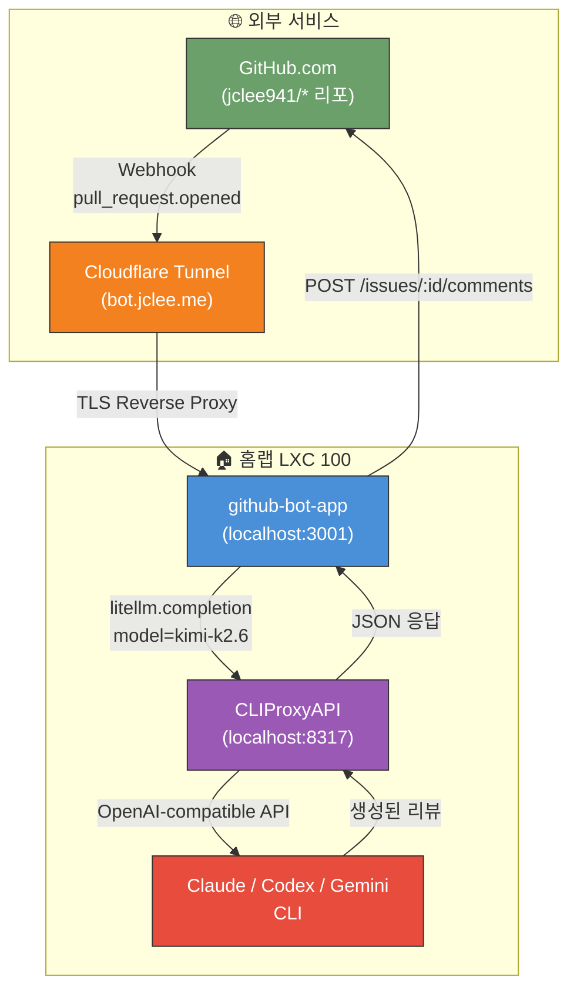
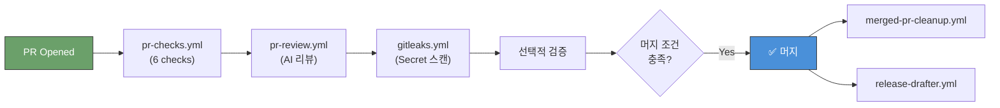

# jclee-bot

> Private AI-powered PR reviewer for `jclee941/*` repos. Hard fork of [qodo-ai/pr-agent](https://github.com/qodo-ai/pr-agent), backed by the homelab **CLIProxyAPI** at `192.168.50.114:8317`.

[](https://github.com/jclee941/.github/actions/workflows/sanity.yml)
[](https://github.com/jclee941/.github/actions/workflows/gitleaks.yml)
[](https://github.com/jclee941/.github/actions/workflows/codeql.yml)
[](https://github.com/qodo-ai/pr-agent)
[](LICENSE)
[](#architecture)

---

## Table of Contents

- [Overview](#overview)
- [Features](#features)
- [Architecture](#architecture)
- [Automation Flow](#automation-flow)
- [Quick Start](#quick-start)
- [Local Development](#local-development)
- [Fork Lineage](#fork-lineage)
- [License](#license)
- [See Also](#see-also)

---

## Overview

`jclee-bot` is a hard fork of [PR-Agent](https://github.com/qodo-ai/pr-agent) wired to run entirely inside the jclee941 homelab as a **GitHub App**:

- **LLM backend**: [`router-for-me/CLIProxyAPI`](https://github.com/router-for-me/CLIProxyAPI) on LXC 100 (`192.168.50.114:8317`), wrapping Claude Code CLI / Codex CLI / Gemini CLI as an OpenAI-compatible API
- **Deployment**: GitHub App `jclee-bot` (ID: 3540327) running on LXC 100 via Cloudflare Tunnel
- **Default model**: `kimi-k2.6` (via cli_proxy), fallback `kimi-k2.5`, `minimax-m2.7`
- **Scope**: Private — for `jclee941/*` repositories only
- **Webhook**: `https://bot.jclee.me/api/v1/github_webhooks`
- **Response language**: Korean (`ko`)

No data leaves the homelab LAN. PR reviews go straight from GitHub webhook → Cloudflare Tunnel → LXC 100 → internal cli_proxy → back to GitHub.

---

## Features

### Slash Commands

| Command | Purpose | Trigger |
|---------|---------|---------|
| `/review` | Full PR review (security, performance, architecture, tests) | PR open / comment |
| `/improve` | Inline code improvement suggestions | PR comment |
| `/describe` | Auto-generate PR title + description + changes walkthrough | PR open |
| `/ask <question>` | Ask about the diff | PR comment |
| `/update_changelog` | Append changelog entry | PR comment |
| `/help` | List all commands | PR comment |

### Core Abilities

- **PR compression** — handles large diffs by intelligently truncating context
- **Dynamic context** — adjusts review depth based on PR size and type
- **Incremental update** — reviews only new commits on push
- **Self-reflection** — reviews its own output for quality
- **Multi-model fallback** — kimi-k2.6 → kimi-k2.5 → minimax-m2.7
- **Korean responses** — all review comments generated in Korean

See [docs/pr-agent-upstream-README.md](docs/pr-agent-upstream-README.md) for the full upstream feature reference.

---

## Architecture



For detailed automation flow diagrams, see [docs/architecture.md](docs/architecture.md).

---

## Automation Flow

### PR Lifecycle



### Downstream Deploy

Push to `master` on `.github` repo triggers `auto-deploy.yml`, which propagates workflow updates to **11 downstream repos** via `scripts/cmd/deploy-to-repos/main.go`.

See [docs/architecture.md](docs/architecture.md) for the complete workflow trigger map, issue lifecycle, security review flow, and release automation diagrams.

---

## Quick Start

The GitHub App `jclee-bot` is already installed on all `jclee941/*` repositories. No per-repo setup is required.

### 1. Open a PR

Create a pull request in any `jclee941/*` repository. The bot will automatically review it.

### 2. Use Slash Commands

Comment on any PR with:

```text
/review
/describe
/improve
/ask What does this PR change?
```

The bot will respond via the GitHub App installation.

### 3. Review Templates

Structured Korean-language review templates:

| Template | File | Purpose |
|----------|------|---------|
| Code Review | [`code-review-template.md`](docs/review-templates/code-review-template.md) | Master format, priorities, severity levels |
| Documentation | [`documentation-checklist.md`](docs/review-templates/documentation-checklist.md) | README, API docs, docstring checks |
| Security | [`security-review-template.md`](docs/review-templates/security-review-template.md) | OWASP Top 10, secret scanning, SAST |

Modify the templates and update `.pr_agent.toml` `[pr_reviewer].extra_instructions` to change review behavior.

---

## Local Development

```bash
git clone https://github.com/jclee941/github-bot
cd github-bot

# Env setup
cp .env.example .env
# .env is already populated if you ran the setup script; otherwise fill CLIPROXY_API_KEY

# Python setup
python3.12 -m venv .venv
source .venv/bin/activate
pip install -e .

# Run tests
pytest tests/unittest -v

# Run a review locally
export LITELLM_LOCAL_MODEL_COST_MAP=True  # avoid import-time network fetch in offline homelab shells
set -a; source .env; set +a
python -m pr_agent.cli --pr_url https://github.com/jclee941/<repo>/pull/<N> review
```

---

## Fork Lineage

- **Upstream**: [qodo-ai/pr-agent](https://github.com/qodo-ai/pr-agent) (AGPL-3.0)
- **Base commit**: [`d82f7d3e`](https://github.com/qodo-ai/pr-agent/commit/d82f7d3e) (2026-04-10)
- **Attribution**: [NOTICE](NOTICE)

### Sync with Upstream

```bash
git fetch upstream
git merge upstream/main
# Expected conflict areas:
#   - pr_agent/settings/configuration.toml  (our cli_proxy model override)
#   - .pr_agent.toml                         (our [openai].api_base override)
git push origin main
```

---

## License

[AGPL-3.0](LICENSE) (inherited). Per AGPL-3.0 §13: if you modify and deploy this as a network service, you must offer source access to users interacting with it. This is a private bot running only on the homelab, so compliance is trivial — this repo + its fork graph is the source.

---

## See Also

- [AGENTS.md](AGENTS.md) — project knowledge base for AI agents and new contributors
- [docs/architecture.md](docs/architecture.md) — system architecture & automation flow diagrams
- [docs/git-workflow-gap-analysis.md](docs/git-workflow-gap-analysis.md) — workflow automation gap analysis (20 gaps)
- [docs/pr-agent-upstream-README.md](docs/pr-agent-upstream-README.md) — original pr-agent README
- [NOTICE](NOTICE) — AGPL-3.0 attribution
- Upstream CLIProxyAPI: [router-for-me/CLIProxyAPI](https://github.com/router-for-me/CLIProxyAPI)
