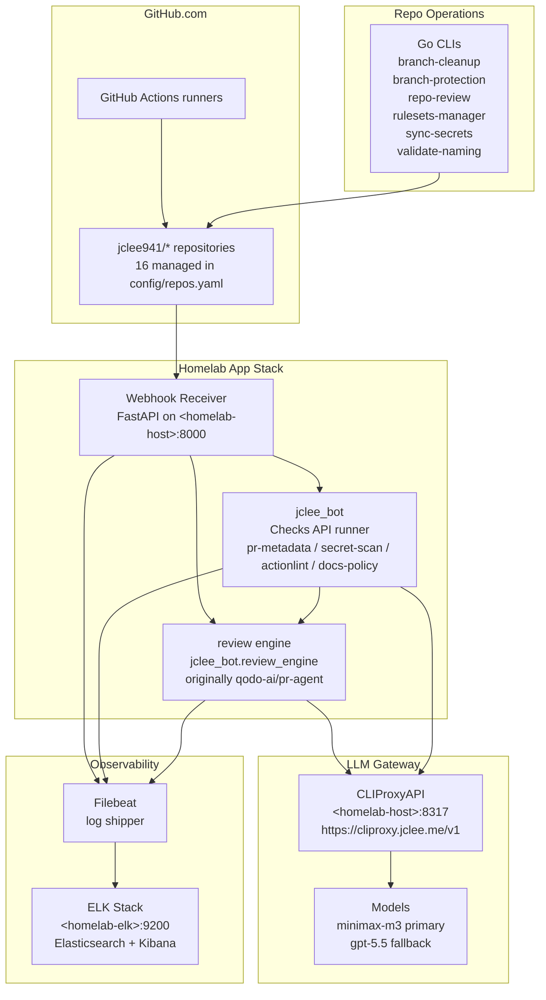

# github-bot | jclee941

> AI-powered PR reviewer and GitHub automation platform for `jclee941/*` repositories, backed by a homelab CLIProxyAPI deployment.
> homelab CLIProxyAPI 배포를 기반으로 `jclee941/*` 저장소를 자동화하는 AI PR 리뷰어 및 GitHub 자동화 플랫폼입니다.

[](pyproject.toml)
[](pyproject.toml)
[](LICENSE)

[](https://cliproxy.jclee.me/v1)
[](#jclee-bot-automation--jclee-bot-자동화)
[](#go-automation-tools-5-total--go-자동화-도구-5개)

---

## Table of Contents | 목차

- [Overview | 개요](#overview--개요)
- [Features | 기능](#features--기능)
- [Architecture | 아키텍처](#architecture--아키텍처)
- [Automation Inventory | 자동화 인벤토리](#automation-inventory--자동화-인벤토리)
  - [jclee-bot Automation | jclee-bot 자동화](#jclee-bot-automation--jclee-bot-자동화)
  - [Go Automation Tools 5 total | Go 자동화 도구 5개](#go-automation-tools-5-total--go-자동화-도구-5개)
- [Repository Structure | 저장소 구조](#repository-structure--저장소-구조)
- [Quick Start | 빠른 시작](#quick-start--빠른-시작)
- [Local Development | 로컬 개발](#local-development--로컬-개발)
- [Commands Reference | 명령어 참조](#commands-reference--명령어-참조)
- [Configuration | 설정](#configuration--설정)
- [Documentation Generation | 문서 자동 생성](#documentation-generation--문서-자동-생성)
- [Contribution Guide | 기여 가이드](#contribution-guide--기여-가이드)
- [License | 라이선스](#license--라이선스)

---

## Overview | 개요

This repository is the `jclee941/*` automation stack: a homelab-hosted GitHub App plus the review engine that powers Korean-first AI PR review. The review engine is originally derived from [qodo-ai/pr-agent](https://github.com/qodo-ai/pr-agent) and has been absorbed in-tree as a first-party package (see `NOTICE` for attribution). The platform delivers AI review, description generation, code suggestions, Q&A, changelog updates, and documentation help, while layering on:

- a first-party `jclee_bot` GitHub App checks runner that posts `pr-metadata`, `secret-scan`, `actionlint`, and `docs-policy` via the Checks API,
- a homelab CLIProxyAPI deployment (`https://cliproxy.jclee.me/v1`) that serves as the LLM gateway,
- `jclee_bot` App-owned automation and **6 Go automation CLIs** that manage 16 downstream repositories end-to-end,
- an ELK observability stack (Elasticsearch + Kibana) with Filebeat log shipping,
- issue/PR templates and review prompt packs localized for Korean-first review output.

Production automation follows a **GitHub App-centered operating model**: the homelab GitHub App posts Checks API runs, reviews, issue maintenance, README automation, and CI failure issue cleanup. GitHub Actions are retained only as CI/build surfaces or thin triggers that call `jclee-bot`.

이 저장소는 `jclee941/*` 저장소 생태계의 자동화 스택입니다. 홈랩에서 운영하는 GitHub App과 한국어 우선 AI PR 리뷰 엔진으로 구성되어 있습니다. 리뷰 엔진은 [qodo-ai/pr-agent](https://github.com/qodo-ai/pr-agent)에서 유래한 코드를 흡수 통합한 1등 시민(first-party) 패키지입니다 (attribution은 `NOTICE` 참조). PR-Agent의 핵심 기능(AI 리뷰, PR 설명 생성, 코드 제안, Q&A, 체인지로그, 문서화 도움말)을 제공하며 다음을 더합니다:

- Checks API를 통해 `pr-metadata`, `secret-scan`, `actionlint`, `docs-policy`를 게시하는 1등 시민 `jclee_bot` GitHub App 검사 러너,
- LLM 게이트웨이 역할을 하는 homelab CLIProxyAPI 배포(`https://cliproxy.jclee.me/v1`),
- 16개의 다운스트림 저장소를 종단(end-to-end)으로 관리하는 `jclee_bot` App 소유 자동화와 **6개의 Go 자동화 CLI**,
- Filebeat 로그 수집을 포함한 ELK 관측 가능성 스택(Elasticsearch + Kibana),
- 한국어 우선 리뷰 출력에 맞춘 이슈/PR 템플릿과 리뷰 프롬프트 팩.

운영 자동화는 **GitHub App 중심 운영 모델**을 따릅니다. homelab GitHub App이 Checks API 실행, 리뷰, 이슈 유지보수, README 자동화, CI 실패 이슈 정리를 담당합니다. GitHub Actions는 CI/build 표면 또는 `jclee-bot` 호출용 thin trigger로만 남깁니다.

---

## Features | 기능

### AI Review & PR Authoring | AI 리뷰 및 PR 작성

- AI-powered PR review (Korean-first), PR description generation, code suggestions, inline questions, and changelog updates via the `jclee_bot.review_engine` CLI (installed as the `pr-agent` console script).
- Routes all LLM traffic through the homelab **CLIProxyAPI** gateway (`https://cliproxy.jclee.me/v1`), with primary/fallback model chains configured per repo.
- Local `pr-agent` console script entry point: `pr-agent --help`.

### GitHub App Checks | GitHub App 검사

- `jclee_bot` posts four Check Runs on every opened/synchronised PR:
  - **`pr-metadata`** — title/body linting and template conformance.
  - **`secret-scan`** — credential and token pattern detection on the diff.
  - **`actionlint`** — workflow YAML static analysis for the touched `.github/workflows/**` files.
  - **`docs-policy`** — documentation freshness and private-IP exposure policy checks.
- Tees the review-engine webhook into App checks so review and Checks API state stay aligned.

### Repository Automation | 저장소 자동화

- **Dependabot auto-merge** for trusted patch/minor updates.
- **Bot auto-merge** for new and existing routine bot PRs after checks pass.
- **Merged-PR cleanup**, **stale PR/issue handling**, and **issue backfill** workflows.
- **Release pipeline** (drafter → notes → publish) and **Pages deploy**.
- **CI failure issue** creation and recovery sweeps to keep failures visible.
- **Hardcode auto-scan** and **NAS cache prune** for hygiene and storage.

### Observability | 관측 가능성

- FastAPI webhook server and `jclee_bot` runner emit structured JSON logs.
- **Filebeat** ships logs to a homelab **ELK** stack; health is checked continuously by dedicated workflows (`26_elk-health-check.yml`, `30_runtime-health-check.yml`, `28_bot-health-monitor.yml`).

### Repo Governance | 저장소 거버넌스

- Six Go CLIs (`branch-cleanup`, `branch-protection`, `rulesets-manager`, `repo-review`, `sync-secrets`, `validate-naming`) roll out stale merged-branch cleanup, branch protection, GitHub Rulesets, secret sync, periodic repo review, and naming/inventory enforcement across the 16 managed repos.
- `config/repos.yaml` is the canonical managed-repo inventory; the `github-bot` source repo itself is excluded from auto-deploy.

---

## Architecture | 아키텍처



> **Diagram conventions | 다이어그램 표기 규약**
> - `<homelab-host>` / `<homelab-elk>` are placeholders for the homelab LXC endpoints. No private IPs or LXC numbers are hardcoded.
> - The CLIProxyAPI public endpoint is `https://cliproxy.jclee.me/v1`.

---

## Automation Inventory | 자동화 인벤토리

### jclee-bot Automation | jclee-bot 자동화

GitHub Actions do not own PR/issue mutation logic. They either run CI/build work or call the App API. Linked workflow filenames are intentionally omitted from this README inventory because they are implementation triggers, not the automation source of truth.

| Surface | Owner | Purpose | 목적 |
|---------|-------|---------|------|
| PR checks | `jclee-bot` App | Checks API runs for metadata, secrets, actionlint, docs policy | PR 메타데이터, 시크릿, actionlint, 문서 정책 검사 |
| PR review | `jclee-bot` App + `review_engine` | Korean-first AI review and suggestions through CLIProxyAPI | CLIProxyAPI 기반 한국어 우선 AI 리뷰 |
| GitOps | `jclee-bot` App | Branch-to-PR, existing bot PR auto-merge sweep, protected master flow | 브랜치→PR, 기존 봇 PR 자동 병합 sweep, master 보호 흐름 |
| Issue maintenance | `jclee-bot` App | stale marking/closing, duplicate review cleanup, issue summaries | stale/중복 리뷰 이슈 정리와 요약 |
| README automation | `jclee-bot` App | README creation/update PRs across managed repos | 관리 저장소 README 생성/갱신 PR |
| CI failure issues | `jclee-bot` App | failure issue creation, recovery close, legacy issue sweep; `jclee-bot에의해자동화됨` | 실패 이슈 등록, 복구 시 닫기, 레거시 이슈 정리 |

### Go Automation Tools 6 total | Go 자동화 도구 6개

All Go CLIs live under `scripts/cmd/<tool>/main.go` and are intended to be run from the repo root via the convention shown in *Commands Reference*. They are statically linked single-binary tools with no runtime dependencies beyond `git` and the `GITHUB_TOKEN` / `GH_TOKEN` env var.

| # | Tool | Purpose | 목적 |
|---|------|---------|------|
| 1 | `branch-cleanup` | Delete remote branches already merged into each managed repo's default branch | 기본 브랜치에 병합된 원격 브랜치 정리 |
| 2 | `branch-protection` | Roll out branch protection rules across the 16 managed repos | 분기 보호 규칙 롤아웃 |
| 3 | `repo-review` | Periodic repo review pass (readme, workflows, CODEOWNERS) | 저장소 주기 리뷰 |
| 4 | `rulesets-manager` | GitHub Rulesets rollout and drift correction | GitHub Rulesets 롤아웃 |
| 5 | `sync-secrets` | Sync repo/org secrets from a canonical source | 시크릿 동기화 |
| 6 | `validate-naming` | Enforce workflow prefixes, template inventory, README links | 명명/인벤토리 검증 |

---

## Repository Structure | 저장소 구조

```text
github-bot/
├── AGENTS.md                            # machine-readable project knowledge base
├── CODE_OF_CONDUCT.md
├── CONTRIBUTING.md
├── Dockerfile.github_action             # Action-mode image
├── Dockerfile.github_app                # GitHub App-mode image (homelab runner)
├── LICENSE                              # AGPL-3.0
├── MANIFEST.in
├── Makefile                             # install / test / lint / clean
├── NOTICE
├── README.md                            # this file
├── SECURITY.md
├── docker-compose.github_app.yml        # App stack compose
├── docker-compose.github_app.yml.lxc    # LXC-tuned override
├── filebeat.yml                         # log shipper config
├── pyproject.toml                       # Python package + ruff lint config
├── requirements-dev.txt
├── requirements.txt                     # runtime deps (litellm, openai, anthropic, …)
├── setup.py                             # legacy shim for editable installs
├── .github/                             # workflows, local actions, templates, CODEOWNERS
├── jclee_bot/                           # GitHub App checks runner + review engine
│   ├── app.py, dispatch.py, github_checks.py  # FastAPI app + Checks API client
│   ├── checks/                                 # pr-metadata, secret-scan, actionlint, docs-policy
│   ├── issue_management.py, issue_maintenance.py  # App-owned issue automation
│   └── review_engine/                          # AI review engine (originally derived from qodo-ai/pr-agent; see NOTICE)
│       ├── cli.py                              # `pr-agent` console-script entry (backed by jclee_bot.review_engine)
│       ├── cli_pip.py
│       ├── config_loader.py
│       ├── custom_merge_loader.py
│       ├── algo/                               # PR processing, file filter, language handler
│       │   └── ai_handlers/                    # litellm / openai / langchain handlers
│       ├── git_providers/                      # github / gitlab / bitbucket / azuredevops / gerrit / gitea
│       ├── secret_providers/                   # aws_secrets_manager, gcs, base interface
│       ├── servers/                            # github_app / github_action_runner / lambdas / polling
│       └── settings/                           # *.toml prompts and configuration
├── scripts/                             # Go CLIs + Python helpers
├── tests/                               # unit / e2e (mocked) / e2e_live (real GitHub)
├── docs/                                # architecture, review templates, ops notes
├── templates/                           # downstream community-file sources
└── config/
    └── repos.yaml                       # canonical managed-repo inventory (16 repos)
```

> **Edit policy | 편집 규칙** — The review engine at `jclee_bot/review_engine/` is first-party code; modify it directly when needed, but prefer narrow changes and update relevant prompt packs rather than rewriting large modules. Put new App-level behavior in `jclee_bot/` and keep the review engine a stable contract surface.

---

## Quick Start | 빠른 시작

### Prerequisites | 사전 요구사항

- Python **3.12 or 3.13**
- `git`, `make`, `curl`
- A GitHub personal access token or GitHub App credentials with `repo` and `checks:write` scope
- Network reachability to the homelab CLIProxyAPI endpoint (`https://cliproxy.jclee.me/v1`) and the homelab LXC host

### Clone and install | 클론 및 설치

```bash
git clone <repo-url> github-bot
cd github-bot
make install         # creates .venv, installs -e .
```

### Configure secrets | 시크릿 설정

Create a `.env` (or export in your shell) with the GitHub credentials and the CLIProxyAPI base. The project uses literal-dot Dynaconf spelling inside workflows (e.g. `OPENAI.KEY`, `OPENAI.API_BASE`, `CONFIG.MODEL`); `GITHUB__USER_TOKEN` is the documented GitHub-token exception.

```bash
export GITHUB__USER_TOKEN=ghp_...
export OPENAI__KEY=sk-...
export OPENAI__API_BASE=https://cliproxy.jclee.me/v1
export CONFIG__MODEL=minimax-m3
export CONFIG__FALLBACK_MODELS='["gpt-5.5"]'
```

### First run | 첫 실행

```bash
pr-agent --help                              # jclee_bot.review_engine CLI (console script)
pr-agent review --pr_url=https://github.com/jclee941/<repo>/pull/<n>
```

### Run the App stack | App 스택 실행

```bash
docker compose -f docker-compose.github_app.yml up -d
docker compose -f docker-compose.github_app.yml logs -f jclee_bot
```

The App exposes the webhook receiver on `<homelab-host>:8000` and posts Check Runs back to GitHub on every opened/synchronised PR.

---

## Local Development | 로컬 개발

### Tests | 테스트

The test suite is split into three layers. Use the `Makefile` targets rather than invoking `pytest` directly so the venv is used:

```bash
make test-unit   # tests/unittest
make test-e2e    # tests/e2e (mocked)
make test-live   # tests/e2e_live (real GitHub; guarded)
make test        # all three
```

`tests/e2e_live/` has its own mutation-guard instructions — read them before adding live tests.

### Linting | 린팅

Ruff is configured in `pyproject.toml` and treats the review engine's legacy `algo/` and `tools/` code more leniently than the rest of the project (cosmetic rules suppressed per-file; correctness rules enforced). First-party code under `scripts/`, `tests/e2e/`, and `tests/e2e_live/` is held to the full ruleset.

```bash
make lint
# or
.venv/bin/ruff check .
```

### Working on the App | App 개발

```bash
# Edit jclee_bot/, then rebuild
docker compose -f docker-compose.github_app.yml build
docker compose -f docker-compose.github_app.yml up -d
```

### Working on workflows | 워크플로우 개발

1. Edit the relevant `.github/workflows/<NN>_*.yml` file in a feature branch.
2. Open a PR — `90_sanity.yml` and the `jclee-bot` App checks run on every PR.
3. Locally, dry-run the naming check with the Go tool:

```bash
(cd scripts && go run ./cmd/validate-naming)
```

### Working on Go tools | Go 도구 개발

```bash
(cd scripts && go run ./cmd/branch-protection --help)
(cd scripts && go run ./cmd/branch-cleanup --help)
(cd scripts && go run ./cmd/repo-review --help)
(cd scripts && go run ./cmd/rulesets-manager --help)
(cd scripts && go run ./cmd/sync-secrets --help)
(cd scripts && go run ./cmd/validate-naming --help)
```

---

## Commands Reference | 명령어 참조

### `Makefile` targets | Makefile 타겟

| Target | Description | 설명 |
|--------|-------------|------|
| `make install` | Create `.venv` and install the package in editable mode | venv 생성 및 패키지 설치 |
| `make test-unit` | Run unit tests | 단위 테스트 |
| `make test-e2e` | Run mocked end-to-end tests | 모의 E2E 테스트 |
| `make test-live` | Run live GitHub e2e tests (guarded) | 라이브 E2E 테스트 |
| `make test` | Run all three test layers | 전체 테스트 |
| `make lint` | Run `ruff check .` | 린트 실행 |
| `make clean` | Remove pytest caches and `__pycache__` | 캐시 정리 |

### `pr-agent` CLI | pr-agent CLI

Installed as a console script (`pr-agent = "jclee_bot.review_engine.cli:run"`).

```text
pr-agent review          --pr_url=<url>
pr-agent describe        --pr_url=<url>
pr-agent improve         --pr_url=<url>
pr-agent ask             --pr_url=<url> --question="..."
pr-agent update_changelog --pr_url=<url>
pr-agent help_docs       --pr_url=<url>
pr-agent add_docs        --pr_url=<url>
pr-agent generate_labels --pr_url=<url>
pr-agent custom_labels   --pr_url=<url>
pr-agent similarity      --pr_url=<url>
pr-agent config          --pr_url=<url>
```

### Go CLIs | Go CLI

| Command | Description | 설명 |
|---------|-------------|------|
| `(cd scripts && go run ./cmd/branch-cleanup)` | Delete remote branches already merged into managed repo default branches | 병합 완료 원격 브랜치 정리 |
| `(cd scripts && go run ./cmd/branch-protection)` | Roll out branch protection to managed repos | 분기 보호 롤아웃 |
| `(cd scripts && go run ./cmd/repo-review)` | Periodic repo review pass | 저장소 주기 리뷰 |
| `(cd scripts && go run ./cmd/rulesets-manager)` | GitHub Rulesets rollout | Rulesets 롤아웃 |
| `(cd scripts && go run ./cmd/sync-secrets)` | Sync secrets across managed repos | 시크릿 동기화 |
| `(cd scripts && go run ./cmd/validate-naming)` | Enforce naming/inventory invariants | 명명 검증 |

---

## Configuration | 설정

- **Managed repo inventory | 관리 저장소 목록** — `config/repos.yaml` is the single source of truth. Do not duplicate repo counts or default branches by hand; tooling reads this file.
- **Review engine defaults | 리뷰 엔진 기본값** — `jclee_bot/review_engine/settings/configuration.toml` and the per-tool `pr_*.toml` prompt packs. Keep project overrides in this directory rather than scattering them across workflows or App code.
- **Dynaconf env vars | Dynaconf 환경 변수** — Inside Actions, use the literal-dot spelling: `OPENAI.KEY`, `OPENAI.API_BASE`, `CONFIG.MODEL`, `CONFIG.FALLBACK_MODELS`. The one exception is `GITHUB__USER_TOKEN`, which keeps the double-underscore form.
- **Templates | 템플릿** — `templates/` holds the downstream community-file sources (CODE_OF_CONDUCT, CONTRIBUTING, SECURITY, issue/PR templates, Korean localisation).
- **App config | App 설정** — `docker-compose.github_app.yml` for the standard layout; `docker-compose.github_app.yml.lxc` adds the LXC-tuned overrides (network mode, mounts).

---

## Documentation Generation | 문서 자동 생성

This README is generated and maintained by the `34_readme-automation.yml` workflow, with the inventory cross-checked by `90_sanity.yml`.

- **Primary model | 기본 모델** — `minimax-m3` via the homelab CLIProxyAPI gateway.
- **Fallback model | 폴백 모델** — `gpt-5.5` via the same gateway.
- **Redaction | 비공개 정보 마스킹** — Generated READMEs redact private RFC1918 IPs and LXC container numbers, replacing them with `<homelab-host>` / `<homelab-elk>` placeholders. Invented repository URLs are rejected at validation time.

---

## Contribution Guide | 기여 가이드

1. **Fork or branch | 포크 또는 브랜치** — Branch off `master`; one logical change per PR.
2. **Workflow edits | 워크플로우 편집** — Keep workflows as CI/build surfaces or thin `jclee-bot` API triggers. PR/issue mutation logic belongs in `jclee_bot/`.
3. **Python style | Python 스타일** — Ruff-enforced (line length 120, full E/F/B/I ruleset across the project; cosmetic suppressions allowed per-file only inside the review engine's `algo/` and `tools/` packages, which carry legacy patterns from the original qodo code).
4. **Tests | 테스트** — Add or update unit tests; for behaviour that touches GitHub, prefer the mocked e2e layer (`tests/e2e/`). Live tests (`tests/e2e_live/`) require the mutation-guard checklist.
5. **No invented URLs | URL 금지** — Only `qodo-ai/pr-agent` (for historical/attribution context only), `cliproxy.jclee.me`, and `bot.jclee.me` are acceptable external links. PRs that introduce other GitHub URLs will be rejected.
6. **No private addresses | 사설 주소 금지** — Never hardcode RFC1918 IPs or LXC container numbers; use the `<homelab-host>` / `<homelab-elk>` placeholders.
7. **Security | 보안** — See `SECURITY.md` for vulnerability reporting. Do not file public issues for suspected secrets; use the channels listed there.
8. **Code of conduct | 행동 강령** — By participating, you agree to `CODE_OF_CONDUCT.md`.

---

## License | 라이선스

This project is licensed under the **GNU Affero General Public License v3.0** (AGPL-3.0) — see [`LICENSE`](LICENSE) and [`NOTICE`](NOTICE) for upstream attributions.

본 프로젝트는 **GNU Affero General Public License v3.0 (AGPL-3.0)** 하에 배포됩니다. 원본 attribution은 `NOTICE`를 참조하세요.

Originally based on: [qodo-ai/pr-agent](https://github.com/qodo-ai/pr-agent) · LLM Gateway: [https://cliproxy.jclee.me/v1](https://cliproxy.jclee.me/v1) · App endpoint: [https://bot.jclee.me](https://bot.jclee.me)
