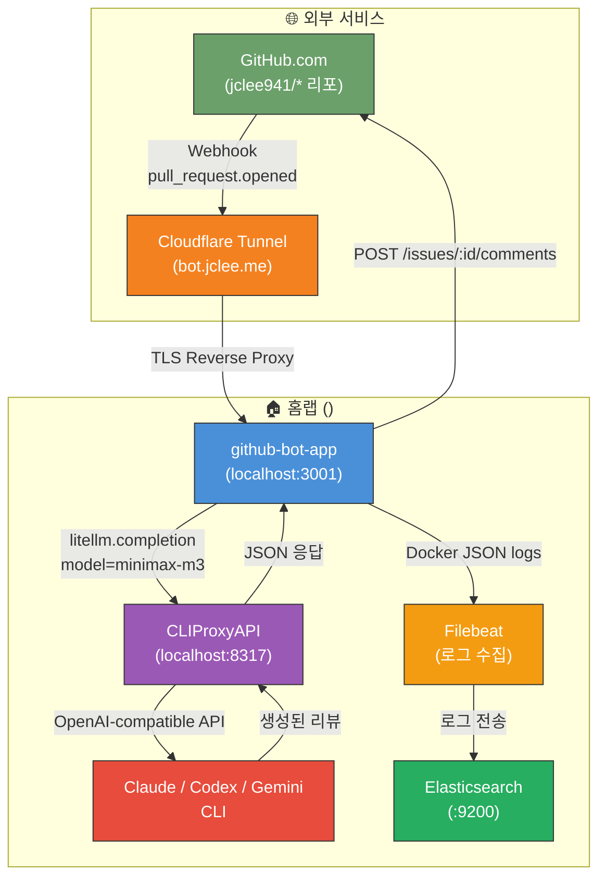
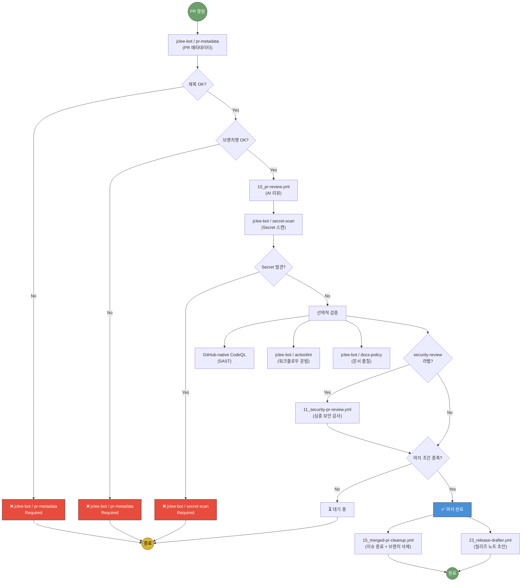
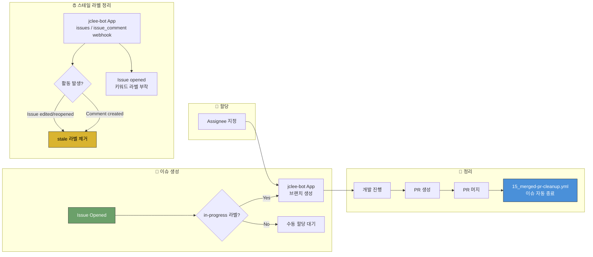
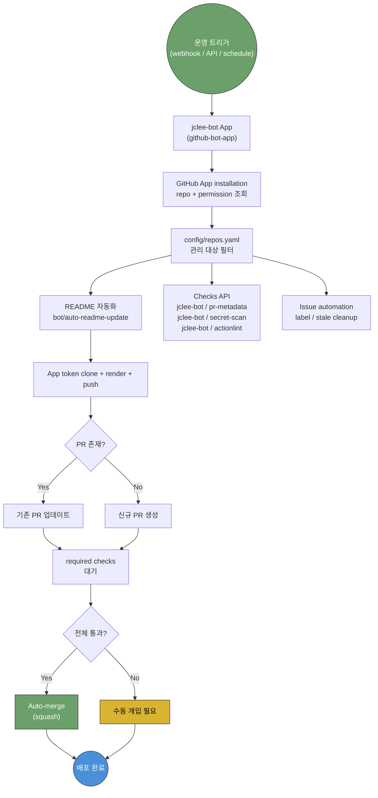
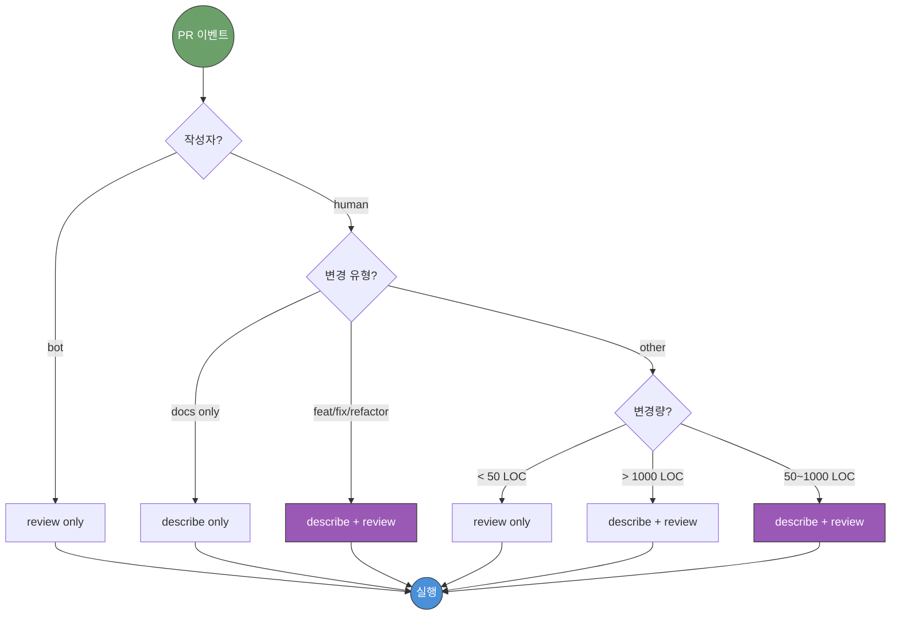
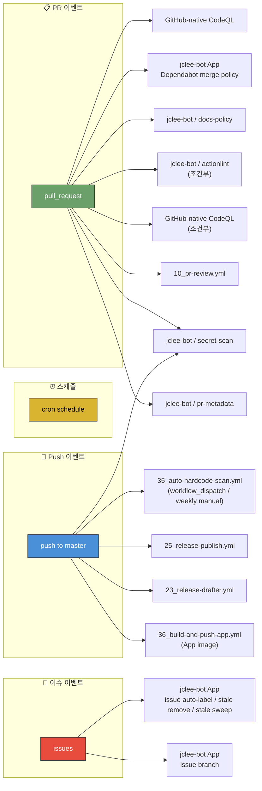
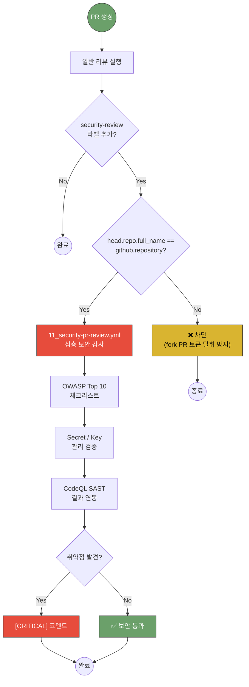
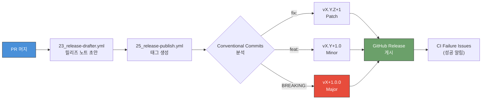

# jclee-bot 아키텍처 및 자동화 흐름

> 본 문서는 `jclee941/.github` 저장소의 전체 자동화 스택을 시각적으로 설명합니다.  
> 모든 다이어그램은 GitHub 네이티브 Mermaid 렌더러로 표시됩니다.

---

## 1. 시스템 개요 (System Architecture)



### 구성 요소 설명

| 구성 요소 | 역할 | 위치 |
|-----------|------|------|
| **GitHub** | PR 이벤트 발생, 리뷰 코멘트 표시 | Public Cloud |
| **Cloudflare Tunnel** | 홈랩 남부 네트워크에 퍼블릭 HTTPS 엔드포인트 제공 | Cloudflare Edge |
| **github-bot-app** | Webhook 수신, 리뷰 엔진 실행, GitHub API 호출 | <homelab-host> (:3001) |
| **CLIProxyAPI** | Claude/Codex/Gemini CLI를 OpenAI API로 래핑 | <homelab-host> (:8317) |
| **AI CLI** | 실제 LLM 추론 수행 (Claude Code / Codex CLI / Gemini CLI) | <homelab-host> (로컬 실행) |
| **Filebeat** | Docker 컨테이너 로그 수집 및 전송 | <homelab-host> (로컬) |
| **Elasticsearch** | 중앙 로그 저장 및 검색 | <homelab-elk> (:9200) |

---

## 2. PR 라이프사이클 (PR Lifecycle)



### 필수 검증 (Required Checks)

| 검증 항목 | 워크플로우 | 실패 시 |
|-----------|-----------|---------|
| PR 메타데이터 | `jclee-bot / pr-metadata` | ❌ 머지 차단 |
| Secret 노출 | `jclee-bot / secret-scan` | ❌ 머지 차단 |
| 워크플로우 문법 | `jclee-bot / actionlint` | ❌ 머지 차단 |

### 권고 검증 (Advisory Checks)

| 검증 항목 | 워크플로우 | 실패 시 |
|-----------|-----------|---------|
| Python SAST | `CodeQL` | ⚠️ Security 탭 |
| 문서 품질 | `jclee-bot / docs-policy` | ⚠️ Check Run |
| AI 코드 리뷰 | `pr-review` | 💬 리뷰 코멘트 |

---

## 3. 시퀀스 다이어그램: 리뷰 생성 과정


---

## 4. 이슈 라이프사이클 (Issue Lifecycle)



---

## 5. App 기반 레포 자동화 흐름 (Repository Automation)



### App 관리 리포지토리

`config/repos.yaml`이 단일 인벤토리입니다. `.github`는 소스 리포로 자체 운영되고,
리뷰 엔진은 인트리에 흡수된 first-party 패키지라 App 자동화 롤아웃에서 제외됩니다. 나머지 공개/비공개
대상 리포는 per-repo workflow 배포가 아니라 `jclee-bot` App 토큰과 Checks API 경로로
운영됩니다.

---

## 6. 리뷰 명령어 선택 로직 (Review Command Selection)



---

## 7. 워크플로우 트리거 관계도 (Workflow Trigger Map)



---

## 8. 보안 리뷰 흐름 (Security Review Flow)



---

## 9. 릴리즈 자동화 흐름 (Release Automation)



---

## 10. 설정 파일 계층 구조 (Configuration Hierarchy)

```mermaid
flowchart TB
    subgraph Origin["📚 Original Source (qodo-ai/pr-agent)"]
        U1["jclee_bot/review_engine/settings/<br/>configuration.toml"]
    end

    subgraph Project_Config["⚙️ Project Configuration"]
        F1[".pr_agent.toml<br/>(최우선)"]
        F2["jclee_bot/review_engine/settings/<br/>configuration.toml<br/>(model/fallback 오버라이드)"]
    end

    subgraph Runtime["🏃 런타임"]
        R1["환경 변수<br/>OPENAI.KEY<br/>CONFIG.MODEL"]
        R2["GitHub Secrets"]
    end

    U1 -->|"기본값 제공"| F2
    F2 -->|"병합"| F1
    F1 -->|"최종 설정"| RUN["pr-agent 실행"]
    R1 -->|"오버라이드"| RUN
    R2 -->|"주입"| R1

    style F1 fill:#6ba06a,stroke:#333,color:#fff
    style U1 fill:#95a5a6,stroke:#333,color:#fff
    style RUN fill:#4a90d9,stroke:#333,color:#fff

### 우선순위 (높음 → 낮음)

1. **환경 변수** (`CONFIG.MODEL`, `OPENAI.KEY`) — 런타임 오버라이드
2. **`.pr_agent.toml`** — Per-repo 설정 (cli_proxy, 한국어 응답, 리뷰 템플릿)
3. **`jclee_bot/review_engine/settings/configuration.toml`** — 엔진 기본값 (model/fallback 변경)
4. **리뷰 엔진 내부 DEFAULTS** — 하드코딩된 폴백

---

## 다이어그램 렌더링 테스트

> **참고**: 위 다이어그램들은 GitHub 네이티브 Mermaid 렌더러에서 자동 표시됩니다.  
> 로컬에서 미리 보려면 [Mermaid Live Editor](https://mermaid.live)에 코드를 붙여넣으세요.

### Mermaid 버전 호환성

| 다이어그램 유형 | GitHub 지원 | 사용 여부 |
|----------------|-------------|-----------|
| `flowchart` | ✅ 완전 지원 | ✅ 사용 중 |
| `sequenceDiagram` | ✅ 완전 지원 | ✅ 사용 중 |
| `gitGraph` | ✅ 완전 지원 | ❌ 미사용 |
| `architecture-beta` | ⚠️ v11.1+ 필요 | ❌ 사용 안 함 |
| Custom CSS / 테마 | ❌ 미지원 | ❌ 사용 안 함 |

### 다크 모드 대응

GitHub의 다크 모드에서도 다이어그램이 가독성 있게 표시되도록 `style` 지시어로 명시적 색상을 지정했습니다.  
GitHub의 iframe 기반 렌더러는 시스템 테마를 자동으로 따릅니다.
