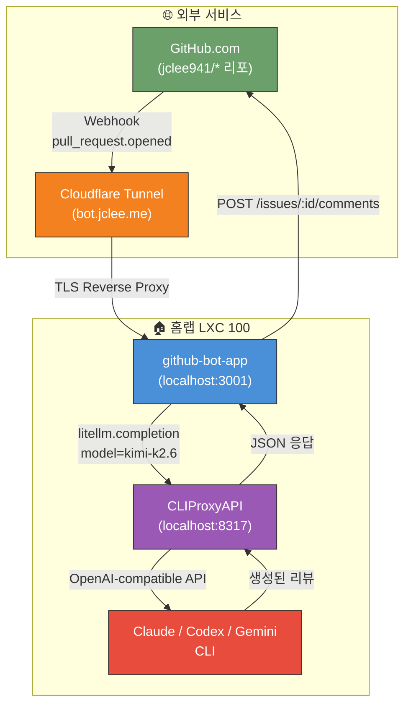
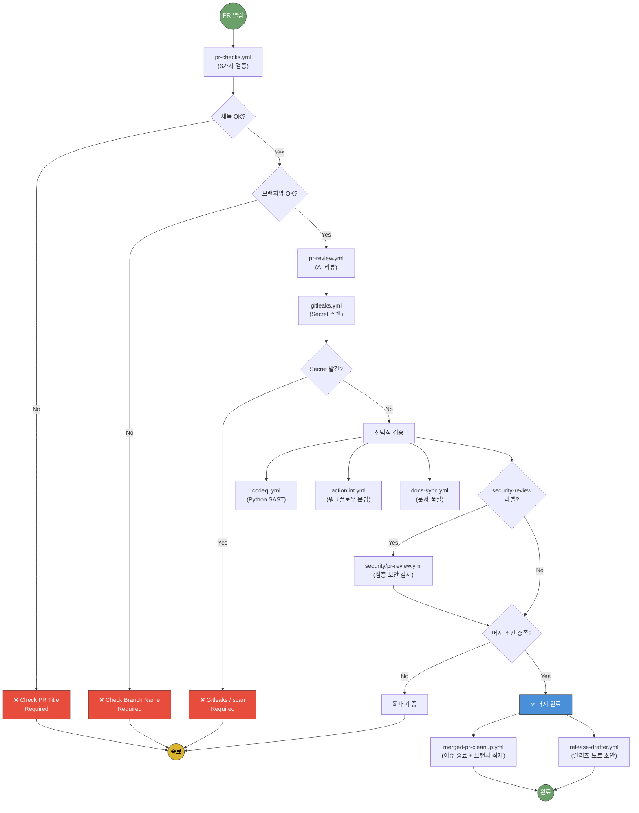
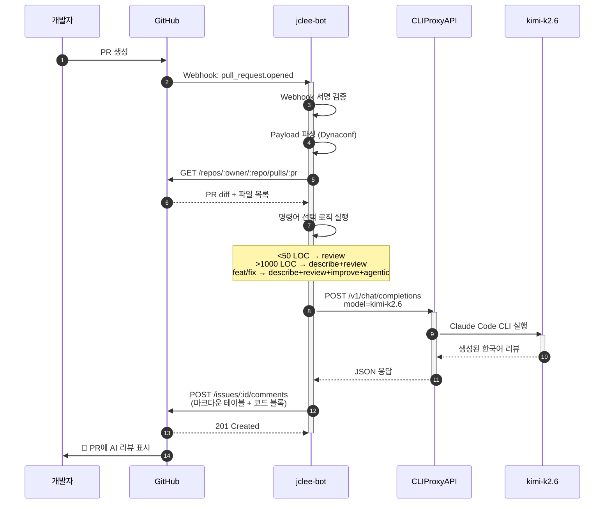
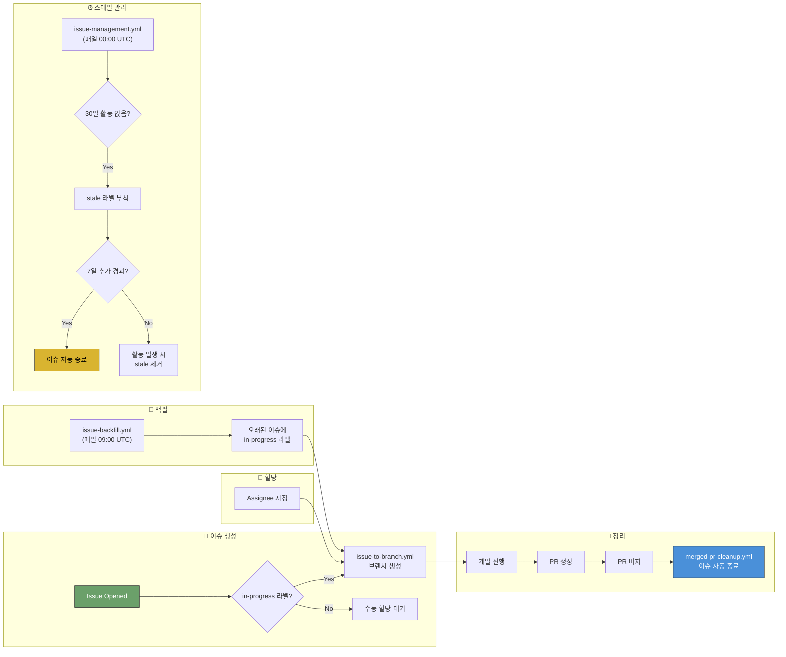
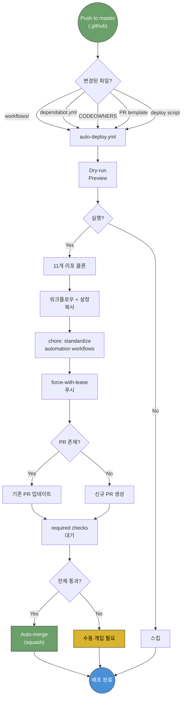
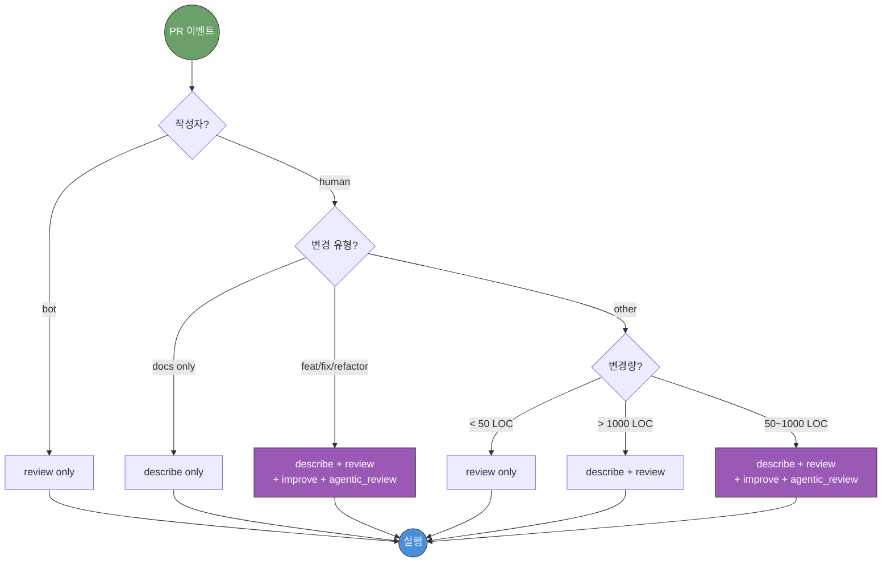
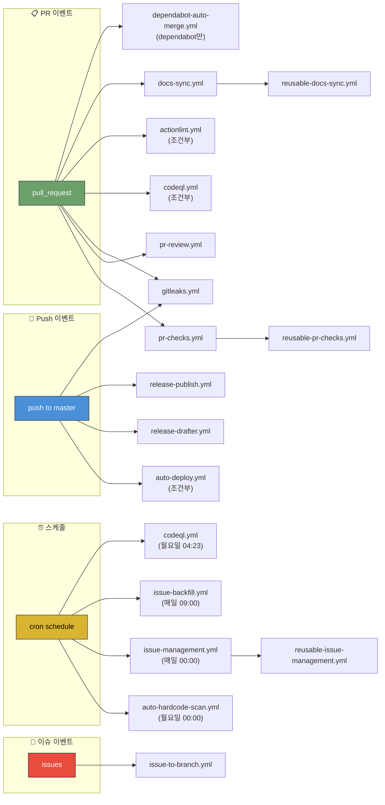
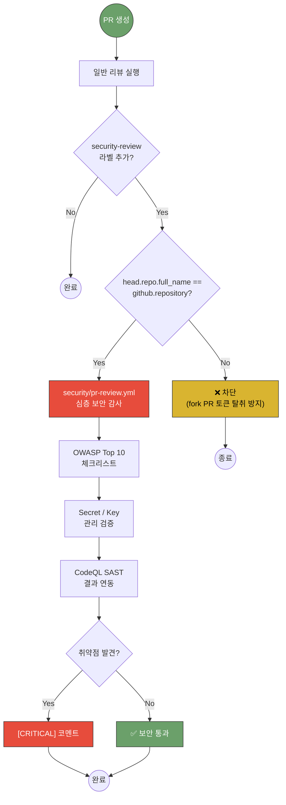
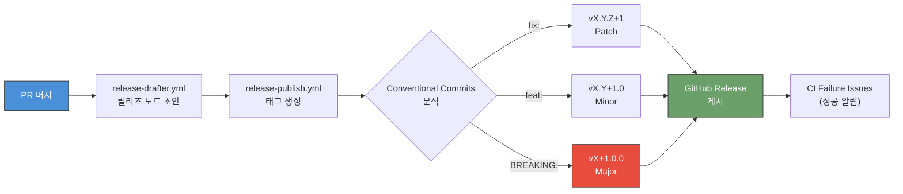
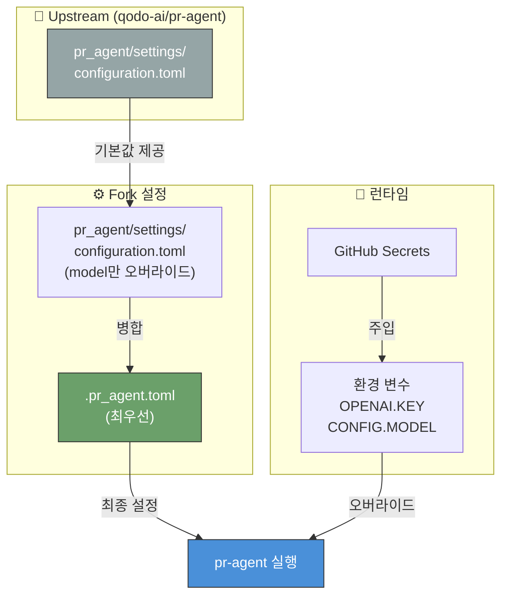

# jclee-bot 아키텍처 및 자동화 흐름

> 본 문서는 `jclee941/.github` 저장소의 전체 자동화 스택을 시각적으로 설명합니다.  
> 모든 다이어그램은 GitHub 네이티브 Mermaid 렌더러로 표시됩니다.

---

## 1. 시스템 개요 (System Architecture)

### 구성 요소 설명

| 구성 요소 | 역할 | 위치 |
|-----------|------|------|
| **GitHub** | PR 이벤트 발생, 리뷰 코멘트 표시 | Public Cloud |
| **Cloudflare Tunnel** | 홈랩 남부 네트워크에 퍼블릭 HTTPS 엔드포인트 제공 | Cloudflare Edge |
| **github-bot-app** | Webhook 수신, pr-agent 실행, GitHub API 호출 | LXC 100 (192.168.50.102) |
| **CLIProxyAPI** | Claude/Codex/Gemini CLI를 OpenAI API로 래핑 | LXC 100 (localhost:8317) |
| **AI CLI** | 실제 LLM 추론 수행 (Claude Code / Codex CLI / Gemini CLI) | LXC 100 (로컬 실행) |

---

## 2. PR 라이프사이클 (PR Lifecycle)

### 필수 검증 (Required Checks)

| 검증 항목 | 워크플로우 | 실패 시 |
|-----------|-----------|---------|
| PR 제목 (Conventional Commits) | `pr-checks / Check PR Title` | ❌ 머지 차단 |
| 브랜치명 표준 prefix | `pr-checks / Check Branch Name` | ❌ 머지 차단 |
| Secret 노출 | `Gitleaks / scan` | ❌ 머지 차단 (Phase 3+) |

### 권고 검증 (Advisory Checks)

| 검증 항목 | 워크플로우 | 실패 시 |
|-----------|-----------|---------|
| PR 설명 길이 | `pr-checks / Check PR Description` | ⚠️ 코멘트만 |
| PR 크기 (500 LOC) | `pr-checks / Check PR Size` | ⚠️ 코멘트만 |
| 대용량 파일 | `pr-checks / Check Large Files` | ⚠️ 코멘트만 |
| 민감 파일 | `pr-checks / Check Sensitive Files` | ⚠️ 코멘트만 |
| Python SAST | `CodeQL` | ⚠️ Security 탭 |
| 워크플로우 문법 | `actionlint` | ⚠️ 코멘트만 |
| 문서 품질 | `docs-sync` | ⚠️ 코멘트만 |
| AI 코드 리뷰 | `pr-review` | 💬 리뷰 코멘트 |

---

## 3. 시퀀스 다이어그램: 리뷰 생성 과정

---

## 4. 이슈 라이프사이클 (Issue Lifecycle)

---

## 5. 다운스트림 배포 흐름 (Downstream Deploy)

### 배포 대상 리포지토리 (11개)

| 리포지토리 | 상태 |
|-----------|------|
| `jclee941/resume` | ✅ 자동화 적용 |
| `jclee941/safetywallet` | ✅ 자동화 적용 |
| `jclee941/tmux` | ✅ 자동화 적용 |
| `jclee941/hycu_fsds` | ✅ 자동화 적용 |
| `jclee941/splunk` | ✅ 자동화 적용 |
| `jclee941/blacklist` | ✅ 자동화 적용 |
| `jclee941/opencode` | ✅ 자동화 적용 |
| `jclee941/terraform` | ✅ 자동화 적용 |
| `jclee941/account` | ✅ 자동화 적용 |
| `jclee941/idle-outpost` | ✅ 자동화 적용 |
| `jclee941/bug` | ✅ 자동화 적용 |

**제외 리포**: `pr-agent` (업스트림 포크, 자체 워크플로우 보유), `hycu`/`youtube`/`propose` (private, Dependabot만)

---

## 6. 리뷰 명령어 선택 로직 (Review Command Selection)

---

## 7. 워크플로우 트리거 관계도 (Workflow Trigger Map)

---

## 8. 보안 리뷰 흐름 (Security Review Flow)

---

## 9. 릴리즈 자동화 흐름 (Release Automation)

---

## 10. 설정 파일 계층 구조 (Configuration Hierarchy)

### 우선순위 (높음 → 낮음)

1. **환경 변수** (`CONFIG.MODEL`, `OPENAI.KEY`) — 런타임 오버라이드
2. **`.pr_agent.toml`** — Fork-level 설정 (cli_proxy, 한국어 응답, 리뷰 템플릿)
3. **`pr_agent/settings/configuration.toml`** — Upstream 기본값 (model만 변경)
4. **pr-agent 내부 DEFAULTS** — 하드코딩된 폴백

---

## 다이어그램 렌더링 테스트

> **참고**: 위 다이어그램들은 GitHub 네이티브 Mermaid 렌더러에서 자동 표시됩니다.  
> 로컬에서 미리 보려면 [Mermaid Live Editor](https://mermaid.live)에 코드를 붙여넣으세요.

### Mermaid 버전 호환성

| 다이어그램 유형 | GitHub 지원 | 사용 여부 |
|----------------|-------------|-----------|
| `flowchart` | ✅ 완전 지원 | ✅ 사용 중 |
| `sequenceDiagram` | ✅ 완전 지원 | ✅ 사용 중 |
| `gitGraph` | ✅ 완전 지원 | ❌ 미사용 |
| `architecture-beta` | ⚠️ v11.1+ 필요 | ❌ 사용 안 함 |
| Custom CSS / 테마 | ❌ 미지원 | ❌ 사용 안 함 |

### 다크 모드 대응

GitHub의 다크 모드에서도 다이어그램이 가독성 있게 표시되도록 `style` 지시어로 명시적 색상을 지정했습니다.  
GitHub의 iframe 기반 렌더러는 시스템 테마를 자동으로 따릅니다.
