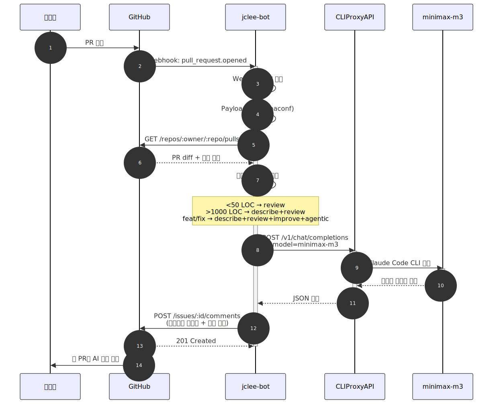

# jclee-bot 아키텍처 및 자동화 흐름

> 본 문서는 `jclee941/jclee-bot` 저장소의 전체 자동화 스택을 시각적으로 설명합니다.
> 모든 다이어그램은 원문 코드가 노출되지 않도록 렌더된 SVG asset으로 표시됩니다.

---

## 1. 시스템 개요 (System Architecture)

### 구성 요소 설명

| 구성 요소 | 역할 | 위치 |
|-----------|------|------|
| **GitHub** | PR 이벤트 발생, 리뷰 코멘트 표시 | Public Cloud |
| **Cloudflare Tunnel** | 홈랩 남부 네트워크에 퍼블릭 HTTPS 엔드포인트 제공 | Cloudflare Edge |
| **jclee-bot-app** | Webhook 수신, 리뷰 엔진 실행, GitHub API 호출 | <homelab-host> (:3001) |
| **CLIProxyAPI** | Claude/Codex/Gemini CLI를 OpenAI API로 래핑 | <homelab-host> (:8317) |
| **AI CLI** | 실제 LLM 추론 수행 (Claude Code / Codex CLI / Gemini CLI) | <homelab-host> (로컬 실행) |
| **Filebeat** | Docker 컨테이너 로그 수집 및 전송 | <homelab-host> (로컬) |
| **Elasticsearch** | 중앙 로그 저장 및 검색 | <homelab-elk> (:9200) |

---

## 2. PR 라이프사이클 (PR Lifecycle)

### 필수 검증 (Required Checks)

| 검증 항목 | 워크플로우 | 실패 시 |
|-----------|-----------|---------|
| PR 메타데이터 | `jclee-bot / pr-metadata` | ❌ 머지 차단 |
| Secret 노출 | `jclee-bot / secret-scan` | ❌ 머지 차단 |
| 워크플로우 문법 | `jclee-bot / actionlint` | ❌ 머지 차단 |

### 권고 검증 (Advisory Checks)

| 검증 항목 | 워크플로우 | 실패 시 |
|-----------|-----------|---------|
| Python SAST | `CodeQL` | ⚠️ Security 탭 |
| 문서 품질 | `jclee-bot / docs-policy` | ⚠️ Check Run |
| AI 코드 리뷰 | `pr-review` | 💬 리뷰 코멘트 |

---

## 3. 시퀀스 다이어그램: 리뷰 생성 과정

---

## 4. 이슈 라이프사이클 (Issue Lifecycle)

---

## 5. App 기반 레포 자동화 흐름 (Repository Automation)

### App 관리 리포지토리

`config/repos.yaml`이 단일 인벤토리입니다. `.github`는 소스 리포로 자체 운영되고,
리뷰 엔진은 인트리에 흡수된 first-party 패키지라 App 자동화 롤아웃에서 제외됩니다. 나머지 공개/비공개
대상 리포는 per-repo workflow 배포가 아니라 `jclee-bot` App 토큰과 Checks API 경로로
운영됩니다.

---

## 6. 리뷰 명령어 선택 로직 (Review Command Selection)

---

## 7. 워크플로우 트리거 관계도 (Workflow Trigger Map)

---

## 8. 보안 리뷰 흐름 (Security Review Flow)

---

## 9. 릴리즈 자동화 흐름 (Release Automation)

---

## 10. 설정 파일 계층 구조 (Configuration Hierarchy)

