# Downstream Standardization Audit | 다운스트림 표준화 점검

> Auto-generated by `scripts/cmd/drift-detector` (`--format=mermaid`). Managed by jclee-bot.  
> Generated: 2026-06-06 19:28 UTC

## Scope | 점검 범위

- **16** repos in `config/repos.yaml` (single source of truth); **14** deployable downstream repos audited.
- `.github` is the standard source (excluded from downstream sync); `pr-agent` is excluded from deploy.
- Managed files: standard workflows + `dependabot.yml`, `CODEOWNERS`, issue templates (deploy-to-repos allowlist).

## Standardization Map | 표준화 구성도

Post auto-fix state (drift remaining lands via open sync PRs):

```mermaid
flowchart TB
    SOURCE["표준 소스<br/>jclee941/.github"]
    subgraph DOWNSTREAM["다운스트림 리포 표준화 상태"]
        repo_account["jclee941/account<br/>warning"]
        file_account_0[".github/dependabot.yml<br/>modified/warning"]
        repo_account --> file_account_0
        repo_blacklist["jclee941/blacklist<br/>warning"]
        file_blacklist_0[".github/dependabot.yml<br/>modified/warning"]
        repo_blacklist --> file_blacklist_0
        repo_bug["jclee941/bug<br/>warning"]
        file_bug_0[".github/dependabot.yml<br/>modified/warning"]
        repo_bug --> file_bug_0
        repo_hycu_fsds["jclee941/hycu_fsds<br/>warning"]
        file_hycu_fsds_0[".github/dependabot.yml<br/>modified/warning"]
        repo_hycu_fsds --> file_hycu_fsds_0
        repo_idle_outpost["jclee941/idle-outpost<br/>warning"]
        file_idle_outpost_0[".github/dependabot.yml<br/>modified/warning"]
        repo_idle_outpost --> file_idle_outpost_0
        repo_opencode["jclee941/opencode<br/>warning"]
        file_opencode_0[".github/dependabot.yml<br/>modified/warning"]
        repo_opencode --> file_opencode_0
        repo_resume["jclee941/resume<br/>warning"]
        file_resume_0[".github/dependabot.yml<br/>modified/warning"]
        repo_resume --> file_resume_0
        repo_safetywallet["jclee941/safetywallet<br/>warning"]
        file_safetywallet_0[".github/dependabot.yml<br/>modified/warning"]
        repo_safetywallet --> file_safetywallet_0
        file_safetywallet_1[".github/workflows/19_issue-backfill.yml<br/>modified/warning"]
        repo_safetywallet --> file_safetywallet_1
        file_safetywallet_2[".github/workflows/37_ci-failure-issues.yml<br/>modified/warning"]
        repo_safetywallet --> file_safetywallet_2
        file_safetywallet_3[".github/workflows/60_ci-auto-heal.yml<br/>modified/warning"]
        repo_safetywallet --> file_safetywallet_3
        file_safetywallet_4[".github/workflows/91_issue-classification.yml<br/>modified/warning"]
        repo_safetywallet --> file_safetywallet_4
        repo_splunk["jclee941/splunk<br/>warning"]
        file_splunk_0[".github/dependabot.yml<br/>modified/warning"]
        repo_splunk --> file_splunk_0
        repo_terraform["jclee941/terraform<br/>warning"]
        file_terraform_0[".github/dependabot.yml<br/>modified/warning"]
        repo_terraform --> file_terraform_0
        file_terraform_1[".github/workflows/19_issue-backfill.yml<br/>modified/warning"]
        repo_terraform --> file_terraform_1
        file_terraform_2[".github/workflows/37_ci-failure-issues.yml<br/>modified/warning"]
        repo_terraform --> file_terraform_2
        file_terraform_3[".github/workflows/60_ci-auto-heal.yml<br/>modified/warning"]
        repo_terraform --> file_terraform_3
        file_terraform_4[".github/workflows/91_issue-classification.yml<br/>modified/warning"]
        repo_terraform --> file_terraform_4
        repo_tmux["jclee941/tmux<br/>warning"]
        file_tmux_0[".github/dependabot.yml<br/>modified/warning"]
        repo_tmux --> file_tmux_0
        repo_hycu["jclee941/hycu<br/>warning"]
        file_hycu_0[".github/dependabot.yml<br/>modified/warning"]
        repo_hycu --> file_hycu_0
        file_hycu_1[".github/workflows/19_issue-backfill.yml<br/>modified/warning"]
        repo_hycu --> file_hycu_1
        file_hycu_2[".github/workflows/37_ci-failure-issues.yml<br/>modified/warning"]
        repo_hycu --> file_hycu_2
        file_hycu_3[".github/workflows/60_ci-auto-heal.yml<br/>modified/warning"]
        repo_hycu --> file_hycu_3
        file_hycu_4[".github/workflows/91_issue-classification.yml<br/>modified/warning"]
        repo_hycu --> file_hycu_4
        repo_youtube["jclee941/youtube<br/>warning"]
        file_youtube_0[".github/dependabot.yml<br/>modified/warning"]
        repo_youtube --> file_youtube_0
        file_youtube_1[".github/workflows/01_branch-to-pr.yml<br/>modified/warning"]
        repo_youtube --> file_youtube_1
        file_youtube_2[".github/workflows/14_bot-auto-fix.yml<br/>modified/warning"]
        repo_youtube --> file_youtube_2
        file_youtube_3[".github/workflows/19_issue-backfill.yml<br/>modified/warning"]
        repo_youtube --> file_youtube_3
        file_youtube_4[".github/workflows/37_ci-failure-issues.yml<br/>modified/warning"]
        repo_youtube --> file_youtube_4
        file_youtube_5[".github/workflows/43_reusable-issue-management.yml<br/>modified/warning"]
        repo_youtube --> file_youtube_5
        file_youtube_6[".github/workflows/60_ci-auto-heal.yml<br/>modified/warning"]
        repo_youtube --> file_youtube_6
        file_youtube_7[".github/workflows/91_issue-classification.yml<br/>modified/warning"]
        repo_youtube --> file_youtube_7
        repo_propose["jclee941/propose<br/>critical"]
        file_propose_0[".github/CODEOWNERS<br/>modified/warning"]
        repo_propose --> file_propose_0
        file_propose_1[".github/ISSUE_TEMPLATE/1-bug-report.yml<br/>modified/warning"]
        repo_propose --> file_propose_1
        file_propose_2[".github/dependabot.yml<br/>modified/warning"]
        repo_propose --> file_propose_2
        file_propose_3[".github/scripts/issue-classifier.cjs<br/>missing/critical"]
        repo_propose --> file_propose_3
        file_propose_4[".github/workflows/01_branch-to-pr.yml<br/>modified/warning"]
        repo_propose --> file_propose_4
        file_propose_5[".github/workflows/06_codeql.yml<br/>modified/warning"]
        repo_propose --> file_propose_5
        file_propose_6[".github/workflows/07_dependency-review.yml<br/>modified/warning"]
        repo_propose --> file_propose_6
        file_propose_7[".github/workflows/08_scorecard.yml<br/>modified/warning"]
        repo_propose --> file_propose_7
        file_propose_8[".github/workflows/09_semantic-pr.yml<br/>modified/warning"]
        repo_propose --> file_propose_8
        file_propose_9[".github/workflows/10_pr-review.yml<br/>modified/warning"]
        repo_propose --> file_propose_9
        file_propose_10[".github/workflows/11_security-pr-review.yml<br/>missing/critical"]
        repo_propose --> file_propose_10
        file_propose_11[".github/workflows/12_dependabot-auto-merge.yml<br/>modified/warning"]
        repo_propose --> file_propose_11
        file_propose_12[".github/workflows/13_pr-auto-merge.yml<br/>modified/warning"]
        repo_propose --> file_propose_12
        file_propose_13[".github/workflows/14_bot-auto-fix.yml<br/>modified/warning"]
        repo_propose --> file_propose_13
        file_propose_14[".github/workflows/18_issue-management.yml<br/>modified/warning"]
        repo_propose --> file_propose_14
        file_propose_15[".github/workflows/19_issue-backfill.yml<br/>modified/warning"]
        repo_propose --> file_propose_15
        file_propose_16[".github/workflows/20_readme-gen.yml<br/>modified/warning"]
        repo_propose --> file_propose_16
        file_propose_17[".github/workflows/21_docs-sync.yml<br/>modified/warning"]
        repo_propose --> file_propose_17
        file_propose_18[".github/workflows/24_release-notes.yml<br/>modified/warning"]
        repo_propose --> file_propose_18
        file_propose_19[".github/workflows/25_release-publish.yml<br/>modified/warning"]
        repo_propose --> file_propose_19
        file_propose_20[".github/workflows/29_downstream-health-check.yml<br/>modified/warning"]
        repo_propose --> file_propose_20
        file_propose_21[".github/workflows/37_ci-failure-issues.yml<br/>modified/warning"]
        repo_propose --> file_propose_21
        file_propose_22[".github/workflows/42_reusable-docs-sync.yml<br/>modified/warning"]
        repo_propose --> file_propose_22
        file_propose_23[".github/workflows/43_reusable-issue-management.yml<br/>modified/warning"]
        repo_propose --> file_propose_23
        file_propose_24[".github/workflows/44_reusable-pr-checks.yml<br/>modified/warning"]
        repo_propose --> file_propose_24
        file_propose_25[".github/workflows/45_reusable-gitleaks.yml<br/>modified/warning"]
        repo_propose --> file_propose_25
        file_propose_26[".github/workflows/60_ci-auto-heal.yml<br/>modified/warning"]
        repo_propose --> file_propose_26
        file_propose_27[".github/workflows/91_issue-classification.yml<br/>missing/critical"]
        repo_propose --> file_propose_27
    end
    SOURCE --> repo_account
    SOURCE --> repo_blacklist
    SOURCE --> repo_bug
    SOURCE --> repo_hycu_fsds
    SOURCE --> repo_idle_outpost
    SOURCE --> repo_opencode
    SOURCE --> repo_resume
    SOURCE --> repo_safetywallet
    SOURCE --> repo_splunk
    SOURCE --> repo_terraform
    SOURCE --> repo_tmux
    SOURCE --> repo_hycu
    SOURCE --> repo_youtube
    SOURCE --> repo_propose
    classDef clean fill:#6ba06a,stroke:#333,color:#fff
    classDef info fill:#4a90d9,stroke:#333,color:#fff
    classDef warning fill:#d9b430,stroke:#333,color:#000
    classDef critical fill:#e74c3c,stroke:#333,color:#fff
    class repo_account warning
    class repo_blacklist warning
    class repo_bug warning
    class repo_hycu_fsds warning
    class repo_idle_outpost warning
    class repo_opencode warning
    class repo_resume warning
    class repo_safetywallet warning
    class repo_splunk warning
    class repo_terraform warning
    class repo_tmux warning
    class repo_hycu warning
    class repo_youtube warning
    class repo_propose critical
```



## Compliance Table | 준수 현황

| Repo | Before (drift) | After (drift) | Worst severity (after) | Sync PR |
|------|---------------:|--------------:|------------------------|---------|
| account | 4 | 1 | warning | [#207](https://github.com/jclee941/account/pull/207) |
| blacklist | 4 | 1 | warning | [#269](https://github.com/jclee941/blacklist/pull/269) |
| bug | 4 | 1 | warning | [#240](https://github.com/jclee941/bug/pull/240) |
| hycu_fsds | 4 | 1 | warning | [#253](https://github.com/jclee941/hycu_fsds/pull/253) |
| idle-outpost | 4 | 1 | warning | [#196](https://github.com/jclee941/idle-outpost/pull/196) |
| opencode | 4 | 1 | warning | [#260](https://github.com/jclee941/opencode/pull/260) |
| resume | 4 | 1 | warning | [#494](https://github.com/jclee941/resume/pull/494) |
| safetywallet | 4 | 5 | warning | [#283](https://github.com/jclee941/safetywallet/pull/283) |
| splunk | 4 | 1 | warning | [#255](https://github.com/jclee941/splunk/pull/255) |
| terraform | 4 | 5 | warning | [#281](https://github.com/jclee941/terraform/pull/281) |
| tmux | 8 | 8 | warning | [#261](https://github.com/jclee941/tmux/pull/261) |
| hycu | 4 | 5 | warning | [#190](https://github.com/jclee941/hycu/pull/190) |
| youtube | 8 | 8 | warning | [#310](https://github.com/jclee941/youtube/pull/310) |
| propose | 28 | 28 | critical | [#132](https://github.com/jclee941/propose/pull/132) |

## Auto-Fix Actions Taken | 자동 조치

1. **Branch protection** applied live to all 15 managed repos (`branch-protection`) — idempotent.
2. **Workflow/standard-file sync** opened as `chore/sync-automation-workflows` PRs on all 14 downstream repos (`deploy-to-repos`), set to auto-merge (squash). Drift resolves on merge.

## Remediation / Re-run | 재실행

```bash
cd scripts
go run ./cmd/drift-detector --format=mermaid   # visual audit map
go run ./cmd/drift-detector --format=json      # machine-readable
go run ./cmd/deploy-to-repos --dry-run         # preview sync
go run ./cmd/branch-protection --dry-run       # preview protection
```
